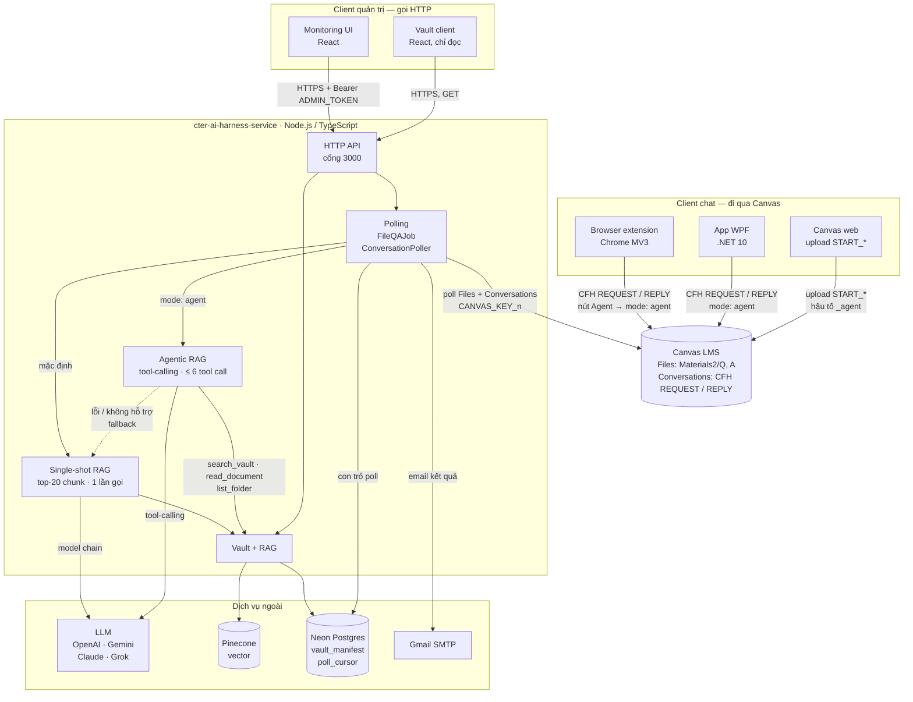
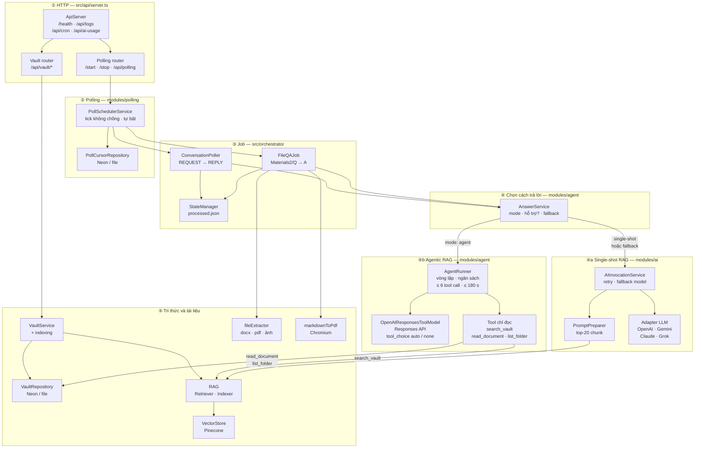
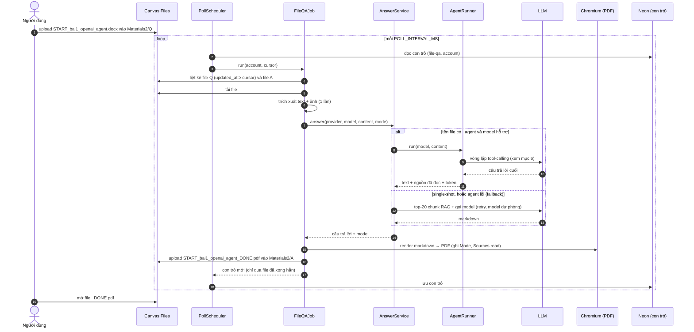
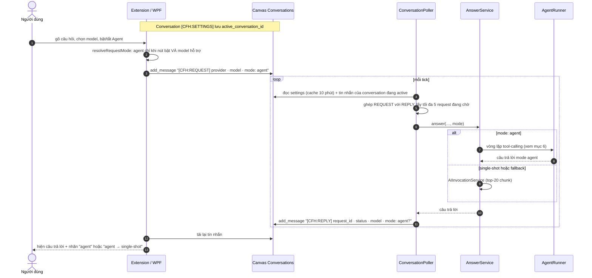
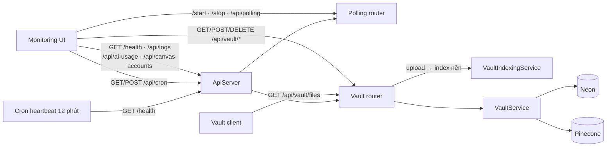
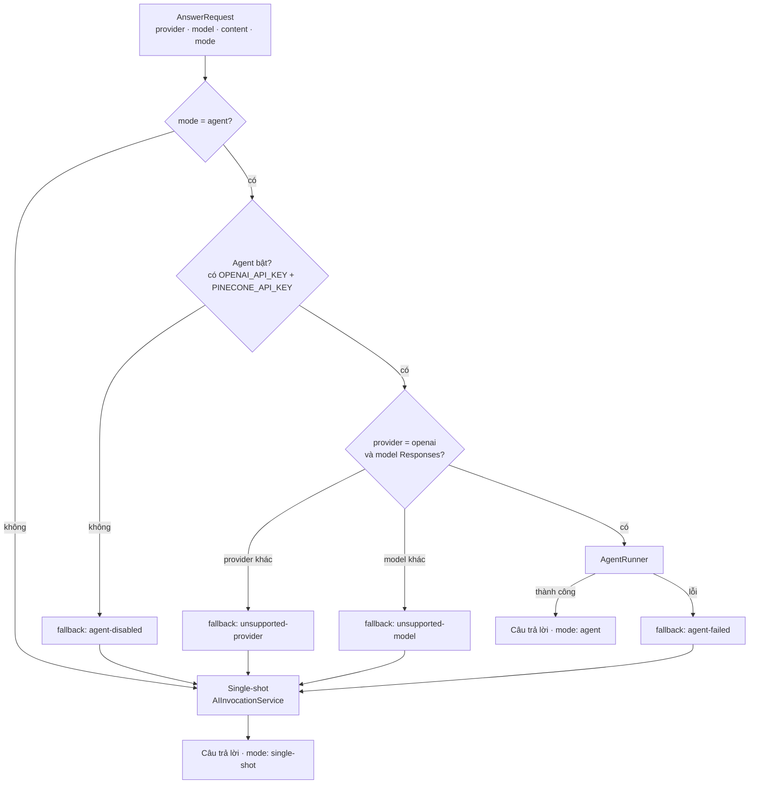
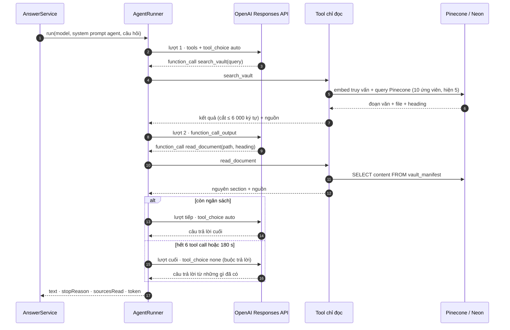
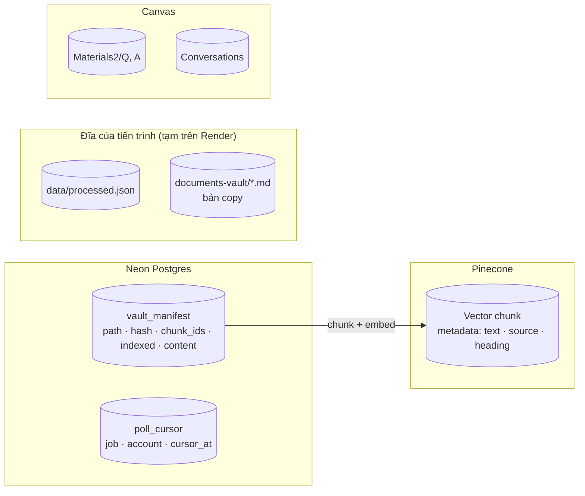
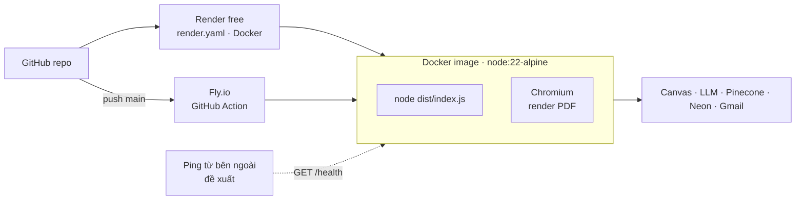

# High-level Architecture — cter-ai-harness-service và các client

> Cập nhật: 2026-10-09 · Phạm vi: backend `cter-ai-harness-service` và 5 client trong workspace `Wrapper-Project`.

**Tóm tắt.** Backend là trung tâm. Các client chat (browser extension, app WPF) **không gọi backend trực tiếp**. Chúng trao đổi qua **Canvas LMS**: client đăng tin `[CFH:REQUEST]` vào một conversation, backend poll Canvas, trả lời bằng `[CFH:REPLY]`, rồi client đọc lại. Riêng hai web UI quản trị (monitoring, vault) gọi **HTTP API** của backend.

Mỗi câu hỏi được trả lời theo một trong hai cách:
- **Single-shot RAG** (mặc định): lấy top-20 chunk từ Pinecone một lần, gọi model một lần.
- **Agentic RAG** (opt-in): model OpenAI dùng tool chỉ đọc để tự tìm và đọc tài liệu nhiều lần, rồi mới trả lời. Bật bằng hậu tố `_agent` ở tên file, hoặc header `mode: agent` (nút Agent trên extension). Agent lỗi thì tự chuyển về single-shot.

## Mục lục

1. [Toàn cảnh hệ thống](#1-toàn-cảnh-hệ-thống)
2. [Bên trong backend](#2-bên-trong-backend)
3. [Luồng 1 — File Q/A qua Canvas Files](#3-luồng-1--file-qa-qua-canvas-files)
4. [Luồng 2 — Chat qua Canvas Conversations (extension, WPF)](#4-luồng-2--chat-qua-canvas-conversations-extension-wpf)
5. [Luồng 3 — Quản trị qua HTTP API](#5-luồng-3--quản-trị-qua-http-api)
6. [Agentic RAG](#6-agentic-rag)
7. [Dữ liệu và nơi lưu](#7-dữ-liệu-và-nơi-lưu)
8. [Triển khai](#8-triển-khai)
9. [Bảng tra cứu thành phần](#9-bảng-tra-cứu-thành-phần)

---

## 1. Toàn cảnh hệ thống

| Client | Nói chuyện với ai | Giao thức | Xác thực | Bật agent thế nào |
|---|---|---|---|---|
| Browser extension | Canvas | Canvas REST, tin nhắn `[CFH:*]` | Token Canvas của người dùng | Nút **Agent** (chỉ bật được với `gpt-6-astra`, `*codex`) → header `mode: agent` |
| App WPF | Canvas | Canvas REST, tin nhắn `[CFH:*]` (lớp chat đang làm dở) | Token Canvas của người dùng | `CanvasSettings.AgentMode` → `MessageFormat.ResolveRequestMode` (chưa có nút trên UI) |
| Canvas web | Canvas | Upload file vào `Materials2/Q` | Đăng nhập Canvas | Tên file `START_<tên>_openai[_<model>]_agent.<ext>` |
| Monitoring UI | Backend | HTTP JSON | `Authorization: Bearer ADMIN_TOKEN` | — |
| Vault client | Backend | HTTP JSON, chỉ GET | Không | — |

`cter-canvas-helper-client` là bản extension cũ gần trùng với `cter-browser-extension-client`, dùng cùng cơ chế.

---

## 2. Bên trong backend

Backend theo hướng module, mỗi module chia 4 lớp (domain · application · infrastructure · presentation). Đọc từ trên xuống: request HTTP hoặc tick poll đi xuống các tầng bên dưới.

Hai phần không vẽ để sơ đồ gọn:
- **Khởi động** (`src/index.ts`): đọc cấu hình, dựng các module, bật API server và polling.
- **Dùng chung** (`src/shared`): `resilience` (phân loại lỗi, backoff) được tầng ④a và ④b dùng; `database` (Neon client, `SchemaGuard`) được các repository ở tầng ② và ⑤ dùng.

| Module | Trách nhiệm | File chính |
|---|---|---|
| `modules/polling` | Lịch poll, chống chạy chồng, con trỏ bền theo (job, account) | `pollScheduler.service.ts` |
| `orchestrator` | Hai job: file Q/A và chat qua Conversations | `fileQAJob.ts`, `conversationPoller.ts` |
| `modules/agent` | **Agentic RAG**: chọn single-shot hay agent, vòng lặp tool-calling có ngân sách, 3 tool chỉ đọc, adapter OpenAI Responses, fallback | `answer.service.ts`, `agentRunner.service.ts`, `openaiResponsesToolModel.ts`, `tools/*.tool.ts` |
| `modules/ai` | Gọi model: retry có backoff, phân loại lỗi, chuyển model dự phòng | `aiInvocation.service.ts` |
| `ai/*Adapter` | SDK của từng nhà cung cấp (SDK retry tắt) | `openaiAdapter.ts`, … |
| `modules/vault` | Kho tài liệu: upload, xoá, liệt kê, index | `vault.service.ts`, `neonVault.repository.ts` |
| `rag` | Chia chunk, embed, truy xuất Pinecone | `knowledgeIndexer.ts`, `ragRetriever.ts` |
| `extractor` · `utils/markdownToPdf` | Đọc file đầu vào; render câu trả lời thành PDF | `fileExtractor.ts`, `markdownToPdf.ts` |
| `shared` | Phân loại lỗi và retry; Neon client và schema | `resilience/`, `database/` |

---

## 3. Luồng 1 — File Q/A qua Canvas Files

Người dùng upload `START_<tên>_<provider>[_<model>][_agent].<ext>` vào `Materials2/Q`; backend trả `<tên>_DONE.pdf` vào `Materials2/A`.

Chống trùng ba lớp: file `_DONE.pdf` đã có trên Canvas; `data/processed.json`; con trỏ trong Neon chỉ tiến qua file đã xong.

---

## 4. Luồng 2 — Chat qua Canvas Conversations (extension, WPF)

Canvas Conversations đóng vai trò hộp thư giữa client và backend.

Giao thức tin nhắn được định nghĩa giống nhau ở 3 nơi, có test hợp đồng giữ chúng khớp nhau:

| Nơi | File |
|---|---|
| Backend | `src/utils/conversationMessageParser.ts` |
| Extension | `lib/messageFormat.js` |
| WPF | `Services/MessageFormat.cs` |

---

## 5. Luồng 3 — Quản trị qua HTTP API

| Endpoint | Method | Auth | Việc |
|---|---|---|---|
| `/`, `/health` | GET | — | Trạng thái, số file đã index, polling đang chạy hay dừng |
| `/start`, `/stop`, `/api/polling` | GET | — | Bật, tắt, xem trạng thái polling |
| `/api/logs` | GET / DELETE | DELETE cần Bearer | Log trong bộ nhớ |
| `/api/cron` | GET / POST | POST cần Bearer | Heartbeat chống ngủ |
| `/api/vault/files` | GET / POST / DELETE | ghi cần Bearer | Liệt kê, upload, xoá theo thư mục hoặc toàn bộ |
| `/api/vault/files/:path[/chunks]` | GET / DELETE | xoá cần Bearer | Chi tiết file, chunk, xoá file |
| `/api/vault/reindex`, `/api/vault/sync-pinecone` | POST | Bearer | Index lại, dọn vector mồ côi |
| `/docs`, `/openapi.json` | GET | — | Swagger |

---

## 6. Agentic RAG

Agent là cách trả lời **opt-in**: model OpenAI (Responses API) được dùng 3 tool **chỉ đọc** để tự tìm, đọc tài liệu trong vault nhiều lần trước khi trả lời. Nếu agent không dùng được hoặc gặp lỗi, request tự chuyển về single-shot, nên không bao giờ mất câu trả lời.

| | Single-shot RAG | Agentic RAG |
|---|---|---|
| Bật bằng | Mặc định | `_agent` trong tên file · `mode: agent` (nút Agent) |
| Provider | OpenAI · Gemini · Claude · Grok | OpenAI, model Responses (`gpt-6-astra`, `*codex`) |
| Truy xuất | 1 lần, top-20 chunk theo nguyên văn câu hỏi | Nhiều lần, model tự viết lại truy vấn (tiếng Việt / tiếng Anh) |
| Đọc tài liệu | Chỉ thấy các chunk rời | Đọc nguyên section hoặc nguyên file |
| Số lần gọi model | 1 (cộng retry khi lỗi) | 2–7 |
| Trích nguồn | Có thể trích file không thật sự dùng | Chỉ trích file tool đã trả về |
| Code | `modules/ai` | `modules/agent` |

### 6.1 Chọn cách trả lời

### 6.2 Vòng lặp agent

### 6.3 Tool và ngân sách

| Tool | Đọc từ | Trả về | Tính là nguồn trích? |
|---|---|---|---|
| `search_vault(query, folder?)` | Pinecone qua `RAGRetriever` | 5 đoạn văn kèm file, heading, độ liên quan | Có |
| `read_document(path, heading?)` | Neon `vault_manifest.content` | Nguyên file, hoặc một section theo heading | Có |
| `list_folder(folder?)` | Neon | Danh sách thư mục hoặc file (tối đa 60 dòng) | Không |

| Giới hạn | Mặc định | Biến môi trường |
|---|---|---|
| Số tool call mỗi câu hỏi | 6 | `AGENT_MAX_TOOL_CALLS` |
| Thời gian mỗi câu hỏi | 180 s | `AGENT_MAX_DURATION_MS` |
| Độ dài mỗi kết quả tool | 6 000 ký tự | — |

An toàn: không có tool ghi; `read_document` chỉ đọc qua DB, không chạm filesystem; prompt coi kết quả tool là dữ liệu, không phải chỉ dẫn. Chi tiết đầy đủ ở `docs/agentic-rag.md`.

---

## 7. Dữ liệu và nơi lưu

| Dữ liệu | Nơi lưu | Mất khi restart? | Ghi chú |
|---|---|---|---|
| Nội dung và metadata tài liệu vault | Neon `vault_manifest` | Không | 235 file `.md`, khoảng 1,6 MB |
| Vector của chunk | Pinecone | Không | Số chiều theo `EMBEDDING_PROVIDER` |
| Con trỏ poll | Neon `poll_cursor` (file khi chạy dev) | Không | Chỉ tiến qua file đã xong |
| Trạng thái từng file / tin nhắn | `data/processed.json` | **Có** trên Render | Chống trùng vẫn đúng nhờ Canvas và con trỏ |
| File đầu vào và kết quả | Canvas Files | Không | `Materials2/Q`, `Materials2/A` |
| Câu hỏi và trả lời chat | Canvas Conversations | Không | `[CFH:REQUEST]`, `[CFH:REPLY]`, header `mode: agent` |
| Vết của một lần chạy agent (tool đã gọi, nguồn đã đọc, token) | Log `[agent]` và header PDF | Có (log trong bộ nhớ) | Chưa lưu bền; nên ghi vào DB nếu cần thống kê |
| Ảnh trong vault | Chưa có nơi lưu trên production | — | Đề xuất: Cloudflare R2 |

---

## 8. Triển khai

| Thành phần | Ghi chú |
|---|---|
| Image | `Dockerfile`: build TypeScript, chạy `node dist/index.js`, có Chromium cho Puppeteer |
| Render free | Ngủ khi không có traffic **từ bên ngoài**; cron nội bộ không giữ được |
| Polling | Tự bật khi khởi động (`POLL_AUTOSTART`, mặc định bật) |
| Cấu hình | `.env`: `CANVAS_URL_n`/`CANVAS_KEY_n`, key LLM, `PINECONE_*`, `DATABASE_URL`, `ADMIN_TOKEN`, `AGENT_*` |

---

## 9. Bảng tra cứu thành phần

| Thành phần | Repo / thư mục | Công nghệ | Vai trò |
|---|---|---|---|
| Backend | `cter-ai-harness-service` | Node.js, TypeScript | Poll Canvas, trả lời bằng LLM + RAG, API quản trị |
| Agentic RAG | `cter-ai-harness-service/src/modules/agent` | OpenAI Responses API, tool-calling | Agent tự tìm và đọc vault; opt-in, có ngân sách và fallback |
| Browser extension | `cter-browser-extension-client` | Chrome MV3, JS thuần | Chat qua Canvas, chụp màn hình, nút Agent |
| Extension cũ | `cter-canvas-helper-client` | Chrome MV3 | Bản cũ, gần trùng |
| App WPF | `cter-interview-cloak-client` | .NET 10, WPF | Overlay, phím tắt; lớp chat Canvas đang làm dở |
| Monitoring UI | `cter-monitoring-client-ui` | React 19, Vite | Dashboard vault, log, cron |
| Vault client | `cter-vault-client` | React 18, Vite | Duyệt vault chỉ đọc, build vào `public/vault` |
| Đánh giá | `cter-ai-harness-service/eval` | TypeScript | `eval:rag`, `eval:answers` (chạy tay, chỉ đọc production) |
