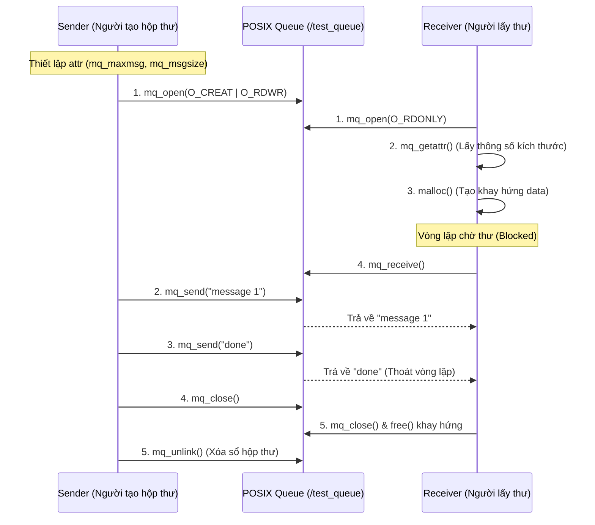
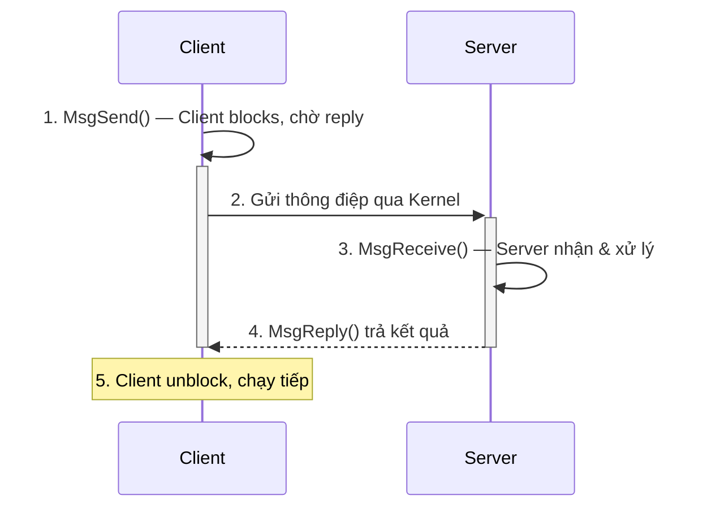
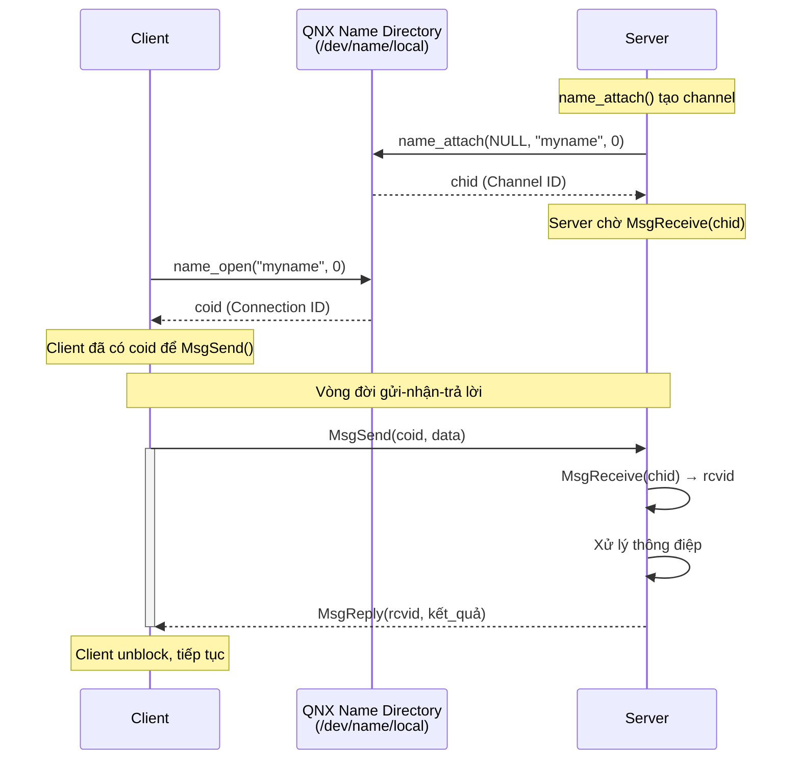

### **1. Khái niệm cơ bản về IPC trong QNX**

- **IPC là gì?** *Viết tắt của Interprocess Communication. Đây là các cơ chế cho phép các tiến trình (processes) hoặc luồng (threads) trao đổi dữ liệu và đồng bộ hóa quá trình thực thi với nhau.*
    
- **Vai trò cốt lõi:** QNX là hệ điều hành thời gian thực (RTOS) kiến trúc vi nhân (Microkernel). Do đó, truyền thông điệp (message passing) chính là "trái tim" kết nối các dịch vụ hệ thống và ứng dụng.
    
- **Kiến trúc Microkernel:** Kernel (nhân) của QNX rất nhỏ gọn, chỉ làm nhiệm vụ cốt lõi là lập lịch (scheduling) và định tuyến thông điệp (message passing). Mọi thành phần khác (Driver, Filesystem, Application...) đều chạy tách biệt như một tiến trình (process) độc lập và phải dùng IPC để nói chuyện với nhau qua Kernel.

![[Pasted image 20260712173903.png]]

![[Pasted image 20260712173914.png|587]]


### **2. Hai phương pháp IPC chính trong cấu trúc bài học**

- **Loại 1: POSIX Message Queues (Hàng đợi thông điệp chuẩn POSIX)**
    
    - **Bản chất:** Hoạt động như một "hộp thư" (mailbox), lưu trữ trước rồi mới chuyển tiếp (store-and-forward).
        
    - **Cơ chế chặn (Blocking):** Thường thì người gửi _không bị chặn_ (non-blocking) trừ khi hàng đợi bị đầy. Người nhận sẽ _bị chặn_ (đứng chờ) nếu hàng đợi đang trống.
        
    - **Ưu điểm:** Khả năng chuyển đổi/tương thích code cao giữa các hệ điều hành dùng chuẩn POSIX.

- **Loại 2: Native QNX Message Passing (Truyền thông điệp đặc hữu của QNX)**
    
    - **Bản chất:** Dựa trên mô hình **Client/Server** và mang tính **đồng bộ (Synchronous)**.
        
    - **Quy trình 3 bước chặt chẽ:** 
	    - 1. **Client** gọi `MsgSend()` gửi đi và _bị chặn lại (block)_ hoàn toàn để chờ. 
	    - 2. **Server** gọi `MsgReceive()` để nhận tin và xử lý. 
	    - 3. **Server** bắt buộc phải gọi `MsgReply()` (hoặc `MsgError()`) thì **Client** mới được giải phóng (unblock) để chạy tiếp.
        
    - **Pulses (Xung tín hiệu):** Một cơ chế phụ của Native IPC. Là loại thông điệp nhỏ, kích thước cố định dùng để báo hiệu sự kiện. Khác với thông điệp thường, Pulses **không chặn (non-blocking)** người gửi và không cần Server phải `MsgReply()`.
        
    - **Qnet (Giao tiếp xuyên mạng):** QNX Native IPC có thể giao tiếp dễ dàng với một tiến trình nằm ở một máy tính/thiết bị (node) khác thông qua mạng (Qnet), địa chỉ truy cập giống hệt như tài nguyên ở máy local (thường qua thư mục `/net`).


### **3. Tiêu chí lựa chọn thiết kế**

- Khi thiết kế hệ thống, việc chọn dùng POSIX Mqueue hay Native QNX Message Passing phụ thuộc vào 4 yếu tố: 
	- (1) Hành vi chặn (blocking behavior).
	- (2) Nhu cầu xếp hàng dữ liệu (queueing). 
	- (3) Yêu cầu về độ trễ (latency).
	- (4) Liệu có cần giao tiếp xuyên mảng giữa các node vật lý khác nhau hay không.
### 4. MÔ HÌNH: POSIX Message Queue (Từ Phần 2)
- **Cơ chế Hộp thư (Store-and-forward):** Người gửi cứ việc ném thư vào hộp rồi đi làm việc khác, thông điệp sẽ nằm ở đó chờ người nhận đến lấy.
    
- **Khi nào bị chặn (Blocked)?**
    
    - **Người gửi** chỉ bị chặn (phải đứng chờ) khi hộp thư đã **đầy**.
        
    - **Người nhận** sẽ bị chặn nếu ra mở hộp mà thấy hộp thư đang **trống rỗng**.
        
- **Đường dẫn:** Trong QNX, các hộp thư này được hệ thống quản lý như một file thực thụ, nằm ở thư mục `/dev/mqueue` (ví dụ: `/dev/mqueue/test_queue`).

- Các hàm API cốt lõi:

| **Hàm API**        | **Chức năng kỹ thuật**                                                                                          | **Mô tả trực quan (Mô hình hộp thư)**                                                                                         |
| ------------------ | --------------------------------------------------------------------------------------------------------------- | ----------------------------------------------------------------------------------------------------------------------------- |
| **`mq_open()`**    | Tạo một hàng đợi mới (sử dụng cờ `O_CREAT`) hoặc mở một hàng đợi đã tồn tại. Trả về thẻ định danh kiểu `mqd_t`. | Giống như việc bạn tạo hoặc xin cấp một chiếc **"chìa khóa"** để bắt đầu sử dụng hộp thư.                                     |
| **`mq_send()`**    | Đưa thông điệp (message) vào hàng đợi.                                                                          | **Gửi/Ném thư** vào hộp.                                                                                                      |
| **`mq_receive()`** | Lấy thông điệp tiếp theo ra khỏi hàng đợi.                                                                      | **Lấy thư** ra khỏi hộp để đọc.                                                                                               |
| **`mq_close()`**   | Đóng kết nối của tiến trình hiện tại đối với hàng đợi.                                                          | Báo với hệ thống: _"Tiến trình của tôi chán rồi, không dùng hộp thư này nữa"_ (nhưng hộp thư vẫn nằm đó cho người khác dùng). |
| **`mq_unlink()`**  | Xóa hoàn toàn tên hàng đợi khỏi hệ thống.                                                                       | **Xóa sổ/Tiêu hủy** hoàn toàn hộp thư (không ai có thể kết nối mới vào nó được nữa).                                          |
- Các kiểu biến, dữ liệu và các rules khi làm việc với kiểu message này:

| **Khái niệm / Quy tắc**                    | **Ý nghĩa Kỹ thuật trong QNX**                                                                                                                                                     | **Hình ảnh ẩn dụ (Mô hình Hộp thư)**                                                                                              |
| ------------------------------------------ | ---------------------------------------------------------------------------------------------------------------------------------------------------------------------------------- | --------------------------------------------------------------------------------------------------------------------------------- |
| **`mqd_t`**                                | Là bộ mô tả hàng đợi (descriptor) được trả về từ hàm `mq_open()`. Dùng nó làm tham số cho các hàm mqueue sau này.                                                                  | Chiếc **"thẻ từ"** hoặc **"chìa khóa"** để mở đúng cái hộp thư bạn cần.                                                           |
| **`mq_attr`**                              | Là cấu trúc (struct) chứa các thông số cài đặt của hàng đợi. Hai thông số quan trọng nhất là `mq_maxmsg` (số tin tối đa) và `mq_msgsize` (kích thước tối đa 1 tin).                | **"Bản thông số kỹ thuật"** quy định sức chứa của hộp thư lớn cỡ nào.                                                             |
| **Buffer size rule** (Luật kích thước đệm) | Bộ đệm dùng để nhận dữ liệu (receive buffer) phải có kích thước **lớn hơn hoặc bằng `mq_msgsize`**. Nếu nhỏ hơn, hàm `mq_receive()` sẽ thất bại ngay lập tức.                      | Bạn phải cầm theo một cái khay **to bằng hoặc lớn hơn** kích thước tối đa của bức thư. Nếu khay quá bé, bưu điện từ chối trả thư. |
| **Lab run order** (Thứ tự chạy code)       | Nếu chương trình nhận (Receiver) mở hàng đợi trước khi chương trình gửi (Sender) kịp tạo ra nó, `mq_open()` sẽ bị lỗi. Do đó, luôn phải chạy chương trình Tạo (Creator) lên trước. | Phải có người **xây hộp thư** xong xuôi thì người đến nhận thư mới có chỗ mà mở.                                                  |



<Code thử phần này nhé>
```
// Sender Pattern 
struct mq_attr attr = {0}; 
attr.mq_maxmsg = 100; 
attr.mq_msgsize = 1000; 
mqd_t qd = mq_open("/test_queue", O_RDWR | O_CREAT, S_IRUSR | S_IWUSR, &attr); mq_send(qd, "message 1", 10, 0); 
mq_send(qd, "done", 5, 0); mq_close(qd); mq_unlink("/test_queue")
```

```
// Receiver Pattern
 mqd_t qd = mq_open("/test_queue", O_RDONLY); 
 struct mq_attr attr; mq_getattr(qd, &attr); 
 char *buf = malloc(attr.mq_msgsize); 
 while (mq_receive(qd, buf, attr.mq_msgsize, NULL) > 0) { 
	 printf("received: %s\n", buf); 
	 if (strcmp(buf, "done") == 0) break; 
} 
mq_close(qd); 
free(buf);
```

### 5. MÔ HÌNH: Native QNX Message Passing (Từ Bước 2)
- **Cơ chế TRUYỀN THÔNG ĐIỆP nội tại (Native)** của QNX tuân theo mô hình Client/Server và mang tính chất đồng bộ (synchronous).
	- **Sự chặn (Blocking) có chủ ý:** Việc các luồng bị chặn lại là cơ chế cốt lõi để đồng bộ hóa hoạt động giữa Client và Server.
	- **Vòng đời gửi - nhận - trả lời:**




- **Cơ chế TÌM THẤY NHAU** qua **ATTACH POINTS**: Làm sao Client biết gõ cửa nhà nào để gửi dữ liệu? Chúng ta dùng **Attach point** (Điểm đính kèm) – một cái tên được Server đăng ký để các Client có thể tìm thấy.
	- Quá trình kết nối:
		- **Server:** Dùng hàm `name_attach(NULL, ATTACH_POINT, 0)` để đăng ký một cái tên và hệ thống sẽ tạo ra một kênh (channel) giao tiếp.
    
		- **Client:** Dùng hàm `name_open(ATTACH_POINT, 0)` để mở cái tên đó ra và nhận về một ID kết nối.




---

	- **Quá trình kết nối:**
    
	    - **Server:** Dùng hàm `name_attach(NULL, ATTACH_POINT, 0)` để đăng ký một cái tên và hệ thống sẽ tạo ra một kênh (channel) giao tiếp.
        
	    - **Client:** Dùng hàm `name_open(ATTACH_POINT, 0)` để mở cái tên đó ra và nhận về một ID kết nối.
        
	- **Ba loại ID tối quan trọng:**
    
	    - `coid`: ID kết nối (Connection ID) được sử dụng bởi Client.
        
	    - `chid`: ID kênh (Channel ID) thuộc sở hữu của Server.
        
	    - `rcvid`: ID nhận (Receive ID) được hàm `MsgReceive()` trả về; Server phải dùng chính ID này truyền vào hàm `MsgReply()` để trả lời đúng người gửi.
        
	- Tên `ATTACH_POINT` (ví dụ "myname") phải khớp nhau hoàn toàn giữa Client và Server. Các điểm đính kèm cục bộ (local) sẽ nằm ở thư mục `/dev/name/local`, còn điểm toàn cầu (global) sẽ nằm ở `/dev/name/global`.

___________________
![[Pasted image 20260712183004.png]]
- Bộ khung code skeleton:
	- **Khung code Server:** Luôn luôn là một vòng lặp vô hạn `while(1)` để liên tục gọi `MsgReceive()`, xử lý dữ liệu, và gọi `MsgReply()` . Khi không dùng nữa, Server dùng `name_detach()` để gỡ bỏ tên.
    
	- **Khung code Client:** Đơn giản hơn nhiều, thực hiện theo luồng tuần tự: `name_open()` -> `MsgSend()` -> rồi `name_close()` .
    
	- **Quy luật ra quyết định (Decision rule):** Khi Server nhận được một gói tin và có giá trị `rcvid`, nó phải xét điều kiện:
    
	    - Nếu `rcvid > 0`: Đây là một thông điệp bình thường. Server lấy dữ liệu ra xử lý và **bắt buộc phải trả lời** (reply).
        
	    - Nếu `rcvid == 0`: Đây là một Pulse (Xung tín hiệu). Server vẫn xử lý sự kiện đó nhưng **tuyệt đối không được trả lời** (do not reply).
```
// Server 
name_attach_t *attach = name_attach(NULL, ATTACH_POINT, 0); 
while (1) { int rcvid = MsgReceive(attach->chid, &msg, sizeof(msg), NULL); 
	if (rcvid == 0) { 
		handle_pulse(msg.hdr.code); 
	} else if (rcvid > 0) { 
		process_message(&msg, &reply); 
		MsgReply(rcvid, EOK, &reply, sizeof(reply)); 
	} else { 
		break; 
	} 
} 
name_detach(attach, 0);
```

```
// Client 
int coid = name_open(ATTACH_POINT, 0); 
if (coid != -1) { 
	MsgSend(coid, &msg, sizeof(msg), &reply, sizeof(reply)); 
	printf("reply: %s\n", reply.buf);
	name_close(coid); 
}
```

<NHỚ QUAY LẠI CODE SAU>

### **6. Pulse**
#### **6.1. Context (Bối cảnh):**
Bạn có thể hiểu các khái niệm này theo tư duy **Cấp độ (Hierarchy)** như sau:
- **IPC (Interprocess Communication):** Là **MỤC TIÊU** (Trao đổi dữ liệu và đồng bộ hóa giữa các tiến trình).
- **Phương pháp truyền tin (Style):** Là **CÔNG CỤ** để đạt được mục tiêu đó. Trong bài học này, bạn có 2 công cụ chính
	- **POSIX Mqueue:** Là công cụ chuẩn quốc tế, hoạt động như một "hộp thư" độc lập.
	- **Native QNX Message Passing:** Là công cụ "đặc sản" của QNX, tích hợp sâu vào nhân hệ điều hành (microkernel).
- Vậy Puse và Data Message là gì?
	- Để trả lời câu hỏi "Pulse là gì", bạn hãy coi **Native QNX Message Passing** là một **Giao thức (Protocol)** có 2 chế độ truyền.

| **Thành phần**   | **Định nghĩa bản chất**                                          | **Vai trò trong Native IPC**                                                                        |
| ---------------- | ---------------------------------------------------------------- | --------------------------------------------------------------------------------------------------- |
| **Data Message** | Là một gói dữ liệu thực thụ có nội dung (Payload).               | Dùng để trao đổi thông tin nghiệp vụ, tính toán (Yêu cầu Reply).                                    |
| **Pulse**        | Là một tín hiệu báo sự kiện (Event) có kích thước cố định (nhỏ). | Dùng để "trigger" (kích hoạt) một phản ứng của Server mà không cần phản hồi (Không chặn người gửi). |
**Chốt lại:**

- **POSIX Mqueue** = Hộp thư bưu điện công cộng (tiêu chuẩn chung).
    
- **Native QNX IPC** = Đường dây điện thoại riêng trong nội bộ công ty QNX.
    
    - **Data Message** = Cuộc gọi điện thoại (nói chuyện, cần trả lời).
        
    - **Pulse** = Tiếng chuông cửa (bấm cái rồi thôi, không cần đối thoại).
#### **6.2. Định nghĩa (Definitions):**
```
PULSE LÀ MỘT TÍN HIỆU SỰ KIỆN CỐ ĐỊNH NHỎ, KHÔNG CẦN PHẢN HỒI (NON-BLOCKING), ĐƯỢC HỆ THỐNG GỬI ĐỂ THÔNG BÁO CÁC TRẠNG THÁI NHƯ NGẮT KẾT NỐI (DISCONNECT) HOẶC SỰ KIỆN LUỒNG (THREAD DEATH) TRONG KHI SERVER ĐANG CHỜ NHẬN TIN.
```
**Slide này đang cố nói với bạn 3 điều quan trọng:**

- **Bản chất:** Pulse là thông báo sự kiện, không phải dữ liệu thông thường.
    
- **Cơ chế:** Nó giúp Server nhận diện các sự kiện hệ thống (như một Client thoát đột ngột) thông qua giá trị `rcvid == 0` mà không làm treo luồng chính của Server bằng cách đòi hỏi `MsgReply()`.
    
- **Mục tiêu:** Đảm bảo hệ thống có khả năng tự dọn dẹp tài nguyên (cleanup) và phản ứng nhanh với các sự kiện thay đổi trạng thái (như disconnect) một cách tự động.
#### **6.3. Tại sao lại cần Pulse?**
| **Vấn đề nếu thiếu Pulse**         | **Tại sao lại nghiêm trọng trong RTOS?**                                                                                                                                                            | **Giải pháp của Pulse**                                                                                                                  |
| ---------------------------------- | --------------------------------------------------------------------------------------------------------------------------------------------------------------------------------------------------- | ---------------------------------------------------------------------------------------------------------------------------------------- |
| **Sự treo cứng (Deadlock/Freeze)** | Nếu bạn chỉ dùng `MsgSend()` (chặn), khi tiến trình Client bị crash hoặc quá tải, Server sẽ đợi mãi mãi. Hệ thống mất tính **Liveness**.                                                            | Pulse cho phép gửi thông báo trạng thái "phi đồng bộ" (Non-blocking) để Server biết ngay Client đã "chết".                               |
| **Tốn tài nguyên (Overhead)**      | Nếu mỗi lần muốn báo một sự kiện nhỏ (như: "đã xong", "dừng lại", "báo lỗi") bạn đều phải thực hiện quy trình `MsgSend -> MsgReceive -> MsgReply`, hệ thống sẽ bị chậm do context switch quá nhiều. | Pulse cực nhẹ, không cần phản hồi, giúp tiết kiệm CPU và giảm độ trễ (Latency) đáng kể.                                                  |
| **Bỏ lỡ sự kiện khẩn cấp**         | Nếu Server đang bận xử lý một `MsgSend` dài hơi, nó có thể bỏ lỡ các tín hiệu ngắt (interrupts) từ phần cứng.                                                                                       | Pulse là cơ chế tuyệt vời để truyền đạt các ngắt phần cứng (Hardware interrupts) hoặc các sự kiện ưu tiên cao tới tiến trình người dùng. |

- Các kịch bản thực tế cần cái này:
  - **Kịch bản 1: Quản lý kết nối (Connection Monitoring)**
    
    - Khi một Client kết nối tới Server, nó tạo ra một kết nối. Nếu Client đột ngột thoát (crash), Server làm sao biết?
        
    - Nếu dùng `MsgSend`, Server không có cách nào biết Client đã biến mất cho đến khi nó gửi một yêu cầu tiếp theo.
        
    - **Với Pulse:** Hệ thống tự động gửi một `_PULSE_CODE_DISCONNECT` tới Server ngay khi kết nối bị ngắt. Server nhận được Pulse này, nó tự động dọn dẹp (cleanup) tài nguyên của Client đó.
        
- **Kịch bản 2: Xử lý sự kiện từ phần cứng (Hardware Events)**
    
    - Các trình điều khiển (Driver) cần báo cho ứng dụng biết "Dữ liệu đã có sẵn trong bộ đệm".
        
    - Ứng dụng không nên đợi (block) liên tục ở đó.
        
    - **Với Pulse:** Driver chỉ cần gửi một Pulse ngắn gọn cho ứng dụng. Ứng dụng nhận Pulse xong sẽ biết "À, phải chạy vào đọc dữ liệu thôi".

___
### **7. Cross-Node Messaging (IPC xuyên node và Xử lý Đa kiến trúc)**
QNX cực kỳ mạnh mẽ nhờ khả năng giao tiếp giữa các máy tính khác nhau thông qua **Qnet**.
- **Cơ chế Qnet:** Cho phép các node (máy tính) "nhìn thấy" nhau qua đường dẫn `/net/<hostname>`. Khi bạn gửi tin nhắn, dữ liệu sẽ đi qua Kernel, rồi qua Qnet và card mạng để tới node đích, việc này diễn ra với rất ít thao tác copy dữ liệu.
- **Node là gì?** trong thế giới QNX, một Node (nút) không chỉ là một cái máy tính. Nó là một thực thể độc lập có khả năng chạy một phiên bản QNX riêng biệt.
	- Bất kỳ phần cứng nào (một bo mạch nhúng, một máy tính công nghiệp, một máy ảo - VM) đang cài đặt và chạy nhân QNX (Neutrino microkernel) đều được coi là một **Node**.
	- **Ví dụ:** Bo mạch điều khiển phanh ô tô là một Node, bộ điều khiển trung tâm là một Node khác, và màn hình hiển thị là một Node thứ ba. Tất cả chúng nối với nhau qua mạng vật lý (Ethernet, CAN bus...).
	
![[Pasted image 20260712185314.png]]
- **Thách thức kiến trúc (32-bit vs 64-bit):** Đây là điểm "cực kỳ quan trọng". Nếu Server chạy 64-bit và Client chạy 32-bit, kích thước kiểu dữ liệu (như `long` hoặc `void*`) sẽ khác nhau.
	- **Giải pháp:** Luôn sử dụng các kiểu dữ liệu có độ rộng cố định như `uint16_t`, `int32_t`,...
	- **Quy tắc vàng:** Đặt Header lên đầu struct tin nhắn và **tuyệt đối không truyền raw pointer** qua mạng.
- Bảng tổng hợp các vùng thay đổi cần chú ý nhiều nhất về kiểu dữ liệu:
Đây là bảng tôi rút gọn từ các nguồn, tập trung vào những thứ hay dùng nhất trong các Lab của bạn:

| **Kiểu dữ liệu**       | **Tại sao nguy hiểm?** | **Cách xử lý (Không thay đổi)**          |
| ---------------------- | ---------------------- | ---------------------------------------- |
| **`long`**             | 32-bit -> 64-bit       | Luôn dùng `int32_t` hoặc `int64_t`       |
| **`void *` (Con trỏ)** | 32-bit -> 64-bit       | **Cấm dùng** trong tin nhắn gửi qua node |
| **`size_t`**           | 32-bit -> 64-bit       | Dùng `uint32_t` hoặc `uint64_t`          |
| **`time_t`**           | 32-bit -> 64-bit       | Dùng `int64_t` để tránh sự cố năm 2038   |
|                        |                        |                                          |
**Mẫu tin nhắn an toàn:**

C

```
typedef struct {
    uint16_t type;
    uint16_t subtype;
    int8_t   code;
    uint8_t  pad[3]; // Explicit padding
    uint32_t value;
} msg_header_t;
```

____
**Vậy là có 3 phương pháp truyền tin?** -> *Bảng dưới sẽ giải đáp*

| **Câu hỏi**                              | **Câu trả lời bản chất**                                                                         |
| ---------------------------------------- | ------------------------------------------------------------------------------------------------ |
| **Có bao nhiêu phương pháp truyền tin?** | Chỉ có 2: **POSIX Mqueue** và **Native QNX IPC**.                                                |
| **Tại sao lại có Cross-node?**           | Đó là một **tính năng** của Native IPC, không phải phương pháp riêng.                            |
| **Pulse là cái gì?**                     | Là một **công cụ (tool)** thuộc Native IPC, dùng để báo hiệu, không phải phương pháp truyền tin. |
### 8. Kỹ thuật kết nối: ChannelCreate & ConnectAttach
Ngoài `name_attach`, bạn có thể dùng cách cấp thấp hơn (low-level) để tối ưu hóa hiệu năng.

- **ChannelCreate():** Server tạo một kênh nội bộ để nhận tin.
    
- **ConnectAttach():** Client kết nối trực tiếp vào kênh của Server nếu biết rõ PID và CHID (giúp tránh việc tìm kiếm tên, tăng tốc độ).
    

**Các trạng thái hàng đợi cần nhớ (pidin):**

1. **Receive-blocked:** Server đang "ngồi đợi" tin nhắn.
    
2. **Send-blocked:** Client đang "đứng chờ" Server nhận tin.
    
3. **Reply-blocked:** Client đã gửi xong nhưng đang "chờ Server trả lời".
### 9. Cạm bẫy (Message-passing Hazards) cần tránh
Khi thiết kế hệ thống concurrent, bạn phải tránh các "thảm họa" sau:

| **Mối nguy**           | **Bản chất**                          | **Cách phòng tránh**                                                    |
| ---------------------- | ------------------------------------- | ----------------------------------------------------------------------- |
| **Deadlock**           | A đợi B, B đợi A.                     | Thiết lập thứ tự gửi: Clients gửi lên cho Servers, Servers reply xuống. |
| **Priority Inversion** | Task cao phải đợi Task thấp.          | Thiết lập độ ưu tiên đúng ngay từ đầu.                                  |
| **Busy-waiting**       | Vòng lặp liên tục kiểm tra (tốn CPU). | Dùng Mutex/Condition Variable để ngủ (block) thay vì lặp.               |
### 10. Đồng bộ hóa luồng (Synchronization)
Đây là cách các luồng nói chuyện và bảo vệ dữ liệu trong vùng nhớ chung.

- **Sơ đồ Producer-Consumer (Bounded Buffer):** * **Logic:** Producer đợi nếu Buffer đầy (`not_full`), Consumer đợi nếu Buffer rỗng (`not_empty`).
    
    - **Điều kiện:** Phải dùng vòng lặp `while` thay vì `if` khi kiểm tra điều kiện.
        

C

```
pthread_mutex_lock(&m);
while (condition is false) {
    pthread_cond_wait(&cv, &m);
}
// Dùng tài nguyên chia sẻ
pthread_mutex_unlock(&m);
```

- **Vì sao phải dùng `while`?** Vì một luồng có thể bị "đánh thức" (wake up) nhưng điều kiện lúc đó vẫn chưa thỏa mãn (do một luồng khác đã tranh giành mất tài nguyên).