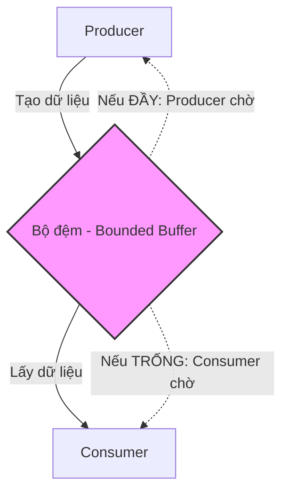
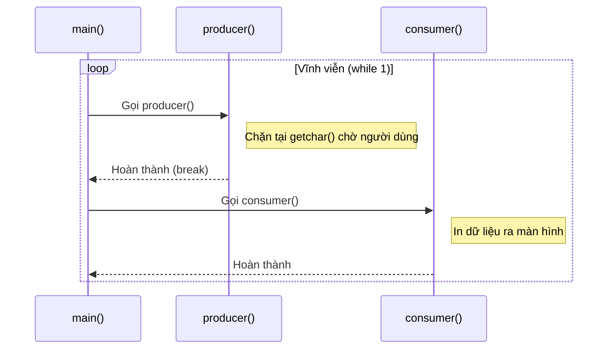
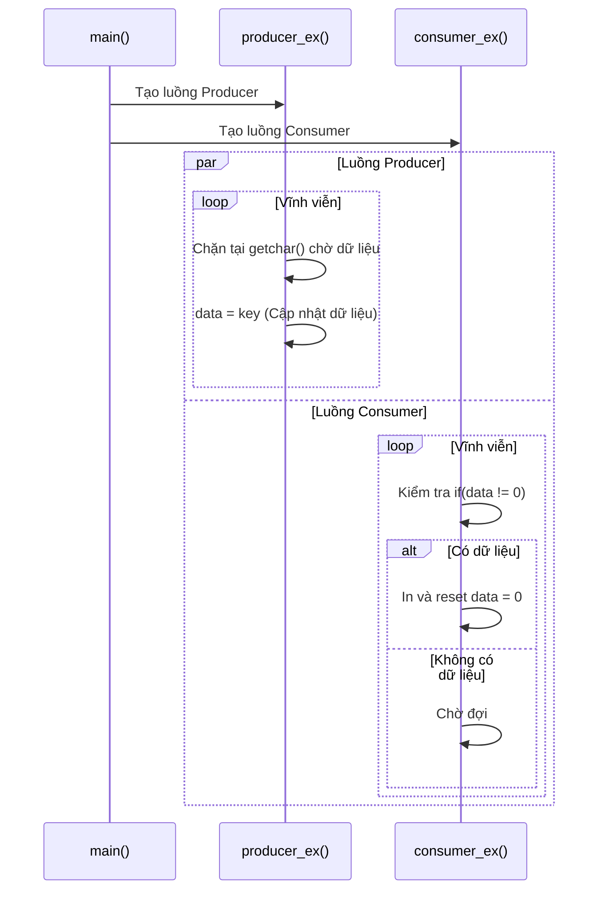
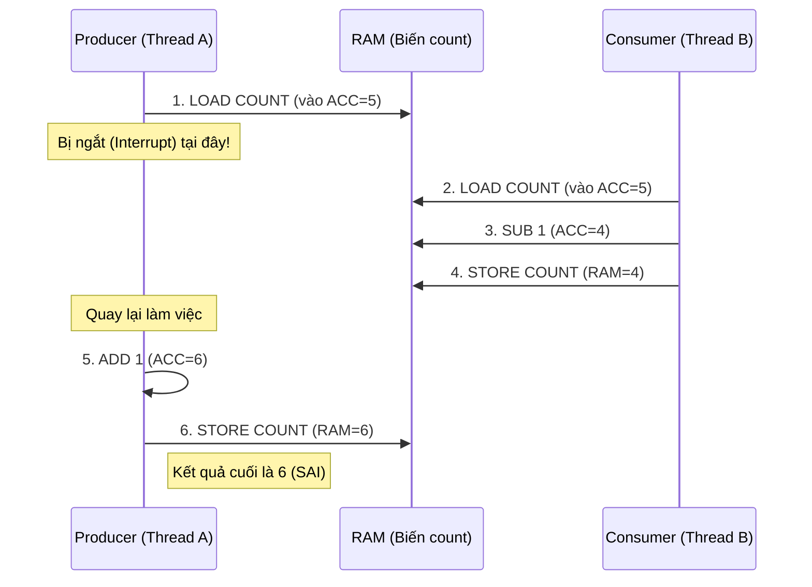
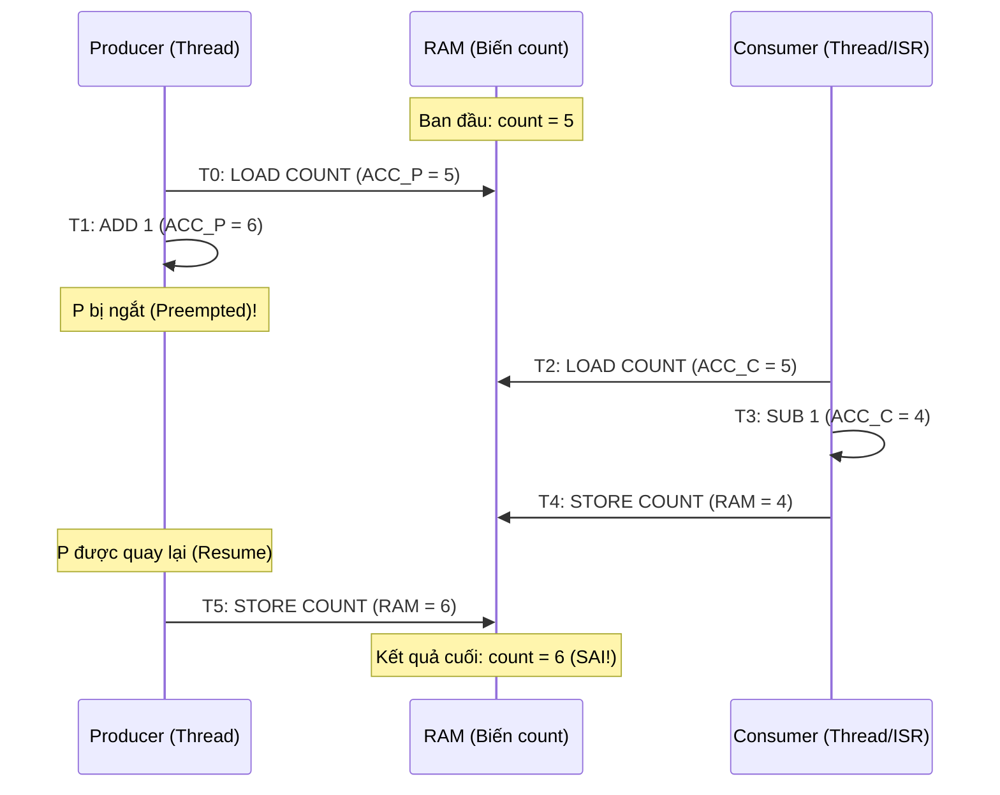
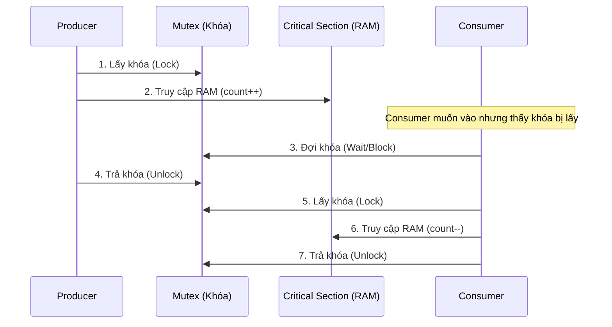
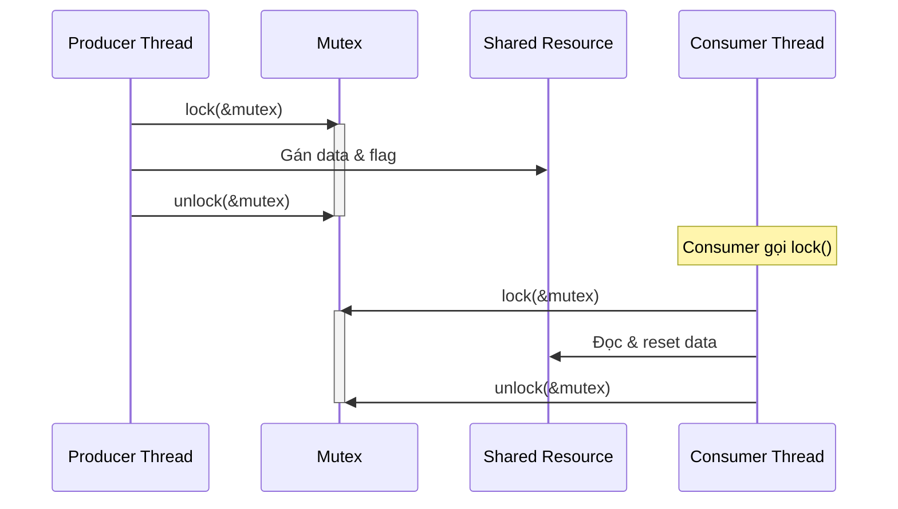
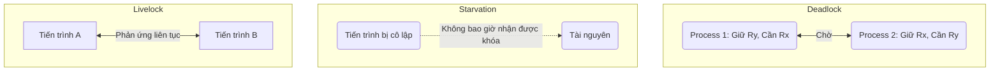
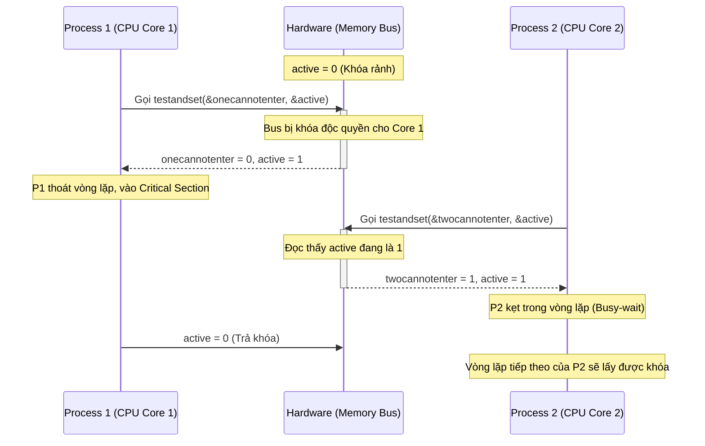
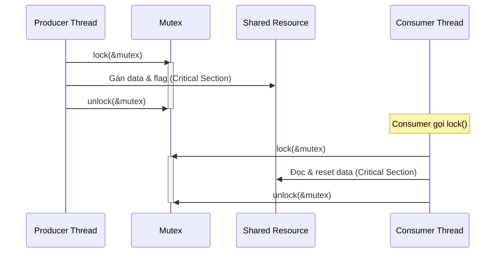

### 1. Vòng đời cơ bản của một Thread (Sơ đồ góc phải)

Một thread trong hệ thống chủ yếu luân chuyển qua 3 trạng thái cốt lõi:

- **Ready (Sẵn sàng):** Thread đã nạp đủ điều kiện, đang xếp hàng chờ tới lượt được cấp CPU.
    
- **Running (Đang chạy):** Thread đang nắm giữ CPU và thực thi mã lệnh.
    
- **Blocked (Bị khóa):** Thread tạm ngưng, không thể chạy tiếp vì đang bận chờ một sự kiện cụ thể.

### 2. Ba kịch bản Thread mất quyền điều khiển CPU

Dưới đây là bảng tổng hợp 3 kịch bản để bạn dễ dàng so sánh và ôn tập nhanh nhé:

| **Kịch bản**                   | **Tính chất** | **Nguyên nhân**                                                                    | **Cơ chế xử lý của OS**                                                             | **Vị trí khi vào lại Ready Queue**                                  |
| ------------------------------ | ------------- | ---------------------------------------------------------------------------------- | ----------------------------------------------------------------------------------- | ------------------------------------------------------------------- |
| **Preempted** (Bị chiếm quyền) | Bị động       | Luồng ưu tiên **cao hơn** xuất hiện (vừa chuyển sang Ready).                       | Tước CPU đột ngột để nhường ngay cho luồng ưu tiên cao hơn.                         | Trở về **Đầu** hàng đợi (để chạy nối tiếp ngay khi luồng kia xong). |
| **Yielded** (Nhường quyền)     | Chủ động      | Code gọi các hàm nhường CPU (VD: `sched_yield()`, `sleep()`).                      | Chấp nhận yêu cầu tự trả CPU, cấp CPU cho luồng ưu tiên cao nhất tiếp theo.         | Lùi về **Cuối** hàng đợi (của mức ưu tiên tương ứng).               |
| **Blocked** (Bị khóa)          | Chờ đợi       | Cần chờ sự kiện ngoài (tin nhắn IPC, mở khóa Mutual exclusion, ngắt phần cứng...). | Rút hẳn luồng khỏi danh sách chạy. Khi sự kiện hoàn tất (Unblocked) thì gọi Wakeup. |                                                                     |
Đối với kịch bản yield, đây là chi tiết về các hàm:

|**Tên hàm**|**Thư viện đi kèm**|**Chức năng & Đặc điểm**|**Trạng thái sau khi gọi**|
|---|---|---|---|
|`sched_yield()`|`<sched.h>`|**Nhường CPU ngay lập tức** cho các luồng khác có **cùng mức độ ưu tiên**. Nếu không có luồng nào khác cùng mức ưu tiên đang đợi, luồng hiện tại sẽ tiếp tục chạy tiếp.|Đứng về **cuối** hàng đợi Ready.|
|`sleep(seconds)`|`<unistd.h>`|**Tạm ngưng (Block) luồng** trong một khoảng thời gian tính bằng **giây**. Luồng sẽ hoàn toàn không tiêu tốn CPU trong lúc ngủ.|Rời khỏi hàng đợi chạy (Blocked) -> Hết giờ Wakeup về cuối hàng đợi Ready.|
|`usleep(usec)`|`<unistd.h>`|**Tạm ngưng luồng** với độ trễ cực nhỏ, tính bằng **micro-giây** ($1/1.000.000$ giây). Rất hay dùng trong hệ thống Real-time để tạo khoảng chờ nhạy bén.|Rời khỏi hàng đợi chạy (Blocked) -> Hết giờ Wakeup về cuối hàng đợi Ready.|
Code snippet minh họa

Dưới đây là một đoạn code C ví dụ cách gọi cả 3 hàm này trong luồng (Thread). 
C

```
#include <stdio.h>
#include <pthread.h>
#include <sched.h>   // Thư viện cần cho sched_yield()
#include <unistd.h>  // Thư viện cần cho sleep() và usleep()

// Luồng 1: Dùng sched_yield() để nhường CPU chủ động
void *thread_yield_ex(void *data) {
    printf("[Luồng 1] Bắt đầu chạy. Tôi sẽ nhường CPU cho luồng khác...\n");
    
    // Nhường quyền ngay lập tức. Hệ thống sẽ cho luồng khác cùng ưu tiên chạy
    sched_yield(); 
    
    printf("[Luồng 1] Đã quay lại! Lượt của luồng khác đã xong.\n");
    return NULL;
}

// Luồng 2: Dùng sleep() và usleep() để tạo tiến trình gây khóa (blocking)
void *thread_sleep_ex(void *data) {
    printf("[Luồng 2] Bắt đầu chạy. Tôi sẽ ngủ 2 giây...\n");
    
    // Ngủ 2 giây. Trong lúc này CPU rảnh tay đi làm việc khác
    sleep(2); 
    
    printf("[Luồng 2] Đã thức dậy! Giờ tôi sẽ nghỉ 500 micro-giây...\n");
    
    // Tạo độ trễ rất nhỏ (500 micro-giây)
    usleep(500); 
    
    printf("[Luồng 2] Đã hoàn thành công việc.\n");
    return NULL;
}

int main(void) {
    pthread_t th1, th2;

    // Khởi tạo 2 luồng
    pthread_create(&th1, NULL, thread_yield_ex, NULL);
    pthread_create(&th2, NULL, thread_sleep_ex, NULL);

    // Chờ 2 luồng thực thi xong mới kết thúc hàm main
    pthread_join(th1, NULL);
    pthread_join(th2, NULL);

    printf("Hàm main kết thúc.\n");
    return 0;
}
```

### 3. Concurrent Threads and Interrupt Service Routines (ISRs)
#### **3.1. ISRs là gì?**
Hiểu một cách đơn giản, trong khoa học máy tính và các hệ thống nhúng (như QNX bạn đang học), ISR là một đoạn mã lệnh (hay một hàm đặc biệt) được thiết kế để xử lý ngay lập tức các sự kiện phần cứng khẩn cấp.

**Cách một ISR hoạt động trên thực tế:**

- **Sự kiện phát sinh:** Khi một thiết bị phần cứng (như bàn phím, chuột, card mạng, hoặc bộ đếm thời gian timer) có một sự kiện cần xử lý gấp, nó sẽ phát ra một tín hiệu gọi là "Ngắt" (Interrupt) gửi thẳng tới CPU.
    
- **Dừng luồng hiện tại:** CPU lúc này dù đang mải mê chạy một Luồng (Thread) nào đó cũng bắt buộc phải tạm dừng công việc (đóng băng trạng thái hiện tại).
    
- **Xử lý ngắt (ISR):** CPU lập tức chuyển quyền điều khiển sang cho đoạn mã **ISR** tương ứng để giải quyết sự kiện kia (ví dụ: cất gói tin mạng vừa tải về vào bộ nhớ, hoặc ghi nhận phím bạn vừa gõ).
    
- **Trở lại bình thường:** Chỉ sau khi ISR hoàn thành nhiệm vụ, CPU mới quay lại tiếp tục chạy Thread đang làm dở lúc nãy.

**Tại sao ISR lại là "nhân vật chính" gây ra rắc rối trong Slide 8?** Chính vì đặc quyền "được phép ngắt ngang ở bất kỳ thời điểm nào", sự xuất hiện của ISR làm cho hệ thống trở nên khó đoán. Các Threads và ISRs thực tế luôn chạy đồng thời và đan xen nhau.

Giả sử luồng của bạn đang thực hiện cộng trừ nhân chia một biến đếm, chưa kịp lưu kết quả thì bị ngắt. ISR nhảy vào làm việc và vô tình cũng thay đổi chính biến đếm đó. Khi ISR xong, luồng của bạn quay lại ghi đè kết quả cũ, thế là dữ liệu bị sai lệch hoàn toàn.

Đó là lý do bài giảng liên tục cảnh báo: Bạn bắt buộc phải thiết kế cơ chế bảo vệ (Mutual Exclusion/Mutex) cho các tài nguyên dùng chung để **bảo vệ các luồng khỏi các luồng khác, và bảo vệ luồng khỏi tất cả các ISRs**.
### 4. Bài toán Nhà sản xuất - Người tiêu dùng (The Producer-Consumer Problem) 

**4.1. Khái niệm cơ bản** Đây là mô hình rất phổ biến trong hệ điều hành hoặc điều khiển thiết bị (Device Control), đặc biệt là quản lý các thiết bị Đầu vào/Đầu ra (I/O). Mô hình gồm 2 phe:

- **Tiến trình Sản xuất (Producer):** Làm nhiệm vụ tạo ra dữ liệu.
    
- **Tiến trình Tiêu dùng (Consumer):** Làm nhiệm vụ lấy dữ liệu đó ra để xử lý/sử dụng.
    
- _Lưu ý:_ Bất kỳ lúc nào, cả Producer hoặc Consumer đều có thể bị điều khiển (driven) bởi một ngắt phần cứng - ISR.
    

**4.2. Đặc điểm tốc độ (Sự chênh lệch)** Thực tế, Producer và Consumer luôn hoạt động với tốc độ khác nhau và thường xuyên biến động. Tuy nhiên, xét về lâu dài, **Consumer thường xử lý nhanh hơn tốc độ Producer tạo ra dữ liệu**.

- _Ví dụ 1 (Đầu vào):_ Bạn gõ bàn phím (Producer tạo ký tự). Dù gõ nhanh đến đâu, phần mềm Word (Consumer) vẫn lấy và hiển thị ký tự đó lên màn hình ngay lập tức (tiêu thụ rất nhanh).
    
- _Ví dụ 2 (Đầu ra):_ Một chương trình xuất dữ liệu in (Producer) tạo ra các ký tự, và Driver máy in (Consumer) sẽ lấy chúng để in ra giấy.
    

**4.3. Giải pháp giúp cả hai chạy đồng thời (Concurrency)** Vì tốc độ chênh lệch, nếu bắt người này chờ người kia thì hệ thống sẽ rất chậm. Để giải quyết, người ta dùng chung một **Hồ chứa bộ đệm (Pool of buffers)**: Producer cứ việc vứt dữ liệu vào bộ đệm, Consumer cứ việc lấy từ đó ra. Có 2 loại bộ đệm:

- **Bộ đệm vô hạn (Unbounded-buffer):** Không giới hạn số lượng bộ đệm, Producer luôn có chỗ trống để điền dữ liệu vào (Tất nhiên, cái này chỉ có trong lý thuyết chứ thực tế RAM không thể vô hạn).
    
- **Bộ đệm có hạn (Bounded-buffer):** Cấp phát một số lượng bộ đệm cố định.
    
    - Nếu bộ đệm **ĐẦY**, Producer bắt buộc phải dừng lại chờ (hoặc đi làm việc khác) cho đến khi có chỗ trống.
        
    - Ngược lại (áp dụng cho cả 2 trường hợp), nếu bộ đệm **TRỐNG TRƠN**, Consumer bắt buộc phải dừng lại chờ Producer tạo thêm dữ liệu.
    


### 5. Mã code thực tế: Bài toán Producer-Consumer và Ác mộng "Race Condition" 

**5.1. Cách 1: Mô hình Tuần tự (Non-Concurrent) - An toàn nhưng lãng phí (Slide 12)**

- Trong ví dụ này, hàm `main()` chứa một vòng lặp `while(1)` gọi lần lượt hàm `producer()` rồi đến `consumer()`.
    
- Hàm `producer()` sẽ chờ người dùng nhập phím `getchar()`, gán vào biến `data`, sau đó phải gọi lệnh `break` để nhường quyền điều khiển cho `consumer()`.
    
- **Vấn đề:** Cấu trúc phần mềm này rất kém hiệu quả. Nó sẽ chặn (block) toàn bộ tiến trình cho đến khi một ký tự được tạo ra. Trong thời gian chờ đợi đó, luồng `consumer` hoặc `main` không thể làm bất kỳ công việc nào khác.
```
volatile char data = 0; 
void producer() { 
	printf("Producer Started....\n"); 
	int key = 0; 
	while(1) { 
		printf("press a key:\n"); 
		key = getchar(); // Wait here 
		getchar(); // waste carriage return 
		data = key; 
		break; // need to give control 
		// to the consumer 
	}
}

void consumer(){
	printf("Consumer Started....\n");
	// do something with the data
}

void main( void ) { 
	while(1) { 
		producer(); // run the producer 
		consumer(); // run the consumer 
	} 
	printf("Never going Terminate...\n"); 
}
```
	


**Tại sao nó "lãng phí"?**

- Nhìn vào biểu đồ trên, khi Producer đang chờ (`getchar()`), thì toàn bộ hệ thống (kể cả `main` và `consumer`) đều "đóng băng".
    
- Consumer không thể làm gì khác (như chuẩn bị dữ liệu hay làm việc khác) vì nó phải đợi Producer trả quyền điều khiển về cho `main`


**5.2. Cách 2: Mô hình Đồng thời (Concurrent Threads) - Nhanh hơn nhưng sinh lỗi (Slide 13)**

- Để giải quyết sự chậm chạp, hệ thống chia thành 3 luồng chạy song song: luồng main, luồng producer, và luồng consumer.
    
- Hàm `producer_ex` cứ việc chặn ở bước lấy phím `getchar()` để chờ dữ liệu, gán `data = key` mà không cần lệnh `break`, vì ta muốn luồng này tiếp tục chạy liên tục.
    
- Hàm `consumer_ex` liên tục kiểm tra điều kiện `if(data != 0)` để lấy dữ liệu in ra, sau đó reset `data = 0`.
    
- **Lỗ hổng logic:** Code có vẻ chạy ổn, nhưng nếu ta thực sự muốn gửi giá trị `0` (NULL) giữa các luồng thì sao?. Nếu gửi `0`, hàm `if(data != 0)` sẽ bỏ qua và không in ra gì cả.
    
- **Đề xuất sửa lỗi:** Ta có thể thêm một biến Cờ (Flag) để báo hiệu khi nào có dữ liệu mới. Tuy nhiên, việc kiểm tra Cờ và cập nhật biến dữ liệu KHÔNG phải là một phép toán nguyên tử (atomic operation), và điều này sẽ dẫn đến lỗi Điều kiện cạnh tranh (Race Condition).
```
volatile char data = 0;
void *producer_ex(void *notused){
	printf("Producer Started....\n");
	int key = 0;
	while(1) {
		printf("press a key:\n");
			key = getchar();      
			// Block here
			
			// reset data value
			getchar(); // waste carriage return
			data = key;
			// no need to break here as we
			// want this thread to continue
			// running
	}
}


void *consumer_ex(void *notused){
	printf("Consumer Started....\n");
	while(1) {
		if(data != 0) {  // wait here
			printf("Consumer received: %c\n", data);
			data = 0;      
		}
	}  
}

void main( void ){
	pthread_t th1, th2;
	pthread_create(&th1, NULL, consumer_ex, NULL);
	pthread_create(&th2, NULL, producer_ex, NULL);
	
	pthread_join(th1, NULL);//needed to stay alive
	printf("Never going to Terminate...\n");
}
```

**5.3. Điều kiện cạnh tranh (Race Condition) là gì? (Slide 14)**

- Nếu thêm biến Cờ, luồng Producer sẽ phải thiết lập cờ, còn luồng Consumer phải xóa cờ, đồng thời cả hai luồng đều phải thao tác với giá trị dữ liệu thực tế.
    
- Thật không may, không có cách nào đảm bảo việc kiểm tra một biến và cập nhật một biến khác diễn ra an toàn mà không bị ngắt quãng bởi Context Switch hay Process Switch.
    
- Kết quả cuối cùng phụ thuộc hoàn toàn vào thứ tự thực thi của hệ thống.
    
- **Ví dụ minh họa (Tài khoản ngân hàng):** Giống như việc một người chồng và một người vợ cùng truy cập vào chung một tài khoản từ hai máy ATM khác nhau cùng một lúc. Máy nào sẽ hiển thị thông tin trung thực nhất?.
    
- Về cơ bản, nếu một luồng đang cập nhật dữ liệu dang dở mà bị luồng khác nhảy vào truy cập biến chia sẻ đó, một sự cố lớn sẽ xảy ra. Những lỗi này được gọi là Race Condition (có lỗi rất tệ, có lỗi có thể chấp nhận được).
    
- Tính chất nguy hiểm nhất của Race Condition là nó thường tạo ra các kết quả khác nhau mỗi lần xuất hiện. Lần này code chạy ngon lành, nhưng lần sau có thể bị crash (sập). Không có cách thực tế nào bắt hệ thống lập lịch cho luồng chạy y hệt như lần trước.
    

**Tại sao nó "nhanh hơn nhưng sinh lỗi"?**

- **Nhanh hơn:** Cả P và C đều chạy độc lập. Producer có thể đang "ngủ" chờ phím bấm, nhưng Consumer vẫn có thể đang chạy vòng lặp kiểm tra liên tục. Không ai phải chờ ai hoàn toàn.
    
- **Sinh lỗi (Race Condition):** Hãy nhìn kỹ vào phần Cập nhật dữ liệu của P và Kiểm tra dữ liệu của C. Vì chúng chạy song song, có khả năng cao là:
    
    1. C vừa kiểm tra `data != 0` (đúng).
        
    2. Đúng lúc đó, hệ thống ngắt C để chuyển CPU cho P.
        
    3. P ghi đè `data` mới.
        
    4. Hệ thống chuyển CPU về lại C, C tiếp tục in giá trị cũ hoặc giá trị bị lỗi.
        
- Đó chính là lý do tại sao ở Cách 2, nếu ta gửi giá trị `0` (NULL) hoặc dùng biến Cờ (Flag) mà không có **khóa bảo vệ**, dữ liệu sẽ bị tranh chấp.
    
Ví dụ:
Sơ đồ này mô tả việc Producer và Consumer cùng giành giật quyền truy cập biến `count` tại vùng Critical Section mà không có khóa.

**Chú thích:**
- Dù đáng lẽ kết quả phải là 5 (5+1-1=5), nhưng vì Producer bị "ngắt" ngang, Consumer đã lấy giá trị 5 cũ, trừ đi 1 và lưu vào RAM. Sau đó, Producer quay lại và lưu giá trị 6 của nó vào, **ghi đè mất** kết quả của Consumer. Đây là bản chất của lỗi Race Condition: kết quả phụ thuộc vào việc ai chạy trước/sau tại thời điểm ngắt.
##### Tóm tắt sự khác biệt cốt lõi:

- **Cách 1:** Giống như 2 người xếp hàng chung một cái ghế, người này phải đứng dậy hẳn thì người kia mới được ngồi. **An toàn nhưng chậm**.
    
- **Cách 2:** Giống như 2 người cùng vào một căn phòng, người này vừa viết lên bảng thì người kia đã xóa ngay. **Nhanh nhưng dữ liệu trên bảng bị loạn**.


**5.4. Hướng giải quyết 

- Để đảm bảo dữ liệu sẵn sàng cho Consumer, ta phải ngăn không cho Consumer chen ngang (preempting) Producer cho đến khi cả dữ liệu và cờ đều đã được gán xong xuôi.
    
- Nói cách khác, ta cần một phương pháp để "khóa" (block) mỗi luồng khi chúng đang thực hiện các quy trình mang tính then chốt (critical procedures) này.

### 6. Giải phẫu lỗi: Tại sao "Critical Section" lại nguy hiểm?

**6.1. Critical Section là gì?**

- Là đoạn mã yêu cầu quyền truy cập độc quyền (exclusive access) vào tài nguyên chung (ví dụ: biến toàn cục `count`).
    
- Vấn đề ở chỗ: Một dòng code bậc cao (như `count++`) khi biên dịch ra cấp độ thấp (Assembly) lại gồm 3 bước riêng biệt:
    
    1. `LOAD COUNT`: Đưa giá trị từ RAM vào thanh ghi (ACC).
        
    2. `ADD 1`: Cộng 1 vào giá trị trong thanh ghi.
        
    3. `STORE COUNT`: Lưu ngược giá trị từ thanh ghi vào RAM.
        
- **Nguy hiểm:** Nếu một ngắt (Interrupt) hoặc Context Switch xảy ra **giữa** các bước này, trạng thái của biến `count` sẽ bị mất tính toàn vẹn (có thể mất hoặc thừa giá trị).
    

**6.2. Ví dụ thực tế: Kịch bản "Thảm họa" (Worst Case Scenario)** Nếu không có cơ chế bảo vệ, sự xen kẽ giữa Producer và Consumer sẽ dẫn đến lỗi như sau:

- **T0-T1:** Producer đã nạp giá trị 5 vào ACC và cộng thành 6, nhưng chưa kịp lưu vào RAM thì bị ngắt.
    
- **T2-T3:** Consumer nhảy vào, nạp giá trị cũ là 5 từ RAM, trừ đi 1 thành 4.
    
- **T4:** Consumer lưu 4 vào RAM.
    
- **T5:** Producer quay lại, thực hiện lưu giá trị 6 (từ ACC của nó) vào RAM, đè lên kết quả của Consumer.
    
- **Kết quả:** Biến `count` bị sai hoàn toàn! Lẽ ra phải là 5, nhưng giờ lại thành 6.
    

##### Giải thích chi tiết từng bước:

- **T0 & T1 (Producer đang làm việc):** Producer bắt đầu tăng biến `count`. Nó đã lấy giá trị `5` từ RAM và tính toán trong thanh ghi nội bộ (`ACC_P`) của nó ra kết quả là `6`. Tại thời điểm này, RAM vẫn đang lưu giá trị `5`.
    
- **Điểm bùng phát (Context Switch):** Ngay khi Producer chuẩn bị lưu kết quả `6` vào RAM thì bị hệ thống ngắt ngang để nhường CPU cho Consumer.
    
- **T2, T3 & T4 (Consumer xen vào):** Consumer lấy giá trị từ RAM. Vì Producer chưa kịp cập nhật, Consumer vẫn lấy được giá trị cũ là `5`. Nó thực hiện trừ `1`, ra kết quả `4` và lưu ngay lập tức vào RAM. Bây giờ RAM đang giữ giá trị `4`.
    
- **T5 (Producer trở lại):** Producer "tỉnh dậy" và tiếp tục công việc còn dang dở. Nó không biết rằng RAM đã bị thay đổi. Nó thực hiện thao tác lưu giá trị `6` đang có trong thanh ghi của nó (`ACC_P`) đè lên RAM.
### 7. Giải pháp chuẩn mực: Mutual Exclusion (Slide 17)

Để ngăn chặn lỗi này, Hệ điều hành cung cấp cơ chế **Mutual Exclusion** (Loại trừ lẫn nhau).

**7.1. Định nghĩa**

- Là một biến đặc biệt hoặc kiểu dữ liệu trừu tượng dùng để kiểm soát quyền truy cập tài nguyên chung.
    
- **Semaphore** là một ví dụ phổ biến: một loại biến đếm mà Hệ điều hành đảm bảo việc kiểm tra hoặc thay đổi giá trị của nó được thực hiện **an toàn, độc quyền và không bao giờ bị dính Race Condition**.
    

**7.2. "Bathroom Analogy" (Phép ẩn dụ Phòng tắm)** Đây là cách dễ hiểu nhất về cơ chế khóa (Locking):

- **Cái chìa khóa (Token):** Dùng để truy cập tài nguyên chung (phòng tắm).
    
- **Quy trình:**
    
    1. Nếu có chìa khóa trên móc, bạn lấy nó và **khóa cửa** khi vào trong.
        
    2. Khi bạn ở trong, tất cả những người khác đều bị "khóa ở ngoài" (không thể vào).
        
    3. Khi xong việc, bạn mở cửa và **treo chìa khóa lại chỗ cũ**.
        
- **Kết luận:** Nhờ có cái chìa khóa, phòng tắm trở thành một tài nguyên được bảo vệ hoàn hảo.
    

**Lưu ý quan trọng:** Thiết kế khóa không cẩn thận có thể dẫn đến hiện tượng **Priority Inversion** (Đảo ngược độ ưu tiên) - một lỗi rất nghiêm trọng trong hệ thống thời gian thực mà bạn sẽ học ở các bài sau.

_Mẹo ôn tập:_ Bạn nên nhớ rằng bất cứ khi nào bạn thấy một biến dùng chung trong code (cả thread và ISR đều đụng vào), thì đoạn code đó **chắc chắn** là một **Critical Section** và bắt buộc phải dùng **Mutex/Semaphore** để bảo vệ. Bạn có muốn mình demo cách dùng `pthread_mutex` để sửa lỗi ở đoạn code cũ không?
Đây là mô hình sử dụng "Cái chìa khóa phòng tắm" để thực hiện nguyên tắc loại trừ lẫn nhau.


**Chú thích:**

- **Bước 1-2:** Producer lấy được khóa, nó trở thành chủ nhân duy nhất của Critical Section.
    
- **Bước 3:** Consumer dù rất muốn truy cập RAM nhưng vì không có khóa, nó bắt buộc phải đứng đợi (Block). Điều này đảm bảo không ai có thể "chen ngang" vào giữa quá trình Producer đang thực hiện 3 bước `LOAD-ADD-STORE`.
    
- **Bước 5-7:** Chỉ khi Producer xong việc và treo chìa khóa lên, Consumer mới được phép lấy khóa và thực hiện công việc của nó. Dữ liệu lúc này luôn được đảm bảo toàn vẹn.

#### Sự khác biệt bản chất:

|**Đặc điểm**|**Critical Section**|**Race Condition**|
|---|---|---|
|**Bản chất**|Là một phần của chương trình.|Là một khiếm khuyết (bug) logic.|
|**Sự tồn tại**|Luôn tồn tại nếu có tài nguyên dùng chung.|Chỉ xảy ra khi lập trình viên không bảo vệ Critical Section.|
|**Mục tiêu**|Chúng ta **cần** xác định nó để khóa lại.|Chúng ta **cần tránh** nó bằng mọi giá.|
#### Tại sao bạn lại cảm thấy chúng giống nhau?

Bởi vì khi bạn lập trình, bạn luôn tìm kiếm **Critical Section** để đặt cơ chế bảo vệ vào đó. Nếu bạn bỏ quên hoặc xác định sai Critical Section, **Race Condition** sẽ xuất hiện ngay lập tức.

**Tóm lại:**
Critical Section là "nơi xảy ra nguy hiểm", còn Race Condition là "kết quả tai hại" nếu bạn đi vào đó mà không có thiết bị bảo hộ (như Mutex). Bạn không thể loại bỏ Critical Section (vì bạn vẫn cần dùng chung biến), nhưng bạn hoàn toàn có thể loại bỏ Race Condition bằng cách quản lý tốt các Critical Section đó.


### 8. Giải pháp chuẩn mực: Mutual Exclusion (Mutex) (Trong QNX)
Sau khi đã thấy sự phức tạp và rủi ro của các thuật toán phần mềm (như Peterson's Algorithm) – vốn chỉ tối ưu cho 2 tiến trình và dễ bị lỗi trên hệ thống đa nhân – Hệ điều hành QNX cung cấp một cơ chế chuyên dụng: **Mutex Object**.
#### 8.1. Định nghĩa Mutex trong QNX
Mutex (Mutual Exclusion) là dịch vụ đồng bộ hóa đơn giản nhất của QNX, dùng để đảm bảo quyền truy cập độc quyền vào các dữ liệu dùng chung giữa các luồng.

- **Cơ chế:** Thay vì tự viết code kiểm tra biến cờ (flag) phức tạp, bạn sử dụng `pthread_mutex_t` để quản lý.
    
- **Ưu điểm:** Nếu một luồng muốn vào Critical Section nhưng khóa đã bị chiếm, nó sẽ tự động bị **Block** (treo luồng) thay vì lãng phí chu kỳ CPU để kiểm tra vòng lặp.
#### 8.2. Cách triển khai thực tế (Integration vào Producer-Consumer)

Dưới đây là cách sử dụng Mutex để "bọc" lại Critical Section, giúp loại bỏ hoàn toàn lỗi Race Condition đã phân tích ở mục 5.3:

#### 8.3. Code minh họa (QNX Style)
Sử dụng Mutex để bảo vệ biến `data` và `data_ready`:

C

```
pthread_mutex_t mutex = PTHREAD_MUTEX_INITIALIZER;

void *producer_ex(void *notused) {
    while(1) {
        int key = getchar();
        pthread_mutex_lock(&mutex);   // Khóa lại trước khi sửa dữ liệu
        data = key;
        data_ready = 1;
        pthread_mutex_unlock(&mutex); // Mở khóa sau khi xong
    }
}

void *consumer_ex(void *notused) {
    while(1) {
        pthread_mutex_lock(&mutex);   // Khóa lại trước khi đọc dữ liệu
        if(data_ready == 1) {
            printf("Received: %c\n", data);
            data_ready = 0;
        }
        pthread_mutex_unlock(&mutex); // Mở khóa
    }
}
```
### 9. Deadlock, Starvation and Livelock


| **Đặc điểm**          | **Deadlock (Bế tắc)**                                                                   | **Starvation (Đói tài nguyên)**                                                                      | **Livelock**                                                                                     |
| --------------------- | --------------------------------------------------------------------------------------- | ---------------------------------------------------------------------------------------------------- | ------------------------------------------------------------------------------------------------ |
| **Bản chất**          | Một vòng tròn chờ đợi vĩnh viễn.                                                        | Một tiến trình bị từ chối cấp tài nguyên vĩnh viễn.                                                  | Hai hoặc nhiều tiến trình liên tục thay đổi trạng thái nhưng không tiến triển.                   |
| **Trạng thái luồng**  | Luồng bị đứng im (chờ đợi sự kiện không bao giờ xảy ra).                                | Luồng vẫn có thể chạy nhưng bị "đói" vì không lấy được tài nguyên.                                   | Luồng hoạt động rất "bận rộn" nhưng vô ích.                                                      |
| **Nguyên nhân chính** | Các tiến trình chờ đợi nhau trong vòng lặp (ví dụ: P1 giữ Ry cần Rx, P2 giữ Rx cần Ry). | Thuật toán lập lịch không công bằng hoặc tiến trình bị các tiến trình khác cướp tài nguyên liên tục. | Các tiến trình cố gắng né tránh xung đột nhưng lại cùng đưa ra những phản ứng đồng bộ/trùng lặp. |
| **Hệ quả**            | Hệ thống dừng hoàn toàn tại các luồng bị bế tắc.                                        | Tiến trình không bao giờ hoàn thành công việc.                                                       | Hệ thống không thể tiến triển (none of the processes will complete).                             |
##### Tóm tắt nhanh bằng ngôn ngữ của bạn:

- **Deadlock:** Là "cái bẫy vòng tròn". Bạn không thể tiến lên vì đang đợi người khác, và người khác cũng đang đợi bạn.
    
- **Starvation:** Là "sự bất công". Bạn cứ mãi đứng cuối hàng đợi dù bạn rất cần tài nguyên.
    
- **Livelock:** Là "cái vòng lẩn quẩn hành động". Hai người cùng né sang trái, rồi cùng né sang phải, nên vẫn cứ đụng độ nhau dù cả hai đều rất tích cực di chuyển.
- 
### 10. Nguyên tắc thiết kế hệ thống: Safety & Liveness
Khi lập trình đa luồng, bạn luôn phải cân bằng giữa hai khái niệm này:

- **Safety (An toàn):** Đảm bảo "điều xấu không xảy ra". Ví dụ: Các tiến trình chạy không đồng bộ không được can thiệp (corrupt) dữ liệu của nhau.
    
- **Liveness (Tính sống động):** Đảm bảo "điều tốt sẽ xảy ra". Hệ thống phải tiếp tục hoạt động đúng hành vi và đáp ứng được các deadline.
    
- **Mutual Exclusion:** Là sự kết hợp cần thiết: Đảm bảo quyền truy cập độc quyền cho **Safety**, nhưng phải giải phóng tài nguyên trong thời gian hợp lý để đảm bảo **Liveness** (tránh deadlock, starvation).

### 11. Giải pháp phần cứng: Test-and-Set Instruction

Các thuật toán phần mềm như Peterson's Algorithm gặp khó khăn trên hệ thống đa nhân (multi-core) vì vấn đề tranh chấp bộ nhớ.
- **Bản chất:** Sử dụng tập lệnh CPU đặc biệt (Atomic Operation) để kiểm tra và thiết lập giá trị trong một chu kỳ duy nhất, không thể bị ngắt (indivisible).
    
- **Hạn chế:** Dù loại bỏ được Race Condition trong phần mềm, nó có thể dẫn đến hiện tượng "Indefinite Postponement" (trì hoãn vô thời hạn) nếu một tiến trình chiếm dụng bus dữ liệu quá lâu.
    
- **Mẹo thực thi trên Single-core:** Nếu Critical Section rất nhỏ, bạn có thể chỉ cần **tắt ngắt (disable interrupts)** hoặc **tắt time-slicing (dùng FIFO scheduling)** để bảo vệ dữ liệu mà không cần thuật toán phức tạp.
#### 11.1. Bản chất của "Test-and-Set" (Slide 36)
Đây là một thao tác **Nguyên tử (Atomic operation / Indivisible)**. Nghĩa là quy trình 3 bước: _Đọc (Read) $\rightarrow$ Sửa đổi (Modify) $\rightarrow$ Ghi (Write)_ diễn ra trong đúng **một chu kỳ duy nhất**, không bất kỳ ngắt (Interrupt) hay luồng nào có thể chen ngang.

Trong thực tế, nó là tập lệnh hợp ngữ của CPU (như lệnh `XCHG` trên x86). Dưới đây là mô phỏng logic của nó bằng code C để dễ hiểu:
C

```
// Hàm này chạy một mạch, không thể bị ngắt ngang
testandset(&a, &b) {
    a = b;  // Lấy trạng thái hiện tại của b gán cho a
    b = 1;  // Đặt b thành True (Khóa lại)
}
```

#### 11.2. Cách triển khai Code (Slide 35)

Dưới đây là cách hai tiến trình sử dụng hàm `testandset` để bảo vệ Critical Section. Biến `active` đóng vai trò là "chìa khóa" chung:

C

```
int active = 0; // 0: Critical Section đang trống, 1: Đã bị chiếm

void * process1( void ) {
    int onecannotenter;
    while(1) {
        onecannotenter = 1;
        // Liên tục thử lấy khóa bằng lệnh Test-and-Set
        while(onecannotenter)
            testandset(&onecannotenter, &active);

        criticalsection1; // Vùng an toàn
        
        active = 0; // Trả khóa
        // ... code khác ...
    }
}

// process2 cũng có cấu trúc y hệt, dùng biến twocannotenter
```

#### 11.3. Sơ đồ giải thích (Diagram)

Để hiểu rõ tại sao đoạn code trên lại an toàn, hãy nhìn vào sơ đồ cách phần cứng "Trọng tài Bus" (Bus arbitration) khóa bộ nhớ lại khi Process 1 thực hiện lệnh Test-and-Set:

Đoạn mã



**Giải thích Sơ đồ:**

- Dù Process 1 và Process 2 có lao vào cùng một phần tỷ giây, phần cứng (Bus arbitration) vẫn sẽ ép chúng vào hàng.
    
- Người đến trước (P1) chạy `testandset` sẽ lấy được `active = 0`, lập tức đẩy `active = 1`.
    
- Người đến sau (P2) chạy `testandset` sẽ chỉ nhận lại `active = 1` và bị nhốt trong vòng lặp `while(twocannotenter)` cho đến khi P1 thả khóa.

#### 11.4. Những mặt hạn chế (Slide 37)

Mặc dù tránh được Race Condition một cách hoàn hảo nhờ phần cứng, nhưng Test-and-Set không phải là giải pháp vạn năng:

1. **Gây Livelock/Trì hoãn vô hạn (Indefinite Postponement):** Nếu một tiến trình chiếm dụng quá lâu hoặc việc khóa Bus bộ nhớ xảy ra liên tục, các tiến trình khác sẽ bị "đói" tài nguyên.
    
2. **Lãng phí CPU:** Việc dùng vòng lặp `while` để chờ đợi (busy-waiting) làm tốn chu kỳ CPU vô ích thay vì block luồng.
    

#### 11.5. Cách "thô sơ" cho CPU đơn nhân (Crude ways)

Nếu hệ thống của bạn chỉ có 1 Core (Single core CPU), và đoạn Critical Section rất ngắn, bạn thậm chí không cần Test-and-Set. Bạn có thể dùng 2 cách "cục súc" nhưng hiệu quả:

- **Tắt ngắt (Disable interrupts):** Đảm bảo không có ISR nào xen vào giữa lúc luồng đang chạy Critical Section.
    
- **Tắt time-slicing (FIFO scheduling):** Ép hệ thống chạy cho xong luồng hiện tại mới được chuyển sang luồng khác.
### 12. Mô hình thiết kế Input/Process/Output

Tùy vào thiết kế, bạn có thể lựa chọn cách truyền dữ liệu giữa các tiến trình:

|**Mô hình**|**Đặc điểm**|**Ưu điểm**|
|---|---|---|
|**Loosely Coupled**|Dùng Pipes, Message Queues, Message Passing.|Dễ tái thiết kế, thay thế, mở rộng (Scalability).|
|**Shared Memory**|Tối ưu đường truyền, thiết kế chặt chẽ hơn.|Tốc độ nhanh và hiệu quả hơn (high bandwidth).|

**Lưu ý:** QNX không hỗ trợ Shared Memory qua mạng, do đó mô hình này chỉ dùng được trong phạm vi một node.


