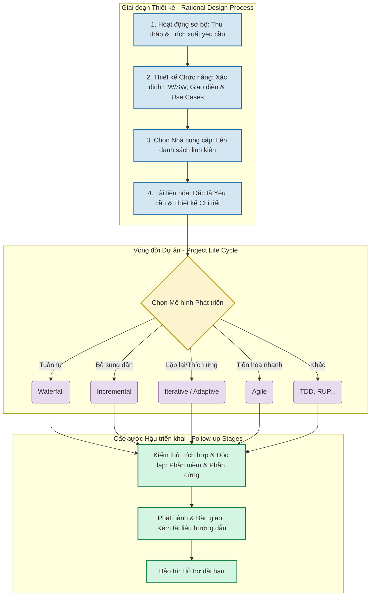

### Quy trình Thiết kế Tối ưu (Rational Design Process)

**1. Các hoạt động sơ bộ (Preliminary Activities)**

- Nghiên cứu, phân tích và tự trau dồi kiến thức.
    
- **Quan trọng nhất:** Trích xuất và thu thập yêu cầu hệ thống (Requirements extraction).
    

**2. Thiết kế Chức năng Hệ thống (System Functional Design)**

- Đây là lĩnh vực của Kỹ thuật hệ thống, có sự tham gia của nhiều chuyên gia (kỹ sư phần mềm, phần cứng, quy trình...).
    
- Nhận diện cụ thể các thành phần phần cứng và phần mềm.
    
- Định nghĩa rõ ràng các giao diện (interfaces) kết nối giữa phần mềm và phần cứng.
    
- Xây dựng các kịch bản Use Case cấp cao để mô phỏng tương tác của người dùng và hành vi của hệ thống.
    

**3. Xác định nhà cung cấp**

- Lập "danh sách mua sắm" các nhà cung cấp linh kiện/thành phần (thường sẽ phải làm việc với nhiều công ty khác nhau).
    

**4. Tài liệu hóa (Đặc biệt quan trọng với dự án lớn)**

- **Mục đích:** Hỗ trợ giải quyết khiếu nại, xử lý thanh toán và làm rõ cơ chế hoạt động của hệ thống.
    
- **Các bộ tài liệu cốt lõi bao gồm:** Phân tích & Đặc tả Yêu cầu, Thiết kế Chức năng, Thiết kế Chi tiết và Hồ sơ Kiểm thử (dùng để nghiệm thu trước khi bàn giao).
    
- **Lưu ý:** Bắt buộc phải áp dụng các phương pháp thiết kế chuẩn mực để viết và bảo trì code hiệu quả (điều này đúng với mọi loại phần mềm, không riêng gì hệ thống thời gian thực).
    

### Phương pháp Vòng đời Dự án (Project Life Cycle Methodologies)

_Giai đoạn này sẽ bắt đầu ngay sau khi quá trình thiết kế phía trên hoàn tất._

**1. Các mô hình phát triển tiêu biểu**

- **Waterfall (Thác nước):** Làm theo trình tự tuyến tính, mỗi giai đoạn đều có kết quả bàn giao (deliverables) cố định.
    
- **Incremental (Tăng trưởng):** Bắt đầu với một bộ tính năng cơ bản, sau đó đắp dần thêm các tính năng mới cho đến khi hoàn thiện.
    
- **Iterative / Adaptive (Lặp lại / Thích ứng):** Ưu tiên tính linh hoạt để liên tục điều chỉnh và đáp ứng các yêu cầu mới.
    
- **Agile (Linh hoạt):** Phù hợp nhất cho các phần mềm cần cập nhật và tiến hóa với tốc độ nhanh.
    
- **Các mô hình khác:** Test Driven Development (TDD), Rational Unified Process (RUP)...
    

**2. Tiêu chí chọn lựa mô hình**

- Việc chọn mô hình nào phụ thuộc vào: Quy mô dự án, tốc độ ra mắt mong muốn, đối tượng người dùng cuối, vị trí địa lý của đội ngũ phát triển và độ ổn định của các yêu cầu ban đầu.
    

**3. Các bước hậu triển khai bắt buộc (Follow-up stages)** Bất kể bạn chọn mô hình vòng đời nào, sau khi code xong đều phải trải qua các giai đoạn sau:

- **Kiểm thử tích hợp (Integration testing):** Đảm bảo phần mềm tương thích và chạy trơn tru trên nền tảng phần cứng.
    
- **Kiểm thử độc lập:** Test riêng lẻ các chức năng của phần mềm và phần cứng.
    
- **Phát hành (Release):** Đưa sản phẩm ra thị trường hoặc bàn giao cho khách hàng.
    
- **Tài liệu phát hành:** Soạn thảo sách hướng dẫn sử dụng (Manuals).
    
- **Bảo trì (Maintenance):** Giai đoạn hỗ trợ, vận hành và sửa lỗi dài hạn.

