### Tổng quan về SA/SD
- Structured Analysis and Structured Design: Nó là một **Phương Pháp**

- SA/SD được phát triển vào thập niên 1970 và 1980, dành riêng cho các ngôn ngữ lập trình cấu trúc như Fortran, Basic, COBOL, Pascal và C.
    
- Phương pháp này bao gồm hai phần chính: 
	- **Phân tích cấu trúc (Structured Analysis)** sử dụng Biểu đồ luồng dữ liệu (DFDs) 
	- **Thiết kế cấu trúc (Structured Design)** sử dụng Biểu đồ cấu trúc (Structure Charts).
### 1. Tổng quan Quy trình Phân tích/Thiết kế (Overview of an Analysis/Design Process)
Dù bạn dùng phương pháp cũ hay mới, một quy trình thiết kế tiêu chuẩn sẽ đi qua 8 bước lặp lại như sau:

- **Bước 1: Trích xuất yêu cầu (Initial Requirements)**
    - Thu thập và xác định rõ các yêu cầu ban đầu của dự án.
        
- **Bước 2: Vẽ Biểu đồ ngữ cảnh (Context Diagram)**
    - Dù không bắt buộc, nhưng bước này rất được khuyến khích sử dụng.
    - Mục đích là để nhận diện nhanh các thực thể bên ngoài (external entities) và các tương tác của chúng với hệ thống.
        
- **Bước 3: Phát triển Use Cases**
    - Xây dựng các kịch bản sử dụng thực tế (scenarios).
        
- **Bước 4: Vẽ Biểu đồ tương tác**
    - Phát triển các biểu đồ Tuần tự (Sequence) và/hoặc biểu đồ Cộng tác/Giao tiếp (Collaboration/Communication) nếu thấy cần thiết.
        
- **Bước 5: Khám phá đối tượng (Object Discovery)**
    - Sử dụng các biểu đồ triển khai như Biểu đồ tác vụ (Object và Activity Diagrams).
    - _(Chỉ dành riêng cho OOP/OOD):_ Tìm kiếm và thiết lập các lớp ứng viên (Candidate Classes) để xử lý tính kế thừa.
        
- **Bước 6: Phân tích sâu hành vi đối tượng (Further Analysis of Object Behaviours)**
    - Phát triển các biểu đồ trạng thái (như State charts, State Machines Diagrams).
    - Nhóm các tác vụ/luồng (tasks/threads) có tính chất giống nhau lại.
    - Xác định trình tự truyền thông điệp (messaging sequences) cuối cùng.
        
- **Bước 7: Thiết kế kiến trúc cấp cao (Top-Level Architectural Design)**
    - Xác định tính đồng thời (concurrency) của các tác vụ và luồng.
    - Đối chiếu và gắn kết các luồng/phần mềm này sao cho khớp với phần cứng (Match to hardware).
        
- **Bước 8: Lặp lại (Iterate through again...)**
    - Quay lại lặp qua các bước trên để liên tục tinh chỉnh và hoàn thiện hệ thống.
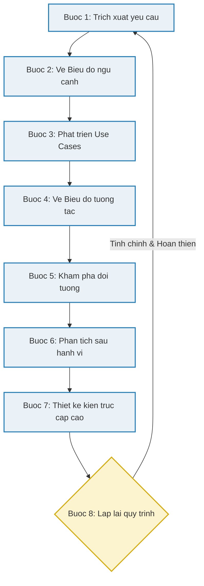

### 2. Context Diagram (Bước 2 trong quy trình SA-SD)
- **Định nghĩa:** Biểu đồ ngữ cảnh còn được gọi là Context-Level DFD hoặc Level-0 DFD. Đây là biểu đồ luồng dữ liệu ở mức cao nhất, thực hiện việc trừu tượng hóa (che đi) toàn bộ chi tiết hoạt động bên trong hệ thống.
- **Sự tương đồng:** Nó có tính chất rất giống với biểu đồ Use Case (không chính thức) được sử dụng trong thiết kế UML.
- **Notation:** *Biểu đồ này luôn đặt **hệ thống ở vị trí trung tâm như một quy trình cấp cao duy nhấ**t, hoàn toàn không hiển thị cấu trúc bên trong, và được **bao quanh bởi các hệ thống/môi trường tương tác với nó**.*

| **Thành phần**                                    | **Ý nghĩa**                                                       | **Ký hiệu thường dùng**                                                     |
| ------------------------------------------------- | ----------------------------------------------------------------- | --------------------------------------------------------------------------- |
| **Quy trình hệ thống (System Process/Entity)**    | Đại diện cho toàn bộ hệ thống đang được phân tích.                | **Hình tròn** chứa tên của quy trình.                                       |
| **Thực thể bên ngoài (External/Actors Entities)** | Các hệ thống hoặc người dùng có tương tác với hệ thống trung tâm. | Các hộp/nhãn có tên, thường là **Hình chữ nhật**.                           |
| **Kho dữ liệu (Data Stores)**                     | Nơi lưu trữ thông tin của hệ thống.                               | **Hai đường thẳng song song** (theo chiều ngang) hoặc đôi khi là hình elip. |
| **Luồng dữ liệu (Data Flows/Relationships)**      | Chỉ ra sự tương tác và hướng di chuyển của dữ liệu.               | **Đường thẳng hoặc cong có mũi tên** để chỉ hướng luồng dữ liệu.            |

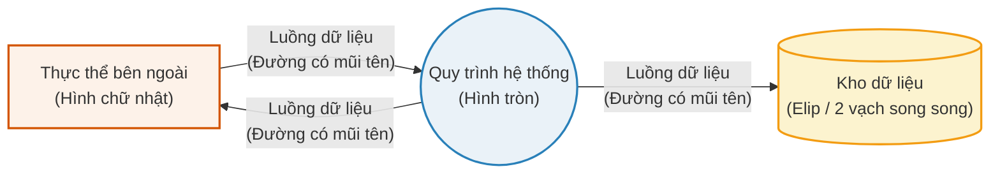

- **Ưu và nhược điểm:**
	Dưới đây là bảng phân chia thành 2 cột Ưu điểm và Hạn chế theo yêu cầu của bạn:

| **Ưu điểm (Benefits)**                                                                                                                                        | **Hạn chế (Limitations)**                                                                                                                                                         |
| ------------------------------------------------------------------------------------------------------------------------------------------------------------- | --------------------------------------------------------------------------------------------------------------------------------------------------------------------------------- |
| Giúp người xem nhìn nhận nhanh chóng phạm vi, ranh giới của hệ thống và các hệ thống khác giao tiếp với nó.                                                   | Nhược điểm lớn nhất là biểu đồ này hoàn toàn không cung cấp bất kỳ thông tin nào về mặt thời gian, trình tự (sequencing), hay sự đồng bộ hóa (synchronization) của các quy trình. |
| Hoàn toàn không yêu cầu kiến thức kỹ thuật chuyên sâu để đọc hiểu sơ đồ.                                                                                      |                                                                                                                                                                                   |
| Rất dễ vẽ và chỉnh sửa nhờ hệ thống ký hiệu giới hạn và đơn giản.                                                                                             |                                                                                                                                                                                   |
| Dễ dàng làm cơ sở để mở rộng và phát triển thêm các cấp độ DFD chi tiết hơn.                                                                                  |                                                                                                                                                                                   |
| Mang lại giá trị cho nhiều đối tượng khác nhau: từ các bên liên quan (stakeholders), nhà phân tích nghiệp vụ, chuyên viên dữ liệu cho đến các lập trình viên. |                                                                                                                                                                                   |

### 3. DFD (Data-flow-Diagram)
#### Đặc điểm cốt lõi của Level-1 DFD
- **Vị trí trong quy trình:** Đây là mức độ chi tiết và phân rã (decomposition) thứ hai của hệ thống, ngay dưới Biểu đồ ngữ cảnh.
    
- **Chức năng chính:** Nó chia nhỏ (break down) bài toán của hệ thống thành nhiều **quy trình (processes)** cụ thể và hiển thị cách thức **dữ liệu luân chuyển (data flowing)** giữa các quy trình đó.
    
- **Phạm vi bao phủ toàn diện:** Một nguyên tắc quan trọng là Level-1 DFD phải nắm bắt **tất cả mọi thứ** của hệ thống, chứ không chỉ phác thảo riêng các khía cạnh về phần mềm. Nó bao gồm cả những công việc thủ công, không liên quan đến máy tính (do by hand).
#### Khắc phục hạn chế của Context Diagram 
Thể hiện trình tự thực thi: Như chúng ta đã phân tích ở phần trước, hạn chế lớn nhất của Context Diagram là không cho biết trình tự. Đến Level-1 DFD, các quy trình đã được đánh số thứ tự (numbered) để cung cấp chi tiết về thứ tự thực thi của chúng.

#### Phương pháp tiếp cận thiết kế
**Bắt đầu bằng bản nháp:** Thiết kế ban đầu thường được bắt đầu bằng các sơ đồ vẽ tay. Chúng không cần (và thường không thể) hoàn hảo ngay từ đầu, mà sẽ đóng vai trò là nền tảng để tiếp tục chỉnh sửa, thay đổi (altered) trong quá trình phát triển.

#### Ví dụ:
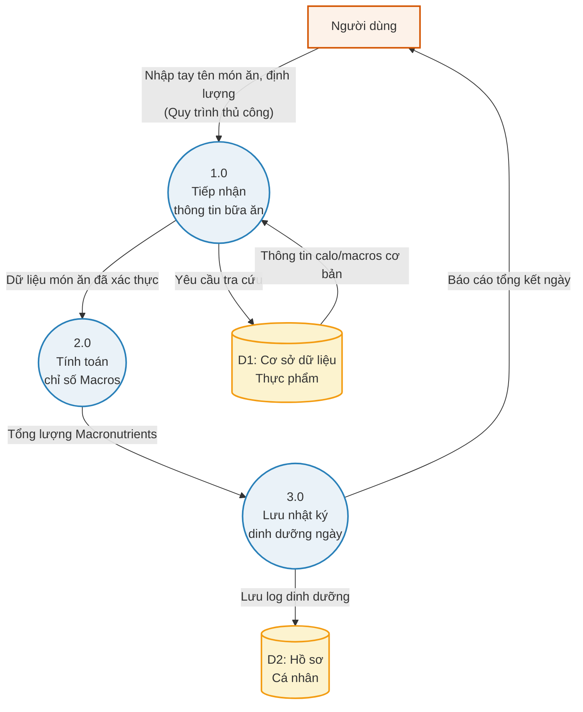
#### Phân tích các đặc điểm của Level-1 DFD trong ví dụ này:

- **Sự phân rã (Decomposition):** Thay vì một cục "Hệ thống chung", bài toán đã được bẻ gãy thành 3 quy trình cụ thể: Tiếp nhận món ăn -> Tính toán dinh dưỡng -> Lưu trữ nhật ký.
    
- **Đánh số thứ tự (Numbered processes):** Các quy trình được gắn nhãn `1.0`, `2.0`, `3.0` để thể hiện rõ ràng luồng thực thi từ lúc người dùng nhập dữ liệu đến khi xuất ra báo cáo.
    
- **Thao tác thủ công (Do by hand):** Nhìn vào luồng dữ liệu từ `Người dùng` đến `1.0`, bạn sẽ thấy hành động "Nhập tay tên món ăn, định lượng". DFD mức này ghi nhận cả những hành động vật lý/thủ công diễn ra trước khi máy tính bắt đầu xử lý, đúng như nguyên tắc "bao gồm mọi khía cạnh, không chỉ phần mềm" mà bài giảng của bạn đã đề cập.
    
- **Kho dữ liệu lộ diện (Data Stores):** Ở Level-0, kho dữ liệu bị giấu đi. Ở Level-1, các Data Store như `D1` (CSDL Thực phẩm) và `D2` (Hồ sơ cá nhân) đã xuất hiện để chỉ rõ dữ liệu đang được lấy từ đâu và lưu vào đâu.

### 4. Biểu đồ cấu trúc (Structure Chart) - Chuyển đổi từ DFD

**Mục đích:** Sau khi có DFD (tập trung vào dữ liệu), bước tiếp theo là chuyển đổi nó thành Biểu đồ cấu trúc để định nghĩa các khía cạnh về **phần mềm**. Biểu đồ này thể hiện trình tự luồng của quy trình chính (executive) khi nó gọi đến các quy trình hoặc chức năng khác.

**Nguyên tắc thực thi & Nhất quán:**

- **Thứ tự ưu tiên:** Các chức năng được gọi theo thứ tự từ trên xuống dưới (Top to Bottom) và từ trái sang phải (Left to Right).
    
- **Sự nhất quán (Consistency):** Bắt buộc phải duy trì sự liên kết chặt chẽ giữa Context Diagram (Level-0), DFD (Level-1) và Structure Chart. Ví dụ: Quy trình 2.0 (Nhập dữ liệu) ở DFD sẽ ánh xạ trực tiếp thành chức năng `Enter Student Information` trên Structure Chart.
    
![[Pasted image 20260801214607.png]]

Tóm gọn lại, biểu đồ này (**Structure Chart**) mô tả cách tổ chức code của phần mềm trong thực tế:
- **Cấu trúc:** Chia chương trình chính (khối màu vàng) thành các hàm/module nhỏ (khối màu xanh).
- **Thứ tự chạy:** Mã nguồn sẽ ưu tiên thực thi từ trên xuống dưới, và **từ trái sang phải** (Nhập thông tin -> Đăng ký -> Thu tiền).
- **Mũi tên đỏ:** Minh họa tính liên kết. Nó cho thấy quy trình 2.0 (từ sơ đồ DFD trước đó) được ánh xạ chính xác thành hàm `Enter Student Information` trong mã nguồn.
### 5. DFD cho Hệ thống thời gian thực (Real-Time Systems)

**Hạn chế cốt lõi của DFD truyền thống:**

Dù chi tiết đến đâu, DFD vẫn có một khiếm khuyết nghiêm trọng là không thể chỉ định đầy đủ **thời gian (timing)** và **chức năng (functionality)** của từng quá trình chuyển đổi dữ liệu.

**Bản nâng cấp (Năm 1985):**

Để khắc phục điểm yếu trên, DFD được bổ sung thêm các thành phần mới để tách biệt hoàn toàn hoạt động lập lịch (scheduling) khỏi luồng dữ liệu đầu vào.

- **Quy trình Điều khiển (Control Processes):** Đóng vai trò như các bộ lập lịch, điều phối thời điểm hoạt động của các quy trình dữ liệu.
    
- **Ký hiệu mới (Notations):** Cập nhật để phân biệt rõ giữa luồng sự kiện/kích hoạt và tin nhắn/dữ liệu thông thường.
    

|**Thành phần mới**|**Ý nghĩa**|**Ký hiệu thường dùng**|
|---|---|---|
|**Control process**|Quy trình điều khiển / Bộ lập lịch|**Hình tròn nét đứt**|
|**Event flow**|Luồng sự kiện / Tín hiệu kích hoạt|**Mũi tên nét đứt**|
|**Continuous data flow**|Luồng dữ liệu chạy liên tục|**Mũi tên nét liền**|

*Theo danh sách ký hiệu (legend) được cung cấp, hệ thống bao gồm 7 thành phần cơ bản:*
![[Pasted image 20260801220149.png|263]]
-  **Control process (Quy trình điều khiển):** Ký hiệu bằng hình tròn nét đứt (ví dụ: Pump control). Đóng vai trò làm bộ lập lịch hoặc quản lý luồng sự kiện.
    
- **Data process (Quy trình dữ liệu):** Ký hiệu bằng hình tròn nét liền (ví dụ: Low-pass filter). Đại diện cho các tác vụ xử lý thông tin thông thường.
    
- **Data source/sink (Nguồn/Đích dữ liệu):** Ký hiệu bằng hình chữ nhật (ví dụ: Sensor array). Thể hiện các thực thể bên ngoài cung cấp dữ liệu đầu vào hoặc nhận dữ liệu đầu ra.
    
- **Data store (Kho dữ liệu):** Ký hiệu bằng hai đường gạch ngang song song (ví dụ: User signatures). Nơi lưu trữ thông tin của hệ thống.
    
- **Event flow (Luồng sự kiện):** Ký hiệu bằng mũi tên nét đứt (ví dụ: Go/NoGo). Thể hiện tín hiệu kích hoạt hoặc điều khiển (không mang theo dữ liệu).
    
- **Discrete data flow (Luồng dữ liệu rời rạc):** Ký hiệu bằng mũi tên nét liền có một đầu nhọn (ví dụ: message). Dữ liệu được gửi đi theo từng gói hoặc thông điệp riêng biệt.
    
- **Continuous data flow (Luồng dữ liệu liên tục):** Ký hiệu bằng mũi tên nét liền với hai đầu nhọn liên tiếp (ví dụ: temp). Đại diện cho luồng thông tin được truyền đi liên tục (như tín hiệu nhiệt độ từ cảm biến).
    
Về hình ảnh thứ hai, đây là một ví dụ minh họa cách các thành phần này kết hợp. Một **Control process (Cntrl)** sử dụng các **Event flow** (mũi tên nét đứt) để điều phối hoạt động của các **Data process (T1, T2, T3)**. Trong khi đó, T1, T2 và T3 giao tiếp với nhau qua các luồng dữ liệu (mũi tên nét liền).

Phác thảo lại bằng Mermaid:
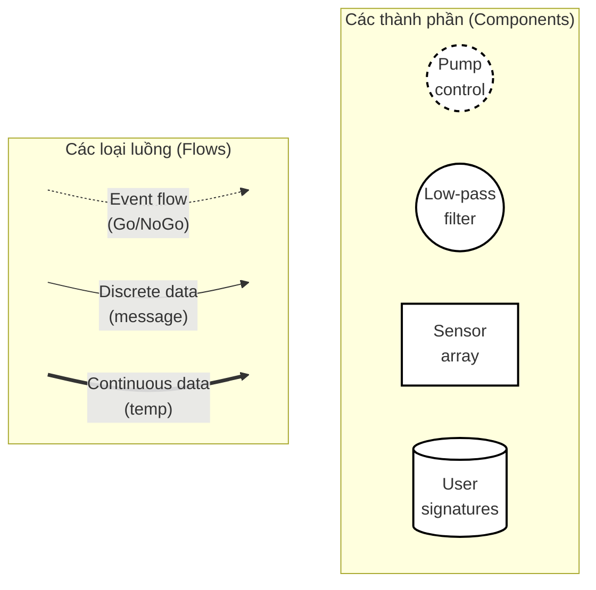

![[Pasted image 20260801220423.png]]

- **T1, T2, T3:** Là các quy trình xử lý dữ liệu thông thường (như tính toán, đọc cảm biến, lọc thông tin...).
    
- **Mũi tên nét liền:** Thể hiện luồng dữ liệu thực tế. Dữ liệu đi từ ngoài vào `T1`, xử lý xong truyền sang `T2`, tiếp tục qua `T3` rồi xuất ra ngoài.
- **Cntrl (Control):** Đóng vai trò là "người quản đốc" (bộ lập lịch). Quy trình này hoàn toàn không đụng vào dữ liệu, nó chỉ làm nhiệm vụ quản lý.
    
- **Mũi tên nét đứt:** Thể hiện các tín hiệu sự kiện (chỉ mang tính chất kích hoạt lệnh, không chứa dữ liệu).
    
    - _Mũi tên đứt đi vào Cntrl:_ Hệ thống nhận được các sự kiện từ môi trường (ví dụ: nút bấm được nhấn, cảm biến báo quá nhiệt).
        
    - _Mũi tên đứt từ Cntrl chỉ vào T1, T2, T3:_ Dựa trên sự kiện nhận được, `Cntrl` sẽ phát tín hiệu ra lệnh cho các quy trình T1, T2, T3 biết lúc nào thì được phép "Bật" hoặc "Tắt".
### 6. Máy trạng thái hữu hạn (Finite State Machines - FSM)

Với các hệ thống có hành vi phức tạp, phụ thuộc vào sự kiện và thời gian thực, DFD là chưa đủ. Lúc này, **Máy trạng thái hữu hạn (FSM)** được sử dụng kết hợp để kiểm soát luồng chuyển đổi trạng thái.

- **Quy trình kết hợp:** Bắt đầu bằng Context Diagram (để nhận diện Input và Output) $\rightarrow$ Phát triển thành Biểu đồ trạng thái hữu hạn (FSD - Finite State Diagram).
    
- **Lợi ích:** Cung cấp sự hỗ trợ mạnh mẽ, bao quát mọi ngóc ngách của hệ thống trong cả giai đoạn thiết kế lẫn triển khai code.
    

**Ví dụ: FSD cho Lò nướng bánh mì thông minh**

Mã Mermaid dưới đây mô phỏng lại luồng trạng thái từ slide, thể hiện rõ cách hệ thống phản ứng với các Input (thêm bánh, nút bấm, hết giờ) để chuyển đổi qua lại giữa các trạng thái.

Đoạn mã

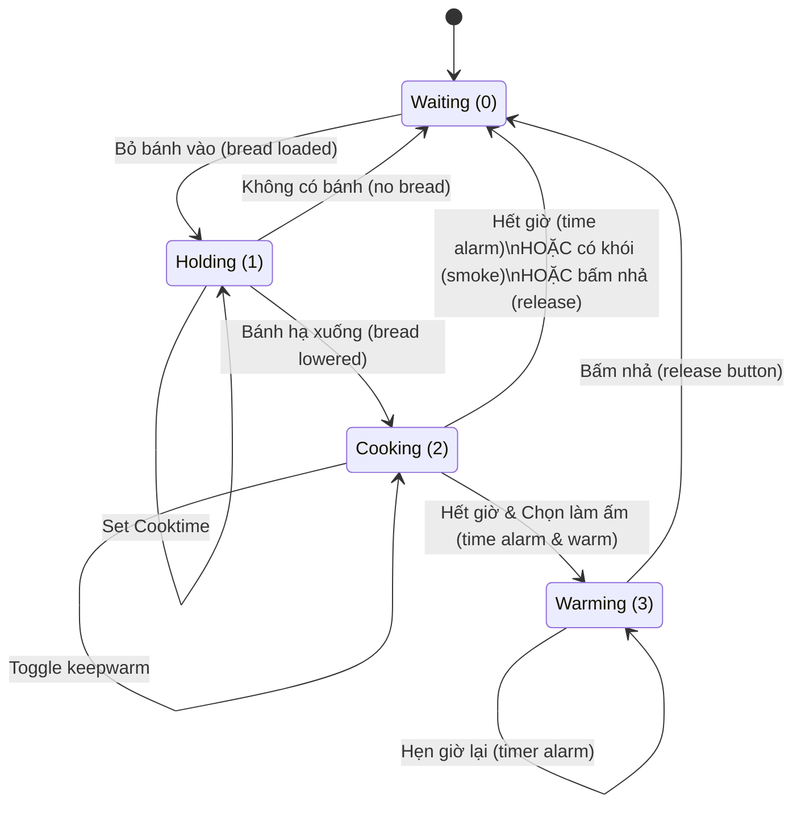
### 7. Ngôn ngữ Mô hình hóa Thống nhất (UML - Unified Modeling Language)

Sau kỷ nguyên của ***SA/SD***, sự phát triển của các hệ thống phức tạp và lập trình hướng đối tượng (OOP) đã đòi hỏi một phương pháp tiếp cận mới. Đó là lúc UML ra đời.

**Tổng quan & Lịch sử:**

- **Định nghĩa:** UML là một tập hợp các bản vẽ đồ họa được sử dụng để mô tả hệ thống bằng cách thể hiện các cấu trúc (constructs) và mối quan hệ (relationships) của chúng.
    
- **Tiến trình phát triển:** Xuất hiện vào giữa thập niên 1990 (sau khi SA/SD đã định hình). Đến những năm 2000, phiên bản UML 2.0 ra đời với tính chất phức tạp và bao quát hơn rất nhiều.
    
- **Vị thế hiện tại:** UML đã thay thế hoàn toàn các phương pháp tiếp cận SA/SD cũ và trở thành **tiêu chuẩn mặc định (de facto standard)** trong ngành công nghiệp phần mềm hiện nay. Dù vậy, UML vẫn chia sẻ nhiều điểm chung cốt lõi với các biểu đồ SA/SD và đã được điều chỉnh để hỗ trợ cả thiết kế hệ thống thời gian thực.
    

**Hai góc nhìn cốt lõi của UML (Two Views):** Khi mô hình hóa một hệ thống bằng UML, chúng ta luôn phải đánh giá qua 2 lăng kính:

1. **Góc nhìn tĩnh (Static view):** Bắt chụp lại _cấu trúc tĩnh_ của hệ thống. Nó định nghĩa hệ thống được cấu tạo từ đâu thông qua các đối tượng (objects), thuộc tính (attributes), phương thức hoạt động (operations) và các mối quan hệ (relationships).
    
2. **Góc nhìn động (Dynamic view):** Bắt chụp lại _hành vi động_ của hệ thống. Nó trực quan hóa cách các đối tượng cộng tác với nhau (collaborations) và sự thay đổi trạng thái bên trong của chúng theo thời gian.
    

**Phân loại Biểu đồ UML (UML Diagrams Taxonomy)** Dựa trên 2 góc nhìn trên, UML chia hệ thống biểu đồ của mình thành 2 nhánh chính: **Structural** (Cấu trúc - thiên về tĩnh) và **Behavioral** (Hành vi - thiên về động).

Dưới đây là sơ đồ Mermaid tổng hợp các loại biểu đồ UML được đề cập trong slide:

``` mermaid
flowchart TD
    %% Khối gốc
    Root["<b>UML Diagrams</b><br>Ngôn ngữ Mô hình hóa Thống nhất"]

    %% Hai nhánh chính
    Str["<b>Structural Diagrams</b><br>(Biểu đồ cấu trúc / Góc nhìn tĩnh)"]
    Beh["<b>Behavioral Diagrams</b><br>(Biểu đồ hành vi / Góc nhìn động)"]

    Root --> Str
    Root --> Beh

    %% Nhánh Structural (Màu trắng)
    Str --- S1["Class Diagram"]
    Str --- S2["Profile Diagram"]
    Str --- S3["Composition Structure Diagram"]
    Str --- S4["Package Diagram"]
    Str --- S5["Component Diagram"]
    Str --- S6["Deployment Diagram"]
    
    %% Object Diagram có màu xanh trong slide
    Str --- S7("Object Diagram")
    style S7 fill:#d5f5e3,stroke:#2ecc71,stroke-width:2px

    %% Nhánh Behavioral (Đa số màu xanh)
    Beh --- B1("Use Case Diagrams")
    Beh --- B2("Sequence Diagram")
    Beh --- B3("Activity Diagram")
    Beh --- B4("State Machine Diagram")
    Beh --- B5("Communication Diagrams")
    
    %% Interaction Overview có màu trắng trong slide
    Beh --- B6["Interaction Overview Diagram"]
    
    %% Ghi chú: Trong slide gốc có sự lặp lại của Deployment Diagram ở nhánh Behavioral, 
    %% điều này có thể là lỗi đánh máy của bài giảng vì Deployment thuộc về Structural.
    Beh --- B7["Deployment Diagrams (Lặp)*"]

    %% Tùy chỉnh màu sắc
    classDef rootBox fill:#fcf3cf,stroke:#f1c40f,stroke-width:2px;
    classDef branchBox fill:#eaf2f8,stroke:#2980b9,stroke-width:2px;
    classDef whiteBox fill:#ffffff,stroke:#333333,stroke-width:1px;
    classDef greenBox fill:#d5f5e3,stroke:#2ecc71,stroke-width:2px;

    class Root rootBox;
    class Str,Beh branchBox;
    class S1,S2,S3,S4,S5,S6,B6,B7 whiteBox;
    class B1,B2,B3,B4,B5 greenBox;
```

- **Tài nguyên tham khảo:** Slide liệt kê các trang web hữu ích để tra cứu đặc tả UML (uml.org), xem hướng dẫn (tutorialspoint), và công cụ vẽ sơ đồ bằng mã lệnh (plantuml.com).
	(Rất recommend uml.org)

### 8. Phương pháp COMET (Concurrent Object Modeling and Architectural Design)
Tổng quan về COMET:
- **Nguồn gốc:** Được phát triển bởi Hassan Gomaa, đây là một phương pháp luận thiết kế phần mềm được tạo ra đặc biệt để **dành riêng cho thiết kế UML**.
    
- **Đặc điểm cốt lõi:** COMET là một phương pháp phát triển phần mềm hướng đối tượng (object-oriented) có tính lặp lại cao (highly iterative).
    
- **Tiếp cận qua Use Case:** Phương pháp này định nghĩa các yêu cầu chức năng của hệ thống thông qua các **Tác nhân (Actors)** và **Ca sử dụng (Use cases)**.
    
    - Mỗi Use case xác định một chuỗi các tương tác giữa một (hoặc nhiều) Actor với hệ thống.
        
    - Một Use case có thể được xem xét ở nhiều mức độ chi tiết khác nhau tùy vào từng giai đoạn.

**3 Giai đoạn Mô hình hóa của COMET:** *COMET giải quyết toàn diện bài toán phát triển phần mềm thông qua 3 giai đoạn mô hình hóa chính:*
- **Giai Đoạn 1. Requirements Modelling (Mô hình hóa Yêu cầu):** Đây là bước khởi đầu để định hình hệ thống, bao gồm:

- Thu thập yêu cầu (Gather Requirements).
    
- Tài liệu hóa các yêu cầu (Document Requirements).
    
- Phát triển Biểu đồ ngữ cảnh ban đầu (Context diagram) và các Use Cases sơ bộ.
    

**Giai Đoạn 2. Analysis Modelling (Mô hình hóa Phân tích):** Giai đoạn đi sâu vào làm rõ các yêu cầu đã thu thập:

- Tinh chỉnh và phát triển các đặc tả chi tiết (Refine and develop specifications).
    
- Chốt lại và phát triển các Use Cases cuối cùng (Develop final Use Cases).
    

**Giai Đoạn 3. Design Modelling (Mô hình hóa Thiết kế):** Chuyển từ "hệ thống cần làm gì" sang "hệ thống sẽ được xây dựng như thế nào":

- **Mô hình hóa Kiến trúc (Architectural Modelling):** Liên quan đến việc thiết kế sự cộng tác của các gói (packages), các tác vụ (tasks) hoặc các bộ xử lý (processors) để tạo nên kiến trúc tổng thể của phần mềm.

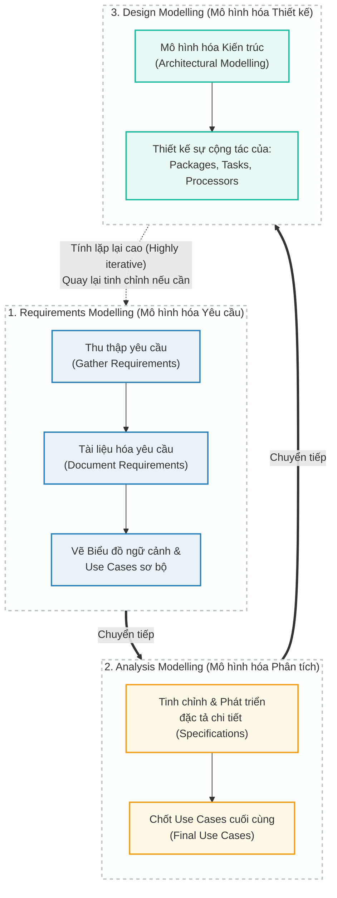

![[Pasted image 20260801231209.png]]

### 9. Biểu đồ Use Case (Use Case Diagrams)

Bước tiếp theo của quy trình là phát triển các biểu đồ Use Case cụ thể cho từng kịch bản nhằm chia nhỏ biểu đồ ngữ cảnh thành các chi tiết sâu hơn. Lưu ý quan trọng là ở bước này, chúng ta không xem xét đến các kiểu dữ liệu (data types) hay tốc độ truyền tải.

Biểu đồ Use Case là một tập hợp các kịch bản được liên kết với nhau bởi một mục tiêu chung của người dùng. Hệ thống được cấu thành bởi 2 yếu tố chính:

**9.1. Tác nhân (Actors):** Có thể là con người hoặc một hệ thống bên ngoài.

- **Tác nhân chính (Primary actors):** Thường là con người, là bên chủ động khởi tạo một kịch bản sử dụng.
    
- **Tác nhân phụ (Secondary actors):** Thường là các hệ thống bên ngoài, tham gia vào kịch bản bằng cách tiếp nhận đầu ra và cung cấp đầu vào cho hệ thống.
    

**9.2. Kịch bản (Scenarios):** Có thể được mô tả bằng lời văn hoặc các biểu đồ phù hợp (như state machines hoặc sequence diagrams).

- **Kịch bản chính (Primary Scenarios):** Mô tả cách phần mềm sẽ hoạt động trong các tình huống bình thường, chỉ ra những cách chính yếu mà Use Case được thực thi.
    
- **Kịch bản phụ (Secondary Scenarios):** Xử lý các tình huống đầu vào có thể bị lỗi, bao gồm các phương án xử lý ngoại lệ (exception handling) và các vấn đề an toàn (safety issues).
    

### 10. So sánh `<<include>>` và `<<extend>>`

Dưới đây là bảng phân biệt hai mối quan hệ cốt lõi thường dùng để cấu trúc các Use Case:

| **Tiêu chí**      | **<<include>> (Bao gồm)**                                                                                                     | **<<extend>> (Mở rộng)**                                                                  |
| ----------------- | ----------------------------------------------------------------------------------------------------------------------------- | ----------------------------------------------------------------------------------------- |
| **Bản chất**      | Là mối quan hệ có hướng cho thấy hành vi của Use Case phụ được chèn trực tiếp vào hành vi của Use Case gốc.                   | Là mối quan hệ có hướng xác định cách thức và thời điểm một hành vi được định nghĩa thêm. |
| **Tính bắt buộc** | **Bắt buộc (Required)**. Quá trình này được định nghĩa riêng biệt nhưng hệ thống bắt buộc phải có nó để hoàn thành quy trình. | **Tùy chọn (Optional)**. Việc có gọi nó hay không phụ thuộc vào từng tình huống cụ thể.   |
| **Tính trọn vẹn** | Use Case gốc sẽ bị thiếu hụt nếu không gọi Use Case được include.                                                             | Use Case gốc (như "Registration") tự nó đã hoàn chỉnh và mang đầy đủ ý nghĩa độc lập.     |

### 11. Giải mã Chiều mũi tên (Trực quan hóa)

Việc nhầm lẫn chiều mũi tên giữa 2 mối quan hệ này là cực kỳ phổ biến. Cách dễ nhất để không bao giờ quên là hiểu logic đằng sau nó:

- **Mũi tên của `<<include>>`: Hướng từ Gốc $\rightarrow$ Phụ.**
    
    - _Cách nhớ:_ Use Case gốc "chỉ tay" gọi Use Case phụ ra làm việc.
        
    - _Theo slide:_ Use Case `Bank ATM Transaction` bắt buộc phải gọi `Customer Authentication`. Mũi tên đi từ Gốc ra Phụ.
        
- **Mũi tên của `<<extend>>`: Hướng từ Phụ $\rightarrow$ Gốc.**
    
    - _Cách nhớ:_ Use Case phụ tự động "chạy đến bám vào" Use Case gốc khi có điều kiện phù hợp. Bản thân Use Case gốc không hề biết sự tồn tại của cái phụ này.
        
    - _Theo slide:_ Use Case `Get Help On Registration` tự động mở rộng và bám vào `Registration`. Mũi tên đi từ Phụ về Gốc.
        

Đoạn mã

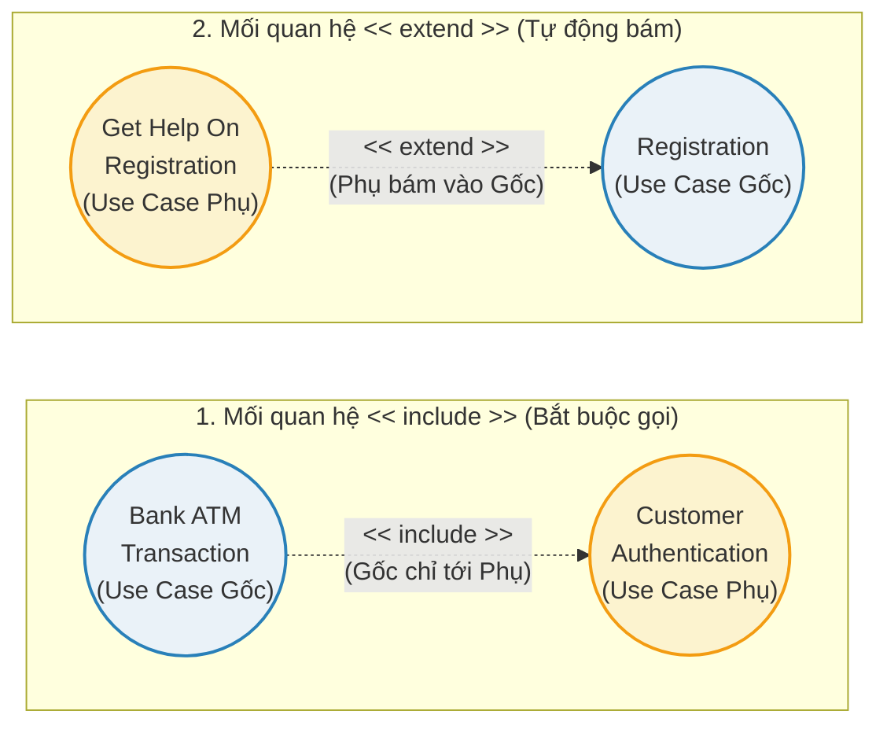

### 12. Vai trò của Use Case qua các Giai đoạn Thiết kế (Design Phases)

Use Case không chỉ dùng để vẽ lúc đầu mà mang lại giá trị xuyên suốt vòng đời phát triển phần mềm:

- **Phân tích (Analysis):** Gợi ý cách phân chia không gian miền quy mô lớn, cấu trúc các đối tượng phân tích, làm rõ trách nhiệm của hệ thống, đồng thời nắm bắt và xác thực các tính năng mới.
    
- **Thiết kế (Design):** Dùng để xác thực sự chi tiết hóa của các mô hình phân tích trước sự hiện diện của các đối tượng thiết kế.
    
- **Lập trình (Coding):** Giúp lập trình viên làm rõ mục đích, vai trò của các classes và tập trung nỗ lực code vào đúng chỗ.
    
- **Kiểm thử (Testing):** Cung cấp các kịch bản kiểm thử (test scenarios) chính và phụ để xác thực hệ thống.
    
- **Triển khai (Deployment):** Gợi ý việc tạo ra các bản nguyên mẫu lặp (iterative prototypes) cho mô hình phát triển xoắn ốc.

### 13. Giai đoạn Mô hình hóa Thiết kế (Design Modeling) trong COMET

Giai đoạn ***Thiết kế được sử dụng để thiết kế kiến trúc phần mềm của hệ thống***.

- Giai đoạn này ***ánh xạ mô hình phân tích (nhấn mạnh vào không gian vấn đề) sang mô hình thiết kế (nhấn mạnh vào không gian giải pháp***).
    
- Mô hình phân tích cũng được ánh xạ vào môi trường vận hành thực tế (ví dụ: hệ thống phân tán, đơn lõi, đa lõi, v.v.).
    
- Để mô tả toàn bộ hệ thống hoặc các hệ thống con chi tiết, phương pháp này dùng biểu đồ Triển khai (Deployment diagram) để hiển thị các bộ xử lý và các module hoặc tác vụ chính cho từng bộ xử lý.
    
- Để đi sâu vào chi tiết cụ thể, ta có thể thay thế biểu đồ đối tượng truyền thống bằng biểu đồ Giao tiếp (Communication diagram) hoặc biểu đồ Đối tượng Hoạt động (Active Object diagram) để thể hiện rõ các luồng tin nhắn (message flows) giữa các tác vụ.

- Ta có thể sử dụng biểu đồ CODARTS Data Flow hoặc Task diagram để nắm bắt sự liên kết giữa các chức năng tác vụ của đối tượng (objects task functions) và các kênh giao tiếp (communication channels).
___
![[Pasted image 20260802063000.png]]

```mermaid
flowchart LR
    %% Cột bên trái: Luồng Hoạt động (Activity Diagram)
    subgraph Left ["Active Object (Task) - Activity Diagram"]
        direction TB
        A1["Initialize<br>Object"]
        A2[/"Wait for<br>Event"\]
        A3["Handle<br>Event"]
        A4{" "}
        A5["Terminate<br>Object"]
        
        A1 --> A2
        A2 --> A3
        A3 --> A4
        A4 -->|"Loop"| A2
        A4 -->|"Exit"| A5
    end
    
    %% Cột bên phải: Biểu đồ Trạng thái (State Machine)
    subgraph Right ["State Machine Diagram"]
        direction TB
        S0((" "))
        S1("created")
        S2("ready")
        S3(((" ")))
        
        S0 -->|"initial state"| S1
        S1 -->|"start/^master.ready()"| S2
        S2 -->|"poll/^master.ack()"| S2
        S2 -->|"stop/"| S3
    end
    
    %% Các đường đứt nét thể hiện sự ánh xạ (Mapping)
    A1 -.-> S0
    A1 -.-> S1
    A2 -.-> S1
    A2 -.-> S2
    A3 -.->|"transition / action"| S2
    A5 -.-> S3
    
    %% Tùy chỉnh màu sắc cho giống slide gốc
    classDef leftBox fill:#f5b7b1,stroke:#922b21,stroke-width:2px;
    classDef rightBox fill:#fcf3cf,stroke:#9a7d0a,stroke-width:2px;
    classDef dot fill:#111,stroke:#111;
    classDef loopBox fill:#fff,stroke:#111;

    class A1,A2,A3,A5 leftBox;
    class A4 loopBox;
    class S1,S2 rightBox;
    class S0,S3 dot;
    
    %% Định dạng CSS cho đường viền của 2 Subgraph
    style Left fill:#fdfefe,stroke:#bdc3c7,stroke-width:2px,stroke-dasharray: 5 5
    style Right fill:#e0f7fa,stroke:#00838f,stroke-width:2px
```
Về biểu đồ này, đây là một minh họa trực quan để giải thích **mối liên hệ mật thiết giữa luồng công việc (Activity) và sự thay đổi trạng thái (State) bên trong của một đối tượng**.
Theo nội dung slide, các biểu đồ State Machine được dùng để xem xét hành vi của một đối tượng duy nhất xuyên suốt một hoặc nhiều Use Case một cách chi tiết. Chúng rất hữu ích cho các tiến trình đồng thời (giống như biểu đồ FSM trong SA/SD) và thường được dùng trong các Hệ thống Thời gian thực.
Biểu đồ này chia làm 2 nửa, được kết nối với nhau bằng các đường đứt nét để chỉ ra sự tương đồng:
- Góc nhìn Hoạt động (Activity Diagram) (Nửa bên trái): Đây là luồng thực thi các tác vụ (Task) của một đối tượng hoạt động (Active Object). Nó mô tả các bước mà đối tượng phải làm: 

Khởi tạo (Initialize Object) $\rightarrow$ Chờ sự kiện (Wait for Event) $\rightarrow$ Xử lý sự kiện (Handle Event) $\rightarrow$ Kết thúc (Terminate Object).

- Góc nhìn Trạng thái (State Machine Diagram) (Nửa bên phải):
	- Phần này chú thích các thuật ngữ cấu thành nên một bản vẽ State Machine chuẩn:
		- **initial state:** Trạng thái bắt đầu (chấm đỏ nhỏ).
		    
		- **superstate:** Trạng thái cha (khung màu xanh lơ nhạt bao trùm tất cả).
		    
		- **state:** Các trạng thái cụ thể như `created` (đã tạo) và `ready` (sẵn sàng).
		    
		- **trigger:** Sự kiện kích hoạt mũi tên chuyển đổi, ví dụ như `start` hoặc `poll`.
		    
		- **action expression:** Hành động hoặc thông điệp phản hồi đi kèm sau dấu `/`, ví dụ như `^master.ready()` hoặc `^master.ack()`.
		    
		- **transition:** Quá trình chuyển tiếp giữa các trạng thái (đường mũi tên liền).
		    
		- **final state:** Trạng thái kết thúc vòng đời (chấm vàng có viền đỏ).
- **Sự liên kết (Ánh xạ qua các đường đứt nét):** Mục đích cốt lõi của hình này là cho thấy hai biểu đồ thực chất đang mô tả cùng một vòng đời, chỉ khác góc nhìn:

	- Hành động **"Initialize Object"** (Khởi tạo) chính là lúc hệ thống đi từ điểm bắt đầu (_initial state_) chui vào trạng thái **`created`**.
    
	- Khối **"Wait for Event"** (Chờ đợi) chính là lúc đối tượng đang nằm im nghỉ ngơi tại trạng thái **`created`** hoặc **`ready`**, chờ đợi một tác động (_trigger_) từ bên ngoài.
    
	- Khối **"Handle Event"** (Xử lý) đại diện cho chính khoảnh khắc mũi tên chuyển đổi (_transition_) được kích hoạt và đối tượng thực thi các đoạn mã phản hồi (_action expression_).
    
	- Cuối cùng, khi tác vụ bị hủy thông qua **"Terminate Object"**, nó tương ứng với việc đối tượng nhận lệnh `stop` và đi vào cõi diệt (_final state_).
***LƯU Ý:*** *Nói tóm lại, anh chỉ dùng hình này để hiểu bản chất của việc chuyển đổi từ tư duy code (Task logic) sang tư duy thiết kế (State Machine). Khi làm bài tập thiết kế hệ thống thực tế hoặc vẽ trên các công cụ chuyên dụng (như Draw.io, Visio, PlantUML), chúng ta sẽ không bao giờ vẽ những đường đứt nét nối hai loại biểu đồ khác nhau lại như vậy.*
### 14. Biểu đồ Máy trạng thái (State Machine Diagrams)

Biểu đồ máy trạng thái (hay còn gọi là Statechart Diagrams) dùng để phân tích các mô hình động (Dynamic models).

- Biểu đồ này được sử dụng để xem xét chi tiết hành vi của một đối tượng duy nhất xuyên suốt một hoặc nhiều Use Case.
    
- Nó rất hữu ích cho các quá trình đồng thời (tương tự như biểu đồ FSM trong SA/SD) và thường xuyên được dùng trong các Hệ thống Thời gian thực (Real-Time Systems).
    
- Theo đặc tả UML 2.x, có hai loại máy trạng thái:
    
    - **Behavioral state machine**: Dùng để xác định hành vi rời rạc của một phần hệ thống thông qua các chuyển đổi trạng thái hữu hạn.
        
    - **Protocol state machine**: Dùng để thể hiện một giao thức sử dụng hoặc một vòng đời (lifecycle).
        
- Cấu trúc cốt lõi của một biểu đồ bao gồm các thành phần: Trạng thái ban đầu (initial state), Trạng thái (state), Trạng thái cha (superstate), Sự kiện kích hoạt (trigger), Biểu thức hành động (action expression), Chuyển đổi (transition), và Trạng thái kết thúc (final state).
___
Các Ký Hiệu Cơ Bản (Cần ghi nhớ)
- **Chấm tròn đen đặc:** Trạng thái bắt đầu (Initial State). Hệ thống luôn khởi động từ điểm này.
    
- **Hình chữ nhật bo tròn góc:** Các trạng thái (States) mà đối tượng đang tồn tại ở một thời điểm cụ thể.
    
- **Mũi tên chỉ hướng:** Sự chuyển đổi trạng thái (Transition). Nó cho biết hệ thống sẽ đi từ trạng thái nào sang trạng thái nào.
    
- **Chữ cái trên mũi tên:** Sự kiện kích hoạt (Trigger/Event). Đây là "nguyên nhân" hoặc hành động khiến trạng thái bị thay đổi.
    
- **Chấm tròn đen có vòng tròn bao quanh (Bullseye):** Trạng thái kết thúc (Final State). Khi chạm đến đây, vòng đời của đối tượng/tiến trình kết thúc.
    
![[Pasted image 20260801232109.png]]

Biểu đồ này mô tả một "giao thức" vòng đời khép kín của một kết nối mạng (URLConnection). Nó khắt khe hơn về mặt trình tự:

1. **Bắt đầu:** Từ chấm đen, hệ thống nhận một lệnh **`create/`** (tạo mới) để khởi tạo kết nối, đưa nó vào trạng thái **`Created`** (Đã được tạo).
    
2. **Kết nối:** Từ **`Created`**, kết nối này chưa thể dùng được ngay mà phải đợi lệnh **`connect/`** (kết nối). Khi nhận lệnh, nó chuyển sang trạng thái **`Open`** (Đang mở/Sẵn sàng truyền dữ liệu).
    
3. **Kết thúc:** Từ **`Open`**, khi quá trình giao tiếp hoàn tất, nó nhận lệnh **`close/`** (đóng kết nối) và đi thẳng vào **Trạng thái kết thúc** (chấm tròn có viền). Vòng đời của kết nối URL này chấm dứt hoàn toàn tại đây, không có mũi tên nào quay ngược lại.

***? Tại sao ở bên BankATM State Machine lại không có end state ?*** 
Trong UML, không phải hệ thống hay đối tượng nào cũng bắt buộc phải có trạng thái kết thúc. Nó phụ thuộc vào **bản chất vòng đời** của đối tượng đó:
- **Hệ thống liên tục (Continuous/Reactive Systems):** Máy ATM là một ví dụ điển hình của hệ thống phản ứng liên tục. Vòng đời của nó được thiết kế để chạy một vòng lặp vô hạn: _Chờ khách $\rightarrow$ Phục vụ $\rightarrow$ Trở lại chờ khách_, hoặc _Đang chạy $\rightarrow$ Hỏng hóc bảo trì $\rightarrow$ Chạy lại_.
    
- **Khi nào nó kết thúc?** Về mặt phần mềm logic, nó không bao giờ tự chủ động "kết thúc". Nó chỉ dừng lại khi có can thiệp vật lý (rút phích cắm, mất điện, bị phá hủy). Do đó, khi vẽ State Machine cho các hệ thống như ATM, Server, hoặc các Background Worker, việc không có Final State (chấm đen có viền) là hoàn toàn hợp lý và đúng chuẩn UML.
***? Ở bên urlConnection thì các cái annotations `reate/`, `connect/` thực chất là gì? Có phải là Endpoint không?*** 
Đầu tiên, anh cần hiểu cú pháp quy chuẩn của mũi tên chuyển trạng thái (Transition) trong UML:

> **`Sự kiện kích hoạt (Trigger) [Điều kiện] / Hành động (Action)`**

Trong biểu đồ URLConnection, nhãn ghi là `create/`, `connect/`. Dấu gạch chéo `/` cho biết từ phía trước nó là một **Sự kiện kích hoạt (Trigger)**, còn hành động phía sau đang được để trống.

Trong thực tế xây dựng hệ thống, các Trigger này có thể được hiện thực hóa (implement) bằng nhiều cách, tùy thuộc vào quy mô anh đang mô hình hóa:
- **Trường hợp 1: Mức Class / Object (Giống biểu đồ này)**
    
    Biểu đồ này đang mô tả class `URLConnection` (rất phổ biến trong các ngôn ngữ lập trình). Ở mức này, `create`, `connect`, `close` chính là **các lời gọi hàm (method invocations)**.
    
    _Ví dụ trong code:_
    
    - `create/` $\rightarrow$ Tương đương với việc gọi constructor: `Connection conn = new Connection();`
        
    - `connect/` $\rightarrow$ Tương đương với việc gọi hàm: `conn.connect();`
        
    - `close/` $\rightarrow$ Tương đương với việc gọi hàm: `conn.close();`
        
- **Trường hợp 2: Mức Web Service / System API**
    
    Nếu anh không dùng UML để vẽ một Class mà dùng để vẽ luồng trạng thái của một tài nguyên trên Server (ví dụ: trạng thái của một Đơn hàng hoặc một Phiên làm việc), thì suy luận của anh là hoàn toàn chính xác. Khi đó, các trigger này chính là các **API Endpoints** mà Client gọi lên Server.
    
    _Ví dụ:_
    
    - `create/` $\rightarrow$ `POST /api/v1/connections`
        
    - `connect/` $\rightarrow$ `PUT /api/v1/connections/{id}/connect`
        
    - `close/` $\rightarrow$ `DELETE /api/v1/connections/{id}`
        

**Tóm lại:** Nhãn trên mũi tên đại diện cho một "sự kiện" làm thay đổi trạng thái. Sự kiện đó có thể là một cú click chuột của User, một lời gọi hàm (method call) trong code, hoặc một API Endpoint được trigger qua mạng, tùy thuộc vào việc biểu đồ đó đang mô tả tầng nào của hệ thống.

### 15. Phân rã trạng thái (Ví dụ: Hệ thống thang máy)

Trong các hệ thống phức tạp, các trạng thái lớn ***(composite states)*** có thể chứa các trạng thái con ***(Substates)*** bên trong, thường được đánh dấu bằng "Include".

- Ở góc nhìn tổng quan (mức cao), thang máy xoay quanh các trạng thái chính như: Elevator Idle, Preparing to Move Up/Down, Moving To Floor, và Checking Next Destination.

![[Pasted image 20260802062604.png]]

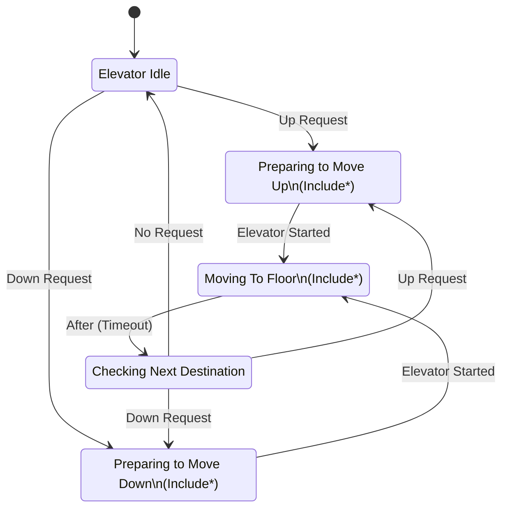
- Khi "zoom" vào chi tiết (phân rã) trạng thái lớn "Moving to Floor", ta sẽ thấy nó bao gồm một chuỗi các trạng thái con hoạt động tuần tự: Elevator Moving $\rightarrow$ Elevator Stopping $\rightarrow$ Elevator Door Opening $\rightarrow$ Elevator at Floor.
    ![[Pasted image 20260802062630.png]]

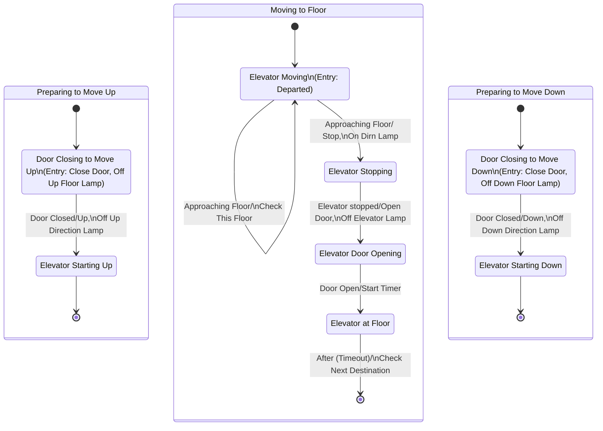

### 16. Nắm bắt Hành vi (Capturing Behaviour)
Tùy thuộc vào việc anh muốn mô tả hệ thống ở góc nhìn vĩ mô (nhiều quy trình) hay vi mô (một kịch bản cụ thể), UML cung cấp các công cụ khác nhau:

|**Phạm vi mô hình hóa (Scope)**|**Biểu đồ khuyên dùng**|**Đặc điểm nổi bật & Chức năng cốt lõi**|
|---|---|---|
|**Bao quát nhiều Use Cases** hoặc **nhiều luồng (threads)**|**Activity Diagram**      _(Biểu đồ Hoạt động)_|Tập trung nắm bắt **luồng điều khiển (flow of control)** hoặc luồng đối tượng (object flow).      $\rightarrow$ Nhấn mạnh vào _trình tự_ và _các điều kiện rẽ nhánh_ của luồng công việc.|
|**Nhiều đối tượng** tương tác trong **MỘT Use Case duy nhất**|Các **Implementation Diagrams**      _(Biểu đồ Triển khai)_|Nhóm này bao gồm: Communication, Object/Task, Sequence, Timing (mới có ở UML 2.x), và Interaction Overview (từ UML 2.4.1).|
|Mô tả **một chuỗi sự kiện** xảy ra theo thứ tự tuyến tính|**Sequence Diagram**      _(Biểu đồ Tuần tự)_|Rất mạnh để mô tả trình tự thời gian. Tuy nhiên, nó mang tính độc nhất cho một kịch bản cụ thể.      $\rightarrow$ **Hạn chế:** Chỉ thể hiện được _1 góc nhìn (viewpoint)_ trên mỗi biểu đồ.|
|Hiển thị cấu trúc **kết nối tĩnh** và **tác vụ đồng thời (concurrent)**|**Communication Diagram**      _(Biểu đồ Giao tiếp - tên cũ là Collaboration)_|Tận dụng bố cục (layout) đồ họa để chỉ ra cách các đối tượng liên kết với nhau. Rất hữu ích để trực quan hóa các luồng tin nhắn (messages) giữa các tác vụ đang chạy đồng thời.|

_(Ghi chú: Nếu hệ thống yêu cầu nhấn mạnh vào yếu tố thời gian khắt khe, đặc biệt trong các hệ thống thời gian thực (Real-time systems), anh có thể cân nhắc thêm **Timing diagrams** thuộc nhóm Implementation)._

![[Pasted image 20260802064635.png]]

![[Pasted image 20260802064648.png]]
____
**Đọc hiểu Communication Diagram (Trên):**
Định nghĩa cơ bản:
- **Communication Diagram** (trong UML 1.x được gọi là _Collaboration Diagram_ - Biểu đồ Cộng tác) thể hiện sự tương tác giữa các đối tượng (objects) hoặc các bộ phận (parts) trong hệ thống.
    
- Khác với Sequence Diagram (Biểu đồ Tuần tự) vốn gò bó theo chiều dọc thời gian, biểu đồ này sử dụng **cách sắp xếp tự do (free-form arrangement)**.
    
- Để biết sự kiện nào diễn ra trước, sự kiện nào diễn ra sau, chúng ta bắt buộc phải **đọc theo số thứ tự (sequenced messages)** được gắn trên các mũi tên.

**Các thành phần trong sơ đồ Thang máy (Elevator System):**
- **Actors (Tác nhân):** `Passenger 1` (Hành khách 1) và `Passenger 2` (Hành khách 2).
    
- **Object (Đối tượng trung tâm):** Khối `Elevator System` (Hệ thống thang máy).
    
- **Self-link (Liên kết tự thân):** Mũi tên vòng lại chính khối Elevator System ghi chữ `{self}` thể hiện việc hệ thống tự thực hiện một tác vụ nội bộ (không giao tiếp với bên ngoài).
##### Phân tích kịch bản tương tác (Đọc theo thứ tự 1 $\rightarrow$ 16)

Sơ đồ này mô tả một kịch bản cực kỳ thực tế khi có 2 người cùng gọi thang máy ở 2 vị trí khác nhau. Luồng sự kiện được chia làm 4 giai đoạn chính:

**Giai đoạn 1: Hành khách 1 (P1) gọi thang**

- **1:** P1 bấm nút gọi thang đi lên (`Request UP elevator`).
    
- **2:** Hệ thống phản hồi bằng cách bật đèn sáng nút bấm của P1 (`Button backlight`) để xác nhận đã nhận lệnh.
    

**Giai đoạn 2: Hành khách 2 (P2) xen ngang**

- **3:** Cùng lúc đó, P2 (đang ở tầng khác) bấm nút gọi thang đi xuống (`Request DOWN elevator`).
    
- **4:** Hệ thống thang máy tự xử lý nội bộ `{self}`: Nó đưa yêu cầu của P2 vào hàng đợi (`Queue request`) vì đang bận đi đón P1 trước.
    
- **5:** Hệ thống bật đèn sáng nút bấm của P2 (`Button backlight`) để xác nhận đã ghi nhận lệnh chờ.
    

**Giai đoạn 3: Phục vụ Hành khách 1**

- **6:** Thang máy đến chỗ P1, cửa mở (`Door opens`).
    
- **7:** Hệ thống tự đếm thời gian, hết giờ (timeout) cửa tự động đóng lại `{self}` (`Door times out and closes`). Lúc này P1 đã vào trong.
    
- **8:** P1 bấm nút chọn lên tầng 8 (`Request floor 8`).
    
- **9:** Hệ thống bật đèn sáng nút tầng 8 để xác nhận (`Button backlight`).
    
- **10:** Thang đến tầng 8, cửa mở cho P1 ra (`Door opens`).
    
- **11:** Hệ thống lại tự đếm ngược và đóng cửa `{self}` (`Door times out and closes`). Kết thúc nhiệm vụ với P1.
    

**Giai đoạn 4: Phục vụ Hành khách 2 (từ hàng đợi)**

- **12:** Thang máy vòng đi đón P2 (yêu cầu từ bước 4). Đến nơi, cửa mở cho P2 (`Door opens`).
    
- **13:** P2 bước vào và bấm nút chọn xuống tầng 1 (`Request floor 1`).
    
- **14:** Hệ thống bật đèn sáng nút tầng 1 (`Button backlight`).
    
- **15:** Hệ thống đếm ngược và đóng cửa `{self}` (`Door times out and closes`).
    
- **16:** Thang đến tầng 1, cửa mở cho P2 ra (`Door opens`).
    

**💡 Tóm lại (Bài học rút ra từ biểu đồ này):**
Biểu đồ Giao tiếp rất xuất sắc trong việc mô tả **bức tranh toàn cảnh về không gian (topology)**. Nhìn vào đây, lập trình viên thấy ngay Hệ thống Thang máy là "trung tâm" giao tiếp với 2 client khác nhau, đồng thời xử lý được đa luồng (lưu queue yêu cầu của người này trong khi đang đi phục vụ người kia).