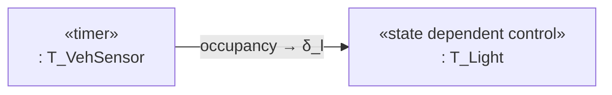

# Diagram Skills — Quy ước vẽ diagram dùng chung (Hanoi + Melbourne)

> **Mục đích:** File này là **chuẩn ký pháp vẽ diagram** dùng chung cho MỌI site option (Hanoi, Melbourne-Glenroy, …). Teammate làm site nào cũng đọc file này trước khi vẽ để đảm bảo **đúng notation của khóa học** (thang điểm Week-8 khuyến khích đúng ký pháp, không chỉ đúng nội dung). Chi tiết từng hình cho Hanoi nằm ở [planning/P2/hanoi/diagram-drawing-guide.md](../P2/hanoi/diagram-drawing-guide.md).

---

## 1. Ký pháp DFD (Level-1) — phân rã từ Context (L0)

> Nguồn: [theory-and-notes/Week-06/02 - SA - SD.md](../../theory-and-notes/Week-06/02%20-%20SA%20-%20SD.md) — phần **Context Diagram → DFD Level-1**. Đây là các thực thể xuất hiện khi phân rã DFD.

### 1.1. Các thực thể (hình dạng)

| Thực thể | Hình dạng | Ví dụ trong hệ thống |
|---|---|---|
| **Control Process** | **Tròn NÉT ĐỨT** (dashed circle) | `7.0 Watchdog` (bộ lập lịch/điều phối, gửi tín hiệu kích hoạt, giám sát sự sống) |
| **Data Process** | **Tròn NÉT LIỀN** (solid circle) | `1.0 Local Controller`, `2.0 Central`, `3.0 Train Line`, `4.0 RC Sensor`, `5.0 Input Sim`, `6.0 Display` |
| **Data source/sink** | **Hình chữ nhật (vuông)** | `Pedestrian`, `Vehicle sensors`, `Train (NB/SB)`, `Railway system (boom, flashing)`, `Operator (control room)`, `Display / terminal` |
| **Data store** | **Hình chữ nhật MỞ: text nằm giữa, KHÔNG có cạnh trái/phải** (chỉ 2 cạnh ngang trên/dưới — kiểu Gane–Sarson); lecture cũng chấp nhận hình trụ DB | `D1` Intersection State, `D2` Config/Plan, `D3` Log/Fault, `D4` Sensor Buffer |

> ⚠️ **Phân biệt hình dạng (quan trọng khi vẽ):**
> - **Source/sink** = hình chữ nhật **ĐÓNG** (đủ 4 cạnh) — entity bên ngoài hệ thống.
> - **Data store** = hình chữ nhật **MỞ** (chỉ 2 cạnh ngang trên/dưới, text ở giữa, **không có cạnh trái/phải**) — hoặc trụ DB theo lecture. Dùng ký pháp mở (Gane–Sarson) để phân biệt rõ với source/sink cùng lúc vẽ trong 1 DFD.
> - Lecture chuẩn dùng **2 vạch ngang song song** (hoặc trụ DB) cho Data store; khi chấm nên theo lecture. Cả hai đều chấp nhận được nếu chú thích rõ trong figure.
>
> **Cân bằng SA/SD (điểm cao):** tập external entity của Level-1 DFD PHẢI giống HỆT Level-0 (context) — không thêm/bớt entity. Ví dụ Hanoi: context và Level-1 cùng dùng 6 entity ở trên; `TRAIN_RED` (hệ thống → tàu khi boom fault) xuất hiện ở cả hai.

### 1.2. Các loại flow (mũi tên)

| Loại flow | Ký hiệu | Ý nghĩa | Ví dụ |
|---|---|---|---|
| **Event flow** | **Mũi tên NÉT ĐỨT + nhãn** (dashed arrow + text) | Tín hiệu kích hoạt / điều khiển, **KHÔNG mang dữ liệu** | `Go/NoGo`, `button push`, `train approach`, `RAIL_STATE pulse`, `heartbeat trigger` |
| **Discrete data flow** | **Mũi tên NÉT LIỀN 1 đầu nhọn** (solid arrow) | Dữ liệu truyền theo từng gói/tin nhắn riêng biệt | `STATUS_CHANGE`, `CMD_PATTERN`, `TRAIN_RED`, `HEARTBEAT`, `PEER_SYNC` |
| **Continuous data flow** | **Mũi tên NÉT LIỀN 2 đầu nhọn cạnh nhau** (solid, kép/bold) | Luồng thông tin truyền liên tục (kiểu tín hiệu analog) | `presence/occupancy` từ cảm biến vòng, `vehicle flow` đo liên tục |

**Quy tắc dùng:**
- **Event flow** (`-.->`) luôn vào/ra **Control Process** → dùng để BẬT/TẮT (`Go/NoGo`) các **Data Process**.
- **Discrete/Continuous data flow** (`-->`) nối giữa các **Data Process** với nhau và với **source/sink / data store**.
- Trong mermaid: event = `A -. "Go/NoGo" .-> B`, discrete = `A -- "message" --> B`, continuous = `A == "temp" ==> B` (hoặc vẽ mũi tên kép 2 đầu nhọn).

---

## 2. Ký pháp Use Case diagram

> Nguồn: [Week-06/02 - SA - SD.md](../../theory-and-notes/Week-06/02%20-%20SA%20-%20SD.md) — phần **Use Case, `<include>`/`<extend>`, COMET**.

### 2.1. Bắt buộc phải có
- **Liệt kê đầy đủ Use Case** (hình elip/oval), đặt tên rõ (verb + object): `UC1 Detect Vehicle`, `UC2 Control Signal Phase`, …
- **Liệt kê đầy đủ Actors** (hình que): Vehicles, Pedestrian, Train, Control Room, (Central System nếu ngoài biên).
- **Đường biên hệ thống** (rectangle = hệ thống) — actors ĐỨNG NGOÀI biên, use case ĐỨNG TRONG.
- **Sub-boundary** (nếu có nhóm chức năng chuyên biệt, vd. "Railway Safety" gom UC6–UC8).

### 2.2. Chiều mũi tên (BẮT BUỘC đúng)
- **Association (quan hệ tham gia): mũi tên NÉT LIỀN**.
  - Actor → Use Case: actor **chủ động khởi tạo** (initiator).
  - Use Case → Actor: actor chỉ **nhận kết quả** (receiver) — vd. hệ thống gửi tín hiệu cảnh báo cho Control Room.
  - Không có chiều ưu tiên mạnh thì vẽ **đường liền không đầu mũi tên** (association line).
- **`<<include>>`: mũi tên NÉT ĐỨT** — use case gốc → use case được gọi (`UC4 ──<<include>>──> UC5`): UC4 luôn chạy UC5.
- **`<<extend>>`: mũi tên NÉT ĐỨT** — use case mở rộng → use case gốc (`UC6 ──<<extend>>──> UC1`): UC6 chạy **thêm vào** UC1 khi có điều kiện.

> ⚠️ Chiều mũi tên nét đứt **ngược với trực giác**: `<include>` vẽ từ UC chính **đến** UC con; `<extend>` vẽ từ UC mở rộng **đến** UC gốc. Nhầm chiều là bị trừ điểm.

---

## 3. Ký pháp nhanh cho các loại diagram khác

| Loại | Ký pháp chuẩn | Lecture |
|---|---|---|
| State chart | UML state machine: state = **chữ nhật BO GÓC** (rounded rectangle), start `[*]` = **vòng tròn đen ĐẶC**, end `[*]` = **vòng tròn đen ĐẶC có viền ngoài**, composite state = khung bo góc **lồng chứa sub-state bên trong**, transition = mũi tên kèm nhãn `event [guard] / action` | [Week-06/02 SA–SD](../../theory-and-notes/Week-06/02%20-%20SA%20-%20SD.md) + [lab-5/Boolean Transitions.md](../../theory-and-notes/lab-5/Boolean%20Transitions.md) |
| Flowchart (control flow) | Process/action = **chữ nhật BO GÓC**, decision = **HÌNH THOI**, mũi tên nhãn `yes`/`no`, start/end = vòng tròn đen | [Week-06/02 SA–SD](../../theory-and-notes/Week-06/02%20-%20SA%20-%20SD.md) |
| Sequence diagram | Lifelines dọc + mũi tên message (đặc mũi tên = sync call, mũi tên đứt = return), ký pháp `MsgSend()` / `MsgReceive()` / `MsgReply()` | [Week-06/02 SA–SD](../../theory-and-notes/Week-06/02%20-%20SA%20-%20SD.md) + [Lecture 2 Part 2 - IPC - QNX.md](../../theory-and-notes/Week-02%20and%2003/Lecture%202%20-%20Part%202%20-%20IPC%20-%20QNX.md) |
| Deployment topology | Nodes (host/device) + kết nối (QNET `/net/`, pulsing) | [Week-01/Hostname-And-QNET-Service.md](../../theory-and-notes/Week-01/Hostname-And-QNET-Service.md) |
| Task Architecture (COMET) | Xem §3.1 bên dưới | [week-08/W8-2 + W8-3](../../theory-and-notes/week-08/) |

---

## 3.1. Ký pháp Task Architecture (COMET — Gomaa, slide week-8)

> Nguồn: [week-08/W8 - 2 - Bóc tách và Nhận diện Task (Separation).md](../../theory-and-notes/week-08/W8%20-%202%20-%20B%C3%B3c%20t%C3%A1ch%20v%C3%A0%20Nh%E1%BA%ADn%20di%E1%BB%87n%20Task%20(Separation).md) (I/O, internal, priority) + [W8 - 3 (Grouping & Inversion)](../../theory-and-notes/week-08/W8%20-%203%20-%20T%E1%BB%91i%20%C6%B0u%20h%C3%B3a%20-%20Gom%20nh%C3%B3m%20v%C3%A0%20%C4%90%E1%BA%A3o%20ng%C6%B0%E1%BB%A3c%20Task%20(Grouping%20%26%20Minimization).md). Đây là **task architecture diagram** bắt buộc của đề (dòng 65) — vẽ đúng ký pháp để đạt điểm notation.

### 3.1.1. Ký pháp task box (bám slide week-8)

Mỗi task trong COMET là **một block chữ nhật 2 dòng** — KHÔNG phải hộp text đơn thuần:

```
┌──────────────────────────----┐
│  «state dependent control»   │  ← dòng 1: STEREOTYPE (loại task)
│  : ATMController             │  ← dòng 2: tên task (bắt đầu bằng ':')
└──────────────────────────----┘
```

| Stereotype `«…»` | Ý nghĩa | Ví dụ trong bài |
|---|---|---|
| `«periodic»` / `«timer»` | Task kích hoạt định kỳ bằng bộ định thời | `T_VehSensor` (poll 200 ms), `T_Watchdog` |
| `«event»` / `«asynchronous»` | Task kích hoạt bởi sự kiện/message/pulse | `T_CentralComm`, `T_PeerSync`, `T_RailMon` |
| `«state dependent control»` | Control task — chạy state machine | `T_Light` (FSM đèn), `T_Central`, `T_TrainLine` |
| `«input»` / `«output»` | I/O task gắn thiết bị | `T_Ped` (input button), `T_Display` (output) |

**Quy ước cho team (Hanoi):** trong mermaid không vẽ được frame 2 dòng kiểu UML, dùng **label 2 dòng**: dòng 1 = stereotype `«…»` (chữ nghiêng), dòng 2 = `: TênTask`. Ví dụ:



### 3.1.2. Port đánh số (communication interface)

- Mỗi task box có thể có **port hình vuông nhỏ** ở biên (số 1, 2…) tượng trưng cho luồng message ra/vào (MsgSend/MsgReceive/pulse).
- Mermaid không vẽ port riêng → **mô tả bằng nhãn trên mũi tên** (tên message + loại kênh: `Native`/`pulse`/`QNET`). Đủ để chấm "task architecture + IPC".

### 3.1.3. Lưu ý phổ biến khi chấm

- Không được vẽ task như data-process của DFD (vòng tròn) — task là **chữ nhật**.
- Không được gộp time-critical task với task thường (W8-2 criterion 3) — nếu có gom nhóm, giải thích lý do (W8-3 grouping/inversion).
- Task = active object (có thread riêng); data = passive entity (data store) — phân biệt rõ trong diagram.

---

## 3.2. Màu sắc & công thức toán trong diagram (HÀNG BẮT BUỘC)

> **Quyết định nhóm (Hanoi):** tất cả diagram xuất **TRẮNG ĐEN** (B&W) — `primaryColor:#FFFFFF`, border/text `#000000` (xem `mmdc-config.json` trong temp render). Lý do: in PDF + photocopy + chấm đọc dễ, không bị phụ thuộc màu mực.

- **Ký tự toán học trong mermaid:** chỉ dùng các glyph có trong font trebuchet-ms/segouib (mermaid mặc định) — **kiểm tra glyph trước khi render** (`δ_l`, `ℓ_v`, `≥`, `·`, `×`, `−`… dễ bị "tofu box" nếu font thiếu). 
  - An toàn: `δ_l` → `δ<sub>l</sub>`, `g_feeding` → `g<sub>feeding</sub>`, `×` giữ nguyên, `≥` giữ nguyên, `−` dùng U+2212.
  - Sau khi render PDF → **kiểm tra chữ xuất ra** (extract text / render PNG) xem có glyph bị thiếu không; nếu thiếu → đổi font hoặc thay ký tự ASCII.
- Checklist export có mục này (xem §4).

---

## 4. Checklist trước khi export

- [ ] Tên file ASCII, đúng quy ước (vd. `state-normal.pdf`), lưu vào `diagrams/` — bộ `.pdf` (vector cho LaTeX) + `.png` (cho Word/markdown).
- [ ] **B&W** (bắt buộc): config `mmdc-config.json` theme base + `primaryColor/secondaryColor/tertiaryColor/background/#FFFFFF`, text/border `#000000` — verify bằng pdftotext/extract xem không còn màu (chỉ `0 0 0` / `1 1 1`).
- [ ] **Glyph toán học render đủ** (bắt buộc): `δ`, `ℓ`, `≥`, `·`, `×`, `−` không được ra ô trống/tofu — extract text PDF hoặc render PNG kiểm tra.
- [ ] Fig tự giải thích: đủ tiêu đề, nhãn trên mũi tên, chú thích ký pháp (legend) nếu cần.
- [ ] Đúng chiều mũi tên (đặc biệt use case: include/extend; sequence: sync/return).
- [ ] Đúng hình dạng thực thể DFD (đứt = control, liền = data, vuông ĐÓNG = source/sink, vuông MỞ/2 vạch = store).
- [ ] Mọi mũi tên có nhãn bằng tiếng Anh (báo cáo viết bằng English).
- [ ] Đối chiếu nội dung với design-spec của site mình (không vẽ ý tưởng mới không có trong spec).

---
## 6. Tham khảo lecture chính (đọc trước khi vẽ)

- [Week-06/02 - SA - SD.md](../../theory-and-notes/Week-06/02%20-%20SA%20-%20SD.md) — Context, DFD Level-1, Use Case, State Machine, Sequence (NGUỒN KÝ PHÁP CHÍNH).
- [week-08/W8 - 2 - Bóc tách và Nhận diện Task (Separation).md](../../theory-and-notes/week-08/W8%20-%202%20-%20B%C3%B3c%20t%C3%A1ch%20v%C3%A0%20Nh%E1%BA%ADn%20di%E1%BB%87n%20Task%20(Separation).md) — I/O device, task.
- [Week-02 and 03/Lecture 2 - Part 2 - IPC - QNX.md](../../theory-and-notes/Week-02%20and%2003/Lecture%202%20-%20Part%202%20-%20IPC%20-%20QNX.md) — MsgSend/MsgReceive/MsgReply (sequence).
- [week-10/](Section 3) — Banker/deadlock (cho pre-emption 2 tàu).
- [Week-04-05/Data-Protection-In-Realtime-Systems.md](../../theory-and-notes/Week-04-05/Data-Protection-In-Realtime-Systems.md) — fault ladder.
