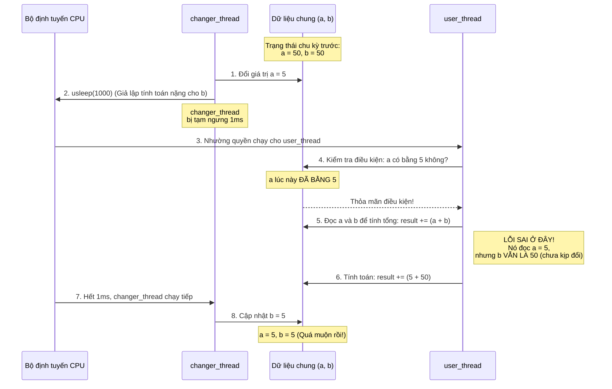

### 1. Anh cần chụp cái gì?

Anh cần chụp **cửa sổ Console/Terminal hiển thị kết quả cuối cùng** sau khi anh chạy file `overlap1.c`.

Cụ thể, bức ảnh cần thấy rõ được dòng chữ mà chương trình in ra ở cuối cùng: `result should be 1000, is 3967` (số 3967 có thể là một số ngẫu nhiên khác tùy vào tốc độ CPU của anh) `[cite: 1]`.

**Tại sao phải chụp cái này?** Mục đích của việc chụp ảnh là để làm bằng chứng cho thấy anh đã chạy thử mã nguồn và quan sát được **sự sai lệch dữ liệu**. Theo logic thông thường (nếu mỗi lần cộng là 5 + 5 = 10, lặp 100 lần thì tổng phải là 1000), nhưng kết quả in ra lại là một con số hoàn toàn khác `[cite: 1]`. Đây chính là "hiện tượng" mà bài lab muốn anh nhìn thấy `[cite: 1]`.

### 2. Giải thích trực quan hiện tượng Overlap (Chồng chéo dữ liệu)

Hiện tượng anh đang thấy được gọi là lỗi đọc/ghi chồng chéo (Overlap Problem), xảy ra khi lập trình đa luồng (multi-threading) `[cite: 1]`. Nguyên nhân cốt lõi là do **một phần code đang thay đổi dữ liệu, trong khi phần code khác lại đọc và sử dụng chính dữ liệu đó cùng lúc** `[cite: 1]`.

Trong bài này, biến `b` cần một khoảng thời gian (giả lập bằng lệnh `usleep(1000)`) để tính toán xong `[cite: 1]`. Lỗ hổng nằm ở ngay khoảng thời gian chờ này `[cite: 1]`.

Mời anh xem sơ đồ Mermaid mô phỏng dòng thời gian dưới đây:

Đoạn mã

**Tóm tắt lại diễn biến:**

1. Hàm `changer_thread` cập nhật `a = 5`, nhưng sau đó bị khựng lại 1 mili-giây (do lệnh `usleep`) trước khi kịp cập nhật biến `b` `[cite: 1]`.
    
2. Điều này tạo ra một "trạng thái lấp lửng" (khe hở 1ms), nơi `a` và `b` không đồng bộ với nhau (`a = 5` nhưng `b` chưa thay đổi, vẫn giữ nguyên giá trị cũ là `50`) `[cite: 1]`.
    
3. Cùng lúc đó, hàm `user_thread` luôn "chờ chực" xem khi nào `a == 5` thì lao vào cộng `[cite: 1]`. Nó thấy `a == 5` nên lập tức lôi cả `a` và `b` ra tính toán `[cite: 1]`.
    
4. Hậu quả là hàm `user_thread` đã lấy nhầm giá trị cũ của `b` (là 50) thay vì giá trị mới (là 5), khiến tổng cộng dồn bị sai lệch hoàn toàn so với con số 1000 dự kiến `[cite: 1]`.