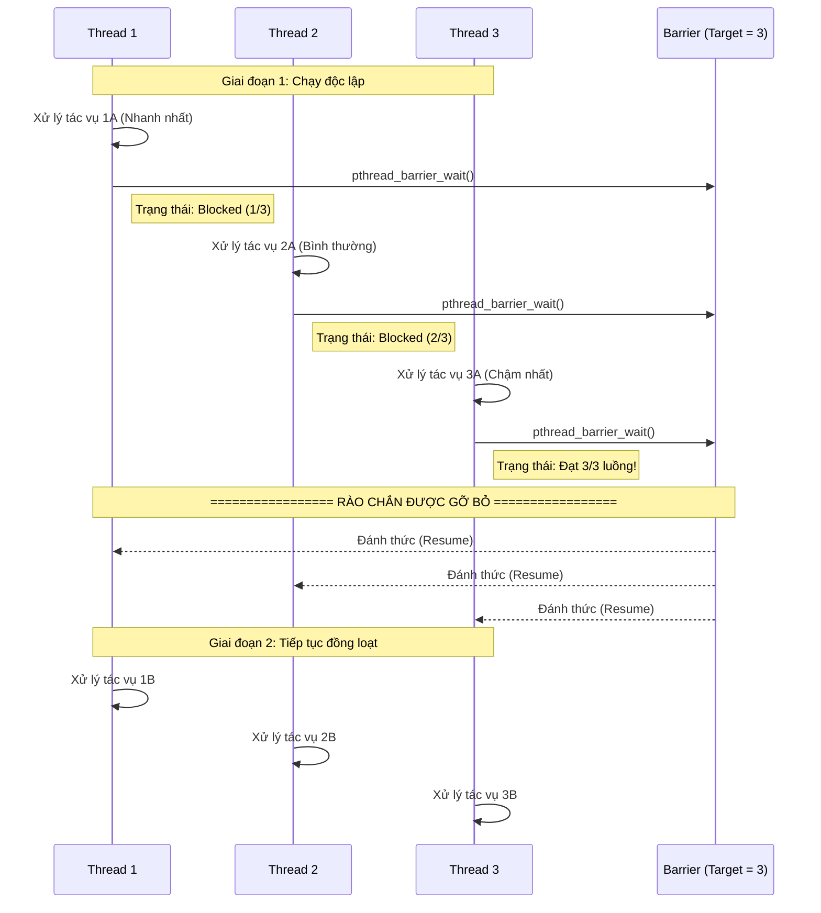

Hãy tưởng tượng bạn và 3 người bạn hẹn nhau đi ăn lẩu. Quy tắc của nhóm là: **"Tất cả 4 người phải có mặt đông đủ ở cửa quán ăn thì mới được đi vào bàn"**.

Trong lập trình đa luồng (multithreading), **Barrier** chính là "cửa quán ăn" đó. Nó là một điểm tập kết để bắt các luồng (threads) phải đợi nhau.

Dưới đây là cách nó hoạt động tương ứng với lý thuyết bạn vừa đọc:

### 1. Đặt chỗ trước (Khởi tạo rào chắn)

- **Hàm code:** `pthread_barrier_init()`
    
- **Ý nghĩa:** Tương đương với việc bạn gọi điện cho quán lẩu báo rằng: "Nhóm tôi có 4 người". Tham số thứ 3 trong hàm này chính là con số `4`. Hệ điều hành sẽ ghi nhớ con số này để biết khi nào thì rào chắn được mở.
    

### 2. Đến điểm hẹn và chờ (Gặp rào chắn)

- **Hàm code:** `pthread_barrier_wait()`
    
- **Ý nghĩa:** Khi một luồng chạy đến dòng code chứa hàm này, nó giống như việc một người trong nhóm đã đến cửa quán.
    
    - Nếu luồng số 1 đến đầu tiên, nó thấy mới có 1/4 người, nó sẽ bị chặn lại (**blocked**) và phải đứng chờ.
        
    - Luồng số 2, số 3 đến tiếp theo cũng phải đứng chờ cùng luồng 1.
        
    - **Khoảnh khắc quyết định:** Khi luồng thứ 4 (luồng cuối cùng) chạy đến và gọi hàm `pthread_barrier_wait()`, hệ thống đếm đủ 4/4 người. Ngay lập tức, rào chắn được gỡ bỏ! Tất cả 4 luồng sẽ cùng nhau đi tiếp (tiếp tục thực thi các dòng code bên dưới).
        

**Tóm lại: Khác biệt cốt lõi so với Mutex/Semaphore là gì?**

- **Mutex/Semaphore:** Giống như một cái nhà vệ sinh chỉ có 1 chìa khóa. Người này đang dùng thì người kia phải đứng ngoài đợi. Mục đích là **ngăn chặn** nhau để bảo vệ dữ liệu khỏi bị ghi đè.
    
- **Barrier:** Giống như việc hẹn nhau đi ăn. Mọi người tự do làm việc riêng (chạy code độc lập), nhưng đến một điểm cụ thể thì phải **đứng lại đợi nhau** cho đủ quân số rồi mới cùng làm bước tiếp theo. Mục đích là **đồng bộ hóa** các giai đoạn của chương trình.

_____

### Giải thích chi tiết theo sơ đồ:

1. **Giai đoạn chạy độc lập (Tác vụ A):** Cả 3 luồng (Thread 1, 2, 3) bắt đầu chạy các tác vụ riêng của mình. Tốc độ chạy của mỗi luồng là khác nhau do hệ điều hành phân bổ tài nguyên CPU.
    
2. **Chạm trán rào chắn (Barrier Wait):**
    
    - **Thread 1** chạy xong tác vụ 1A đầu tiên và gọi hàm `pthread_barrier_wait()`. Lúc này, hệ thống đếm được mới có 1/3 luồng có mặt. Thread 1 rơi vào trạng thái ngủ (blocked) và chờ đợi.
        
    - **Thread 2** chạy xong tác vụ 2A sau đó một lúc và cũng gọi `pthread_barrier_wait()`. Hệ thống đếm được 2/3 luồng. Thread 2 cũng bị chặn lại đứng chờ cùng Thread 1.
        
    - **Thread 3** là luồng chạy chậm nhất. Khi nó hoàn thành tác vụ 3A và gọi `pthread_barrier_wait()`, hệ thống nhận thấy đã đủ 3/3 luồng (đạt con số đã khai báo ở hàm `init`).
        
3. **Gỡ bỏ rào chắn (Resume Execution):** Ngay khoảnh khắc Thread 3 chạm tới rào chắn, hệ thống lập tức đánh thức cả Thread 1 và Thread 2. Cả 3 luồng đồng loạt bước qua rào chắn và tiếp tục thực thi các dòng code tiếp theo (Tác vụ 1B, 2B, 3B).
    

Cách thiết kế này cực kỳ hữu ích trong các bài toán cần chia nhỏ một công việc lớn thành nhiều phần cho các threads tính toán song song, nhưng yêu cầu tất cả phải tính xong phần của mình rồi mới được phép gộp kết quả lại ở bước tiếp theo.

___
Đúng rồi, bạn hiểu chính xác cái cốt lõi rồi đấy! Bản chất của Barrier chính xác là **"đang chạy dở thì dừng lại chờ nhau"**.

Tuy nhiên, không phải là luồng (thread) thích dừng ngẫu nhiên lúc nào cũng được, mà nó chỉ dừng lại khi chạy tới **một vạch kẻ sẵn** do bạn đặt ra (chính là dòng code chứa hàm `pthread_barrier_wait()`).

### Tại sao lại cần "dừng lại chờ nhau"?

- **Chia giai đoạn công việc:** Trong lập trình đa luồng, một chương trình lớn thường được chia làm nhiều giai đoạn. Ví dụ: Giai đoạn 1 là "Tính toán dữ liệu" (song song) và Giai đoạn 2 là "Gộp kết quả" (tổng hợp).
    
- **Ngăn tình trạng "cầm đèn chạy trước ô tô":** Hệ thống bắt buộc _tất cả_ các luồng phải hoàn thành xong Giai đoạn 1 thì hệ thống mới có bức tranh toàn cảnh để làm tiếp Giai đoạn 2.
    
- **Chờ người chậm nhất:** Do hệ điều hành phân bổ CPU khác nhau, sẽ có luồng chạy nhanh, luồng chạy chậm. Luồng chạy nhanh xong việc trước sẽ phi thẳng đến vạch rào chắn và "đứng chơi" (bị hệ thống chặn lại). Nó bắt buộc phải chờ luồng chậm chạp nhất lết được tới vạch đó. Ngay khi luồng cuối cùng điểm danh, rào chắn tự động mở ra và tất cả đồng loạt bước sang Giai đoạn 2.
    

### Ví dụ thực tế: Làm bài tập nhóm

Hãy tưởng tượng một nhóm có 3 sinh viên được giao làm một file báo cáo chung:

1. **Sinh viên A** viết Phần 1 (Xong trong 1 ngày).
    
2. **Sinh viên B** viết Phần 2 (Xong trong 2 ngày).
    
3. **Sinh viên C** viết Phần 3 (Xong trong 3 ngày).
    

Vạch rào chắn (Barrier) ở đây chính là buổi **"Họp nhóm để ghép file Word"**.

- Sinh viên A viết xong từ ngày đầu tiên nhưng không thể nộp bài ngay hay làm việc tiếp, mà phải **dừng lại chờ**.
    
- Sinh viên A và B phải đợi đến tận ngày thứ 3. Chỉ khi sinh viên C viết xong và mang bài đến nộp, cả 3 người mới ghép lại thành một file hoàn chỉnh. Lúc này rào chắn được gỡ, và cả 3 cùng nhau bước sang giai đoạn tiếp theo là nộp bài cho giảng viên.
    

Tóm lại, Barrier sinh ra để giữ nhịp, đảm bảo các luồng không bị lệch pha nhau tại những thời điểm chuyển giao quan trọng của chương trình.