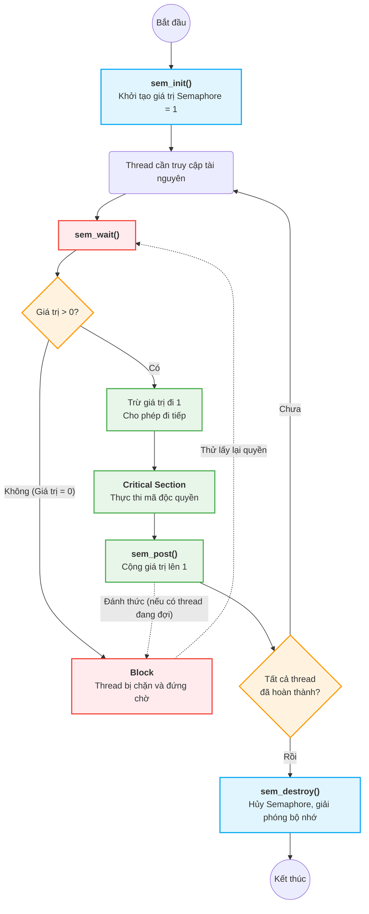

### 1. Mục đích sử dụng

Thay vì dùng các hàm `pthread_mutex_*` để bảo vệ Critical Section (vùng găng), bạn sẽ dùng Semaphore. Trong ngữ cảnh Mutual Exclusion, bạn sẽ sử dụng **Binary Semaphore** (Semaphore có giá trị khởi tạo là 1).

### 2. Phạm vi hoạt động (Scope)
Đề bài chỉ định rõ là dùng **unnamed semaphores** (semaphore không tên). Trong QNX, loại này chỉ có thể đồng bộ hóa giữa các luồng (threads) **bên trong cùng một tiến trình (process)**.

### 3. Vòng đời của một Semaphore (4 hàm cơ bản)
Bạn bắt buộc phải khai báo thư viện `#include <semaphore.h>` và sử dụng tuần tự 4 hàm sau:

- **`sem_init()`**: Khởi tạo cấu trúc semaphore. Để thay thế mutex, bạn cần khởi tạo giá trị ban đầu là `1`.
    
- **`sem_wait()`**: Tương đương với hành động `lock()`. Khi một thread gọi hàm này, nếu giá trị semaphore $> 0$, nó sẽ trừ đi 1 và cho phép thread đi tiếp. Nếu giá trị $= 0$, thread sẽ bị chặn (block) và phải đứng chờ.
    
- **`sem_post()`**: Tương đương với hành động `unlock()`. Nó cộng thêm 1 vào giá trị của semaphore và đánh thức các thread đang bị block ở `sem_wait()` (nếu có).
    
- **`sem_destroy()`**: Hủy semaphore và giải phóng tài nguyên hệ thống sau khi tất cả các thread đã chạy xong.



### Khung code cơ bản (Skeleton)
C

```
#include <stdio.h>
#include <pthread.h>
#include <semaphore.h>

// 1. Khai báo biến semaphore toàn cục
sem_t my_sem; 

void* thread_function(void* arg) {
    // 2. Chờ lấy quyền truy cập (Lock)
    sem_wait(&my_sem); 

    // --- BẮT ĐẦU CRITICAL SECTION ---
    // Chỉ 1 thread được chạy đoạn code này tại 1 thời điểm
    // --- KẾT THÚC CRITICAL SECTION ---

    // 3. Trả lại quyền truy cập (Unlock)
    sem_post(&my_sem); 

    return NULL;
}

int main() {
    // 4. Khởi tạo: tham số thứ 2 là pshared (0 = chia sẻ giữa các threads), tham số thứ 3 là giá trị khởi tạo (1)
    sem_init(&my_sem, 0, 1);

    // ... (Khởi tạo và chạy các pthreads tại đây) ...

    // 5. Hủy semaphore
    sem_destroy(&my_sem); 
    
    return 0;
}
```
