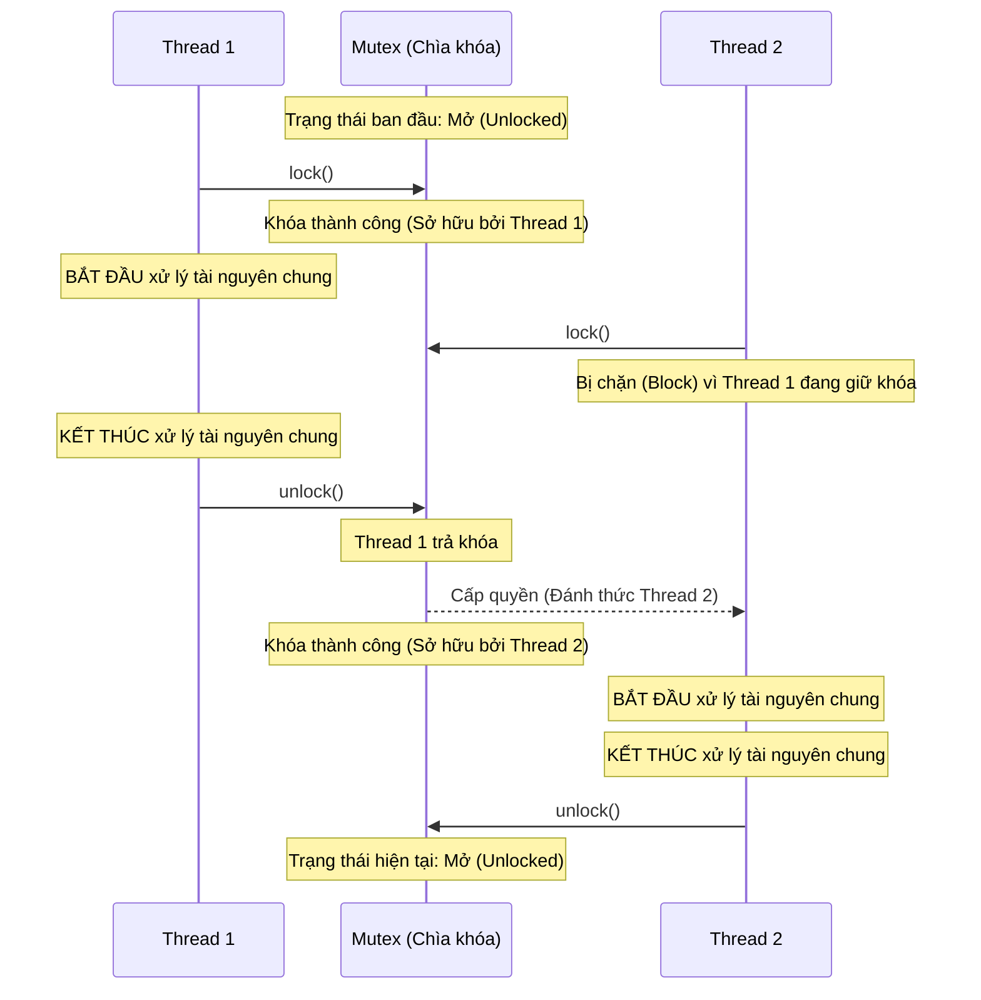
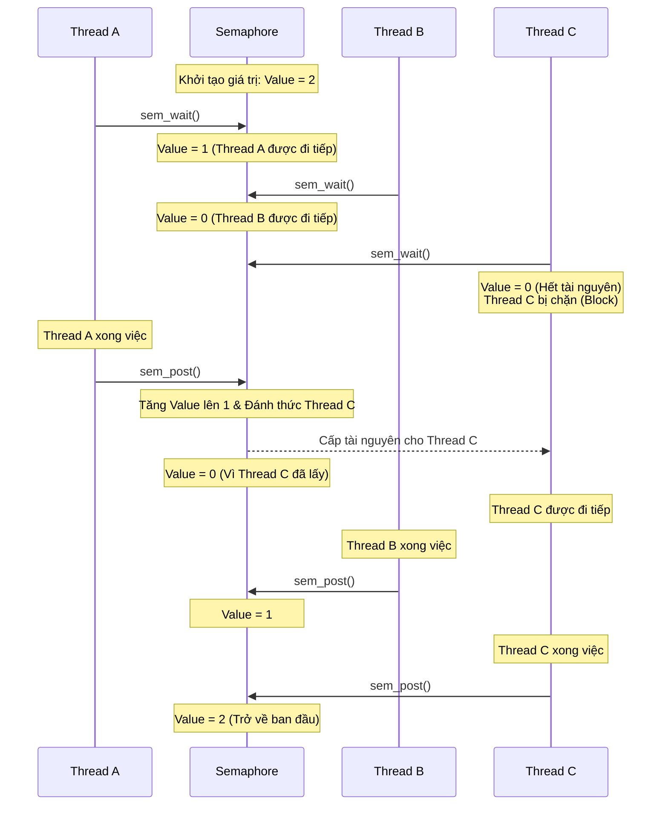

### 1. Mutex (Mutual Exclusion)

Mutex đóng vai trò như một **chiếc chìa khóa (Lock)**. Mục đích duy nhất của nó là bảo vệ một tài nguyên dùng chung (vùng găng - critical section) sao cho tại một thời điểm, **chỉ có duy nhất một luồng (thread) được phép truy cập**.

- **Tính sở hữu (Ownership):** Đây là đặc điểm cốt lõi của Mutex. Thread nào "khóa" (lock) Mutex thì **chính thread đó** phải là người "mở khóa" (unlock). Không một thread nào khác có quyền mở khóa thay nó.
    
- **Ví dụ thực tế:** Hãy tưởng tượng phòng vệ sinh chỉ có một buồng và một chiếc chìa khóa. Người A lấy chìa khóa, vào phòng và chốt cửa lại (Lock). Những người khác đến sau phải đứng đợi. Khi A làm xong việc, chính A phải bước ra và trả lại chìa khóa (Unlock) thì người B mới được vào.
    

### 2. Semaphore

Semaphore đóng vai trò như một **hệ thống báo hiệu (Signaling)** và quản lý số lượng. Nó sử dụng một biến đếm số nguyên để điều phối việc các threads truy cập vào một tập hợp các tài nguyên giống nhau.

- **Không có tính sở hữu (No Ownership):** Bất kỳ thread nào cũng có thể gọi `sem_wait()` (giảm biến đếm) và bất kỳ thread nào cũng có thể gọi `sem_post()` (tăng biến đếm). Thread A có thể đợi (wait), nhưng thread B có thể giải phóng (post) cho nó.
    
- **Phân loại:**
    
    - **Counting Semaphore:** Biến đếm lớn hơn 1. Dùng để quản lý một số lượng tài nguyên giới hạn (ví dụ: hồ bơi kết nối database chỉ cho phép tối đa 10 kết nối đồng thời).
        
    - **Binary Semaphore:** Biến đếm chỉ là 0 hoặc 1. Loại này rất hay bị nhầm lẫn với Mutex, nhưng vì không có "tính sở hữu", nó thường được dùng để đồng bộ hóa thứ tự thực thi giữa 2 threads (Thread A làm xong việc 1 thì phát tín hiệu báo cho Thread B bắt đầu làm việc 2).
        
- **Ví dụ thực tế:** Hãy tưởng tượng một bãi đỗ xe có 5 chỗ trống và một anh bảo vệ cầm bộ đếm. Mỗi khi có xe vào, anh ta trừ đi 1. Khi biến đếm bằng 0, xe đến sau phải chờ ở cổng. Khi một xe bất kỳ rời đi, anh ta cộng thêm 1 và vẫy tay (phát tín hiệu) cho xe đang đợi ở cổng tiến vào.
    

### Bảng so sánh nhanh cốt lõi

| **Tiêu chí**       | **Mutex**                                              | **Semaphore**                                             |
| ------------------ | ------------------------------------------------------ | --------------------------------------------------------- |
| **Bản chất**       | Cơ chế Khóa (Locking mechanism).                       | Cơ chế Báo hiệu (Signaling mechanism).                    |
| **Tính sở hữu**    | **Có.** Ai lock thì người đó phải unlock.              | **Không.** Thread A có thể wait, thread B có thể post.    |
| **Giá trị**        | Chỉ có 2 trạng thái: Khóa (Locked) và Mở (Unlocked).   | Số nguyên (0, 1, 2, 3...).                                |
| **Mục đích chính** | Tránh Race Condition bằng cách cấm truy cập đồng thời. | Quản lý số lượng tài nguyên hoặc đồng bộ thứ tự thực thi. |

__
**Mutex Visualization**

**Semaphore**:

____
**Nguyên lý Value 0 và 1**
Vì đây là Binary Semaphore (Semaphore nhị phân), cái hộp này chỉ chứa được tối đa **1 cái vé**.
#### 1. Ý nghĩa của giá trị (Value)
- **Value = 1**: Trong hộp đang có đúng 1 cái vé. Điều này ngầm báo hiệu: _"Tài nguyên đang rảnh rỗi, ai cần thì cứ vào lấy"_.
- **Value = 0**: Trong hộp trống rỗng, không có vé nào. Điều này ngầm báo hiệu: _"Tài nguyên đang bị chiếm dụng rồi, ai đến sau thì xếp hàng đợi đi"_.
#### 2. Khi Thread gọi `sem_wait()` (Hành động thò tay lấy vé)
Khi một luồng (thread) chạy đến dòng code có `sem_wait()`, nó sẽ nhìn vào cái hộp:
- **Trường hợp hộp có vé (Value đang là 1):** Nó rút luôn cái vé đó ra và đi tiếp. Vì nó đã lấy mất vé, trong hộp giờ trống rỗng $\rightarrow$ hệ điều hành tự động cập nhật **Value = 0**.
- **Trường hợp hộp trống rỗng (Value đang là 0):** Nó không có vé để đi tiếp. Lúc này, hệ điều hành sẽ bắt thread này **tạm ngưng hoạt động (Block/Sleep)** và bắt đứng đợi ngay cạnh cái hộp. Nó sẽ ngủ ở đó cho đến khi nào có vé xuất hiện.
#### 3. Khi Thread gọi `sem_post()` (Hành động trả vé vào hộp)
Khi thread làm xong công việc trong vùng găng (Critical Section), nó gọi `sem_post()`:
- Nó thả 1 cái vé vào lại trong hộp $\rightarrow$ hệ điều hành cập nhật **Value = 1**.
- **Điều kỳ diệu xảy ra ở đây:** Ngay khi vé rơi vào hộp, hệ điều hành sẽ nhìn xem có thread nào đang "ngủ" gục chờ vé không. Nếu có, nó sẽ "đánh thức" thread đó dậy. Thread vừa tỉnh dậy sẽ chộp ngay lấy cái vé (Value lại về 0) và tiếp tục chạy.