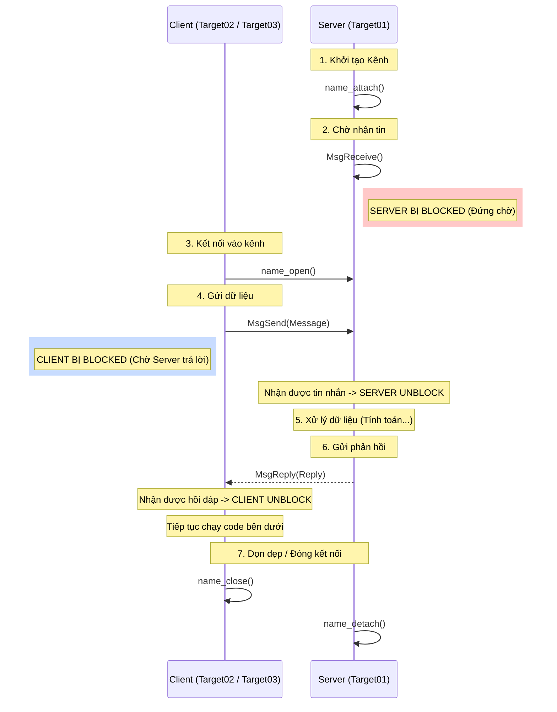
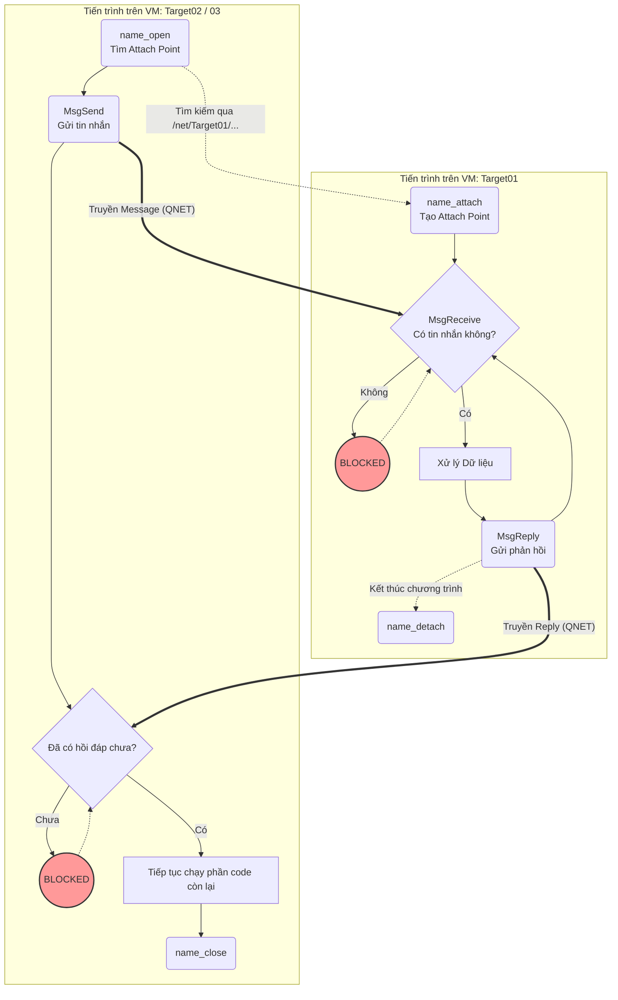

QNX có một cơ chế giao tiếp giữa các tiến trình (IPC) "chính chủ" được thiết kế tối ưu cho các hệ thống thời gian thực, vượt trội hơn so với TCP/IP thông thường hay POSIX mqueues.

Cơ chế này hoạt động dựa trên mô hình **Client-Server** và tính chất **Blocking** (chờ đồng bộ) cực kỳ chặt chẽ:

- **Vòng đời của Server:** Server tạo một "kênh" kết nối (gọi là Attach Point) bằng hàm `name_attach()`. Sau đó, nó gọi `MsgReceive()` và sẽ bị "block" (đứng im tại dòng code đó) cho đến khi có một client gửi tin nhắn đến.
    
- **Vòng đời của Client:** Client muốn gửi tin thì dùng `name_open()` để kết nối vào kênh của Server. Sau đó, nó gọi `MsgSend()` để gửi tin. Ngay lập tức, Client cũng bị "block" để chờ Server trả lời.
    
- **Quá trình xử lý & Hồi đáp:** Server nhận được tin, thoát khỏi trạng thái block, tiến hành xử lý dữ liệu. Xử lý xong, Server bắt buộc phải gọi `MsgReply()` để gửi kết quả về. Lúc này, Client nhận được hồi đáp mới được "unblock" để chạy những dòng code tiếp theo. Cuối cùng, kết nối được đóng bằng `name_close()` (Client) và `name_detach()` (Server).
    

**Giao thức QNET:** Đây là "vũ khí bí mật" của QNX. Bằng QNET, Client ở một máy ảo khác hoàn toàn có thể mở kết nối đến Server như thể chúng đang chạy trên cùng một máy, chỉ khác ở cú pháp đường dẫn.

**Pulse (Xung):** Khác với tin nhắn (Message) yêu cầu gửi và chờ reply, Pulse là dạng tín hiệu một chiều, cực nhẹ, gửi xong là thôi. Trong bài này, Client có thể gửi một Pulse để yêu cầu Server tự thoát (Terminate). Server có một biến `Stay_alive`, nếu đổi giá trị này, Server sẽ phớt lờ yêu cầu thoát.

___

Biểu đồ này mô tả trục thời gian giao tiếp giữa Client và Server. Bạn sẽ thấy rõ ai gửi trước, ai chờ ai, và lúc nào thì được "giải phóng" (Unblock).

Biểu đồ này tập trung vào luồng code của từng máy ảo độc lập và cách chúng tác động chéo lên nhau. Các đường đứt nét màu đỏ thể hiện luồng dữ liệu truyền qua mạng QNET

