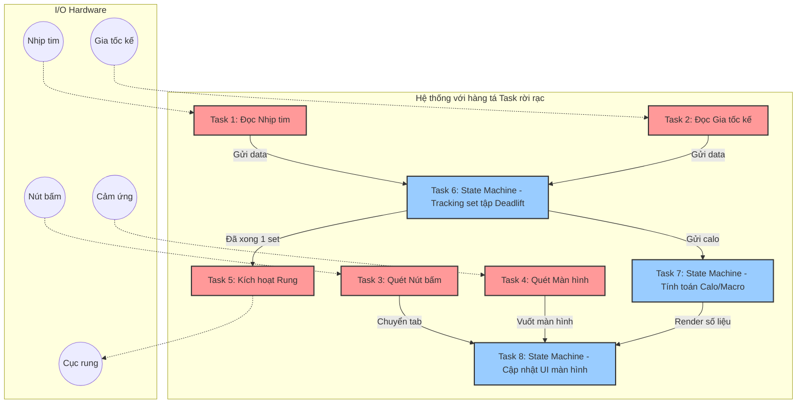
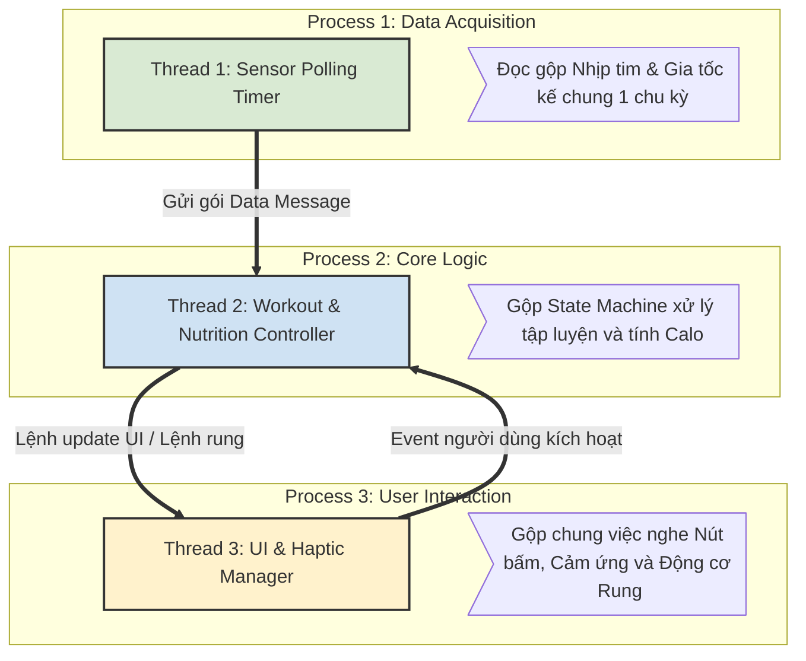
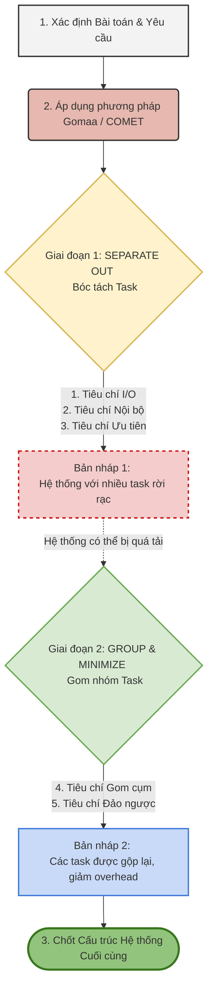

### 1. Vấn đề cốt lõi của các hệ thống lớn (Slide 3)
- Các hệ thống lớn thông thường sẽ chứa rất nhiều đối tượng (objects) đi kèm với các mối quan hệ phức tạp.
- Chính vì sự phức tạp này, chúng ta cần phải đầu tư công sức vào việc xác định xem hệ thống nên được sắp xếp (arranged) như thế nào.
- Nếu chúng ta thiết kế theo một cách bộc phát, chẳng hạn như gán 1 task cho mỗi thiết bị I/O, 1 task cho mỗi state machine, hoặc 1 task cho một thành phần độc lập, điều này sẽ dẫn đến việc sinh ra một lượng task khổng lồ.
- Lượng task lớn này bắt buộc phải được tổ chức lại vào một cấu trúc chuẩn xác bao gồm các quy trình (processes) và luồng (threads).
Hãy xem điều gì xảy ra nếu chúng ta áp dụng cách chia bộc phát: 1 thiết bị I/O = 1 Task và 1 State Machine = 1 Task
***Ví dụ 1: Thiết kế không có cấu trúc*** 
Giả sử chiếc đồng hồ có các phần cứng sau: Cảm biến nhịp tim, Gia tốc kế (để đo chuyển động nâng tạ), Cảm biến GPS, Nút bấm vật lý, Màn hình cảm ứng, Động cơ rung.

Nếu chia bộc phát, kiến trúc hệ thống sẽ trông như thế này:

**Diễn giải sự phức tạp (Overhead & Cổ chai):**
- **Lãng phí tài nguyên CPU (Excessive Task Switching):** Bạn có 8 tasks chạy liên tục. Bộ định tuyến (Scheduler) của hệ điều hành phải liên tục dừng Task 1 để chạy Task 2, rồi dừng Task 2 để chạy Task 3... Việc "cất" dữ liệu của task cũ và "lôi" dữ liệu của task mới ra (Context Switching) tiêu tốn rất nhiều chu kỳ CPU, khiến đồng hồ bị giật lag và hao pin nhanh khủng khiếp.
    
-  **Xung đột bộ nhớ (Synchronization Hell):** Task 6 (Tracking tập luyện) và Task 8 (Cập nhật màn hình) có thể muốn cùng truy cập vào một vùng nhớ chung (biến lưu số Reps hoặc tổng Calo). Nếu không dùng Mutex/Semaphore cẩn thận, hệ thống sẽ crash ngay lập tức.
    
-  **Mớ bòng bong giao tiếp (Messy Communication):** Các luồng mũi tên đan chéo nhau chằng chịt. Việc debug xem tại sao rung không kêu khi tập xong một set sẽ vô cùng khó khăn.

***Ví dụ 2: Thiết kế có cấu trúc (COMET/Gomaa): Gom Cụm (Clustering)***
Bây giờ, chúng ta dùng lý thuyết ở Slide 4 (Nhóm task để giảm overhead) và Slide 8-9 (Task Clustering) để quy hoạch lại. Chúng ta sẽ gom các task có cùng bản chất thời gian (Temporal Clustering) hoặc logic tuần tự (Sequential Clustering) vào chung các Processes lớn.

Diễn giải cách hệ thống trở nên gọn gàng:
- Từ 8 Tasks giảm xuống còn 3 Threads chính: Hệ điều hành RTOS bây giờ thở phào nhẹ nhõm. Việc chuyển đổi giữa 3 Threads tốn ít tài nguyên hơn rất nhiều so với 8 Tasks rời rạc.
- Temporal Clustering (Gom theo thời gian) ở Process 1: Thay vì 2 task đọc nhịp tim và gia tốc kế tranh giành CPU, ta cho chúng vào 1 Thread chạy bằng 1 timer duy nhất. Cứ đúng 100ms, hàm này thức dậy, đọc nhịp tim, đọc gia tốc, đóng gói thành 1 message rồi đi ngủ tiếp.
- Control/Sequential Clustering (Gom logic điều khiển) ở Process 2: Không cần 2 task tách biệt cho việc đếm Reps và tính Calo. Nó chỉ là 1 luồng code chạy tuần tự: 
	Nhận data -> Nếu nhận dạng đúng cử động nâng tạ -> Reps++ -> Cập nhật Macro tiêu hao.
Đó chính là lý do vì sao ở Slide 3, thầy nhấn mạnh: _"Lượng task lớn này bắt buộc phải được tổ chức lại vào một cấu trúc chuẩn xác"_. Nếu bạn thiết kế một app hay một hệ thống nhúng mà để nó tự sinh sôi nảy nở các luồng xử lý, hệ thống sẽ tự sập vì chính sức nặng của nó.
### 2. Tầm quan trọng của Phương pháp tiếp cận có cấu trúc (Slide 3)

- Các nhà phát triển có thể sử dụng phương pháp thiết kế lặp đi lặp lại (iterative design approaches), tuy nhiên cách làm này có thể sẽ đòi hỏi phải đập đi làm lại (re-working) nhiều phần của hệ thống.
    
- Thay vào đó, sẽ tốt hơn nếu áp dụng một phương pháp tiếp cận chính quy hóa (formalized approach) bằng cách sử dụng các Tiêu chí Cấu trúc Task (Task Structuring Criteria).
    
- Có một số phương pháp luận lớn về cấu trúc task đã được đề xuất bởi Gomaa, Williams, v.v., bao gồm:

|**Phương pháp luận**|**Tên đầy đủ**|**Mô tả / Đặc điểm chính**|
|---|---|---|
|**SA/SD**|Structured Analysis and Design|Phân chia giải pháp thành các Processes và Threads dựa trên phương pháp 11 điểm.|
|**CODARTS**|Concurrent Design Approach for Real-time Systems|Phương pháp thiết kế đồng thời dành cho các hệ thống thời gian thực.|
|**COMET**|Concurrent Object Modeling and Architectural Design|Phiên bản mô hình hóa sử dụng UML do Gomaa đề xuất và phát triển.|
        
- Đối với các hệ thống thời gian thực (real time systems), có 2 loại tiêu chí cấu trúc task chính là định kỳ (Periodically) và không định kỳ (Aperiodically). Ngoài ra, còn một vấn đề được đặt ra là làm thế nào để xử lý các thuộc tính liên tục (continuous).
    

### 3. Năm Hạng mục Tiêu chí Cấu trúc Task của Gomaa (Slide 4)

- Trong thực tế, đôi khi việc xác định xem các task nên được nhóm lại như thế nào là không hề hiển nhiên (not obvious).
    
- Để giải quyết, Gomaa đã đề xuất một phương pháp chi tiết gọi là Tiêu chí Cấu trúc Task, chia việc phân nhóm thành 5 hạng mục chính:

| **Mục đích cốt lõi**                                                                                                                                                                                                                                                                                                                                                                                                                                                                               | **Hạng mục (Tiêu chí Gomaa)**                                             | **Chi tiết & Đặc điểm**                                                                                   |
| -------------------------------------------------------------------------------------------------------------------------------------------------------------------------------------------------------------------------------------------------------------------------------------------------------------------------------------------------------------------------------------------------------------------------------------------------------------------------------------------------- | ------------------------------------------------------------------------- | --------------------------------------------------------------------------------------------------------- |
| **Tách (Separate out)**      Mục đích là để bóc tách các task ra một cách rành mạch.                                                                                                                                                                                                                                                                                                                                                                                                   | **1. Tiêu chí cấu trúc task I/O** (I/O task structuring criteria)         | (Không có ghi chú thêm ở phần này)                                                                        |
|                                                                                                                                                                                                                                                                                                                                                                                                                                                                                                    | **2. Tiêu chí cấu trúc task nội bộ** (Internal task structuring criteria) | Bao gồm các task điều khiển (Control task), state machine, v.v.                                           |
|                                                                                                                                                                                                                                                                                                                                                                                                                                                                                                    | **3. Tiêu chí mức độ ưu tiên của task** (Task priority criteria)          | Tiêu chí này cực kỳ quan trọng đối với các hệ thống sử dụng lập lịch thời gian thực như hệ điều hành QNX. |
| **Nhóm (Group/Minimize)**      Được dùng để nhóm các task lại với nhau nhằm đạt được các lợi ích:      - Giảm thiểu số lượng threads/processes trong hệ thống.      - Tránh việc chuyển đổi task không cần thiết (avoid unnecessary task switching).      - Hạn chế tối đa tình trạng chuyển đổi task quá mức (Minimize excessive task switching).      - Giúp quá trình bảo trì hệ thống (Maintenance of system) trở nên dễ dàng hơn. | **4. Tiêu chí gom cụm task** (Task clustering criteria)                   | Dùng để giảm thiểu số lượng các task.                                                                     |
|                                                                                                                                                                                                                                                                                                                                                                                                                                                                                                    | **5. Tiêu chí đảo ngược task** (Task inversion criteria)                  | Thuộc nội dung chương 14 của Gomaa.                                                                       |
___
DIỄN GIẢI THÊM ĐỂ HIỂU IDEA:
**1. 5 Tiêu chí này là "đặc sản" của phương pháp Gomaa**

- SA/SD, CODARTS hay COMET (của Gomaa) là các _phương pháp luận_ (methodologies) khác nhau để tiếp cận việc thiết kế.
    
- **5 tiêu chí cấu trúc task** chính là nội dung cốt lõi nằm bên trong phương pháp của Gomaa. Tức là, khi bạn chốt sử dụng phương pháp của Gomaa (COMET) cho bản design, bạn sẽ tự động sử dụng 5 tiêu chí này làm công cụ thực hành.
    

**2. Không phải là "thỏa mãn", mà là "áp dụng theo quy trình"** Từ "tiêu chí" (criteria) ở đây không mang nghĩa là các điều kiện bắt buộc mà bản design phải thỏa mãn (pass) cả 5. Thay vào đó, Gomaa chia ra thành 5 danh mục (categories) đóng vai trò như một **quy trình 2 bước** để bạn nhào nặn hệ thống:

- **Bước 1 - Dùng 3 tiêu chí đầu để "Chia để trị" (Separate out):** Bạn cầm bản phân tích hệ thống lên, áp dụng lăng kính của 3 tiêu chí (I/O, Nội bộ, Mức độ ưu tiên) để bóc tách. Ví dụ: _"Thiết bị phần cứng này cần 1 task"_, _"State machine kia cần 1 task"_, hay _"Cái này Time Critical phải tách riêng ưu tiên cao"_.
    
- **Bước 2 - Dùng 2 tiêu chí cuối để "Dọn dẹp" (Group/Minimize):** Sau Bước 1, hệ thống của bạn sẽ bị "băm" ra thành quá nhiều task. Lúc này, bạn dùng lăng kính của 2 tiêu chí cuối (Clustering và Inversion) để rà soát lại: gộp các task có họ hàng với nhau lại để giảm số lượng thread/process, tránh việc chuyển đổi task (task switching) quá mức gây nặng máy.
    

**Tóm lại:**

Quá trình thiết kế của bạn sẽ là: Xác định bài toán $\rightarrow$ Chọn phương pháp Gomaa (COMET) $\rightarrow$ Dùng 3 tiêu chí đầu để bóc tách hệ thống thành các task rời rạc $\rightarrow$ Dùng 2 tiêu chí sau để gom nhóm lại cho tối ưu $\rightarrow$ Chốt cấu trúc hệ thống cuối cùng.

