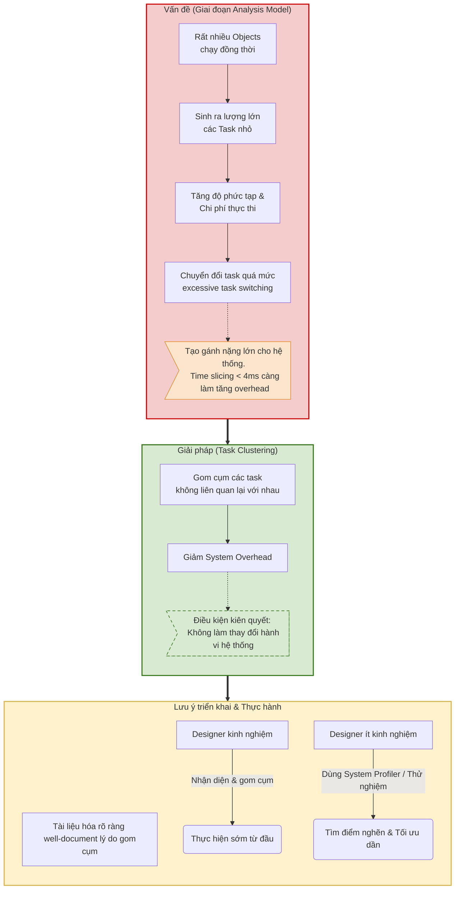

### 1. Tiêu chí Gom cụm (Task Clustering Criteria)

**Vấn đề cốt lõi (Slide 8):**

- Trong giai đoạn lập Mô hình Phân tích (Analysis model phase), rất nhiều đối tượng (objects) có vẻ như đang chạy đồng thời (running concurrently).
    
- Điều này có thể dẫn đến một lượng lớn các task nhỏ, làm tăng độ phức tạp của hệ thống và chi phí thực thi (execution overhead).
    
- Việc chuyển đổi task quá mức (excessive task switching) tạo ra gánh nặng lớn cho hệ thống (System overhead). Mức chia thời gian (Time slicing) 4 msec đã là rất dài, nếu làm nhỏ hơn nữa thì overhead của hệ thống sẽ càng tăng.
    

**Giải pháp & Lưu ý (Slide 8):**

- Gom cụm các task (không liên quan) lại với nhau sẽ giúp giảm system overhead.
    
- Tiêu chí gom cụm được dùng để xác định các task nào có thể gộp chung vào 1 thread/process mà **không làm thay đổi hành vi của hệ thống**.
    
- Cần phải **tài liệu hóa rõ ràng (well document)** lý do gom cụm, vì đôi khi không dễ nhận biết tại sao các hoạt động lại được ghép cặp với nhau (ví dụ: do chung yêu cầu thời gian, liên quan đến I/O, v.v.).
    
- Các designer giàu kinh nghiệm có thể gom cụm ngay từ bước nhận diện task, trong khi người ít kinh nghiệm hơn có thể phải dùng system profiler để tìm ra điểm nghẽn hoặc thử nhiều cách sắp xếp khác nhau để tối ưu.



    

**Bảng phân loại 4 phương pháp Gom cụm (Slide 9):**

|**Loại Clustering**|**Nguyên tắc Gom cụm PDF**|
|---|---|
|**Temporal (Thời gian)**|- Có thể kết hợp các task được kích hoạt bởi cùng một sự kiện (thường là sự kiện định kỳ).<br><br>  <br><br>- Sẽ khó kết hợp nếu chu kỳ (periods) của chúng khác nhau, nhưng có thể cố gắng kết hợp các task có chu kỳ liên quan.<br><br>  <br><br>- Ưu tiên gom các task có liên quan về mặt chức năng và có tầm quan trọng ngang nhau trong việc lập lịch (scheduling).<br><br>  <br><br>- **Không được kết hợp** task time critical với task less time critical.|
|**Sequential (Tuần tự)**|Các hoạt động (operations) bắt buộc phải xảy ra theo một trình tự tuần tự có thể được kết hợp vào chung một task.|
|**Control (Điều khiển)**|Một task điều khiển (control task) có thể được gộp với các phép biến đổi dữ liệu (data transformations) mà nó kích hoạt.|
|**Mutually Exclusive (Loại trừ lẫn nhau)**|Có thể kết hợp các chức năng không bao giờ thực thi đồng thời (never execute concurrently), kể cả khi chúng được kích hoạt bởi các sự kiện khác nhau.|

> Quy tắc "Không kết hợp" (When not to combine):
> 
> - Không kết hợp nếu các task có mức độ ưu tiên khác nhau (differing priorities).
>     
> - Hãy đặt câu hỏi xem việc gom task có thực sự giúp ích không nếu các task đó có thể chạy đồng thời trên các lõi CPU (hoặc nodes) tách biệt.
>     

**Ví dụ thực tế: Hệ thống máy ATM (Slide 10 & 11):**

- _Trước khi tối ưu (Analysis Model):_ `ATMController` là một task điều khiển phụ thuộc vào trạng thái (state dependent control), và nó giao tiếp tách biệt với 2 task interface đầu ra là `ReceiptPrinterInterface` và `CashDispenserInterface`.
    ```mermaid
    graph TD
    subgraph Analysis ["Giai đoạn 1: Analysis Model (Trước tối ưu)"]
        direction TB
        C1["Task: ATMController (Phụ thuộc trạng thái)"]
        P1["Task: ReceiptPrinterInterface"]
        D1["Task: CashDispenserInterface"]

        C1 -->|"Gửi Message"| P1
        C1 -->|"Gửi Message"| D1
    end

    style Analysis fill:#f4cccc,stroke:#cc0000,stroke-width:2px
    style C1 fill:#fff2cc,stroke:#d6b656,stroke-width:2px
    style P1 fill:#fff2cc,stroke:#d6b656,stroke-width:2px
    style D1 fill:#fff2cc,stroke:#d6b656,stroke-width:2px
    ```
    
- _Sau khi tối ưu (Final Design Model):_ Dựa trên thực tế là `ATMController` là task duy nhất điều khiển máy nhả tiền và đầu ra máy in, ta có thể áp dụng **Control clustering** để gộp cả 3 thành phần này vào chung một task tổng thể duy nhất.
    ```mermaid
graph TD
    Reason["Lý do tối ưu: ATMController là task duy nhất <br> điều khiển máy in và máy nhả tiền"]

    subgraph Design ["Giai đoạn 2: Final Design Model (Sau tối ưu)"]
        direction TB
        C2["1 Task Tổng Thể duy nhất: ATMController <br> (Đã gộp nội bộ Printer & Dispenser)"]
    end

    Reason -.->|"Áp dụng Control Clustering"| Design

    style Design fill:#d9ead3,stroke:#38761d,stroke-width:2px
    style C2 fill:#c9daf8,stroke:#3c78d8,stroke-width:2px
    style Reason fill:#fce5cd,stroke:#e69138,stroke-width:2px,stroke-dasharray: 5 5
    ```
    


### 2. Tiêu chí Đảo ngược (Task Inversion Criteria)

**Nguyên lý chung (Slide 12):**

- Tương tự như task clustering, task inversion được dùng để giảm overhead của việc xử lý task.
    
- Đây là một phương pháp khác để giảm số lượng task trong hệ thống một cách có hệ thống (systematic manner).
    
- Trường hợp cực đoan (Extreme case): Ánh xạ một giải pháp đa nhiệm (concurrent solution) thành một giải pháp tuần tự (sequential solution), hoặc giảm toàn bộ xuống chỉ còn 1 task.
    

**Bảng phân loại 3 phương pháp Đảo ngược (Slide 12, 13, 14, 17):**

|**Loại Inversion**|**Cơ chế hoạt động**|**Ví dụ cụ thể**|
|---|---|---|
|**1. Multiple instance** (Cùng chức năng)|- Thay thế các task "giống hệt nhau" (cùng loại) bằng một task duy nhất cung cấp cùng một dịch vụ.<br><br>  <br><br>- Thông tin trạng thái của mỗi đối tượng được lưu giữ riêng trong một thực thể bị động (passive entity object).|**Hệ thống thang máy (Slide 13):** Thay vì tạo "One Task for each Elevator", ta dùng "One Task for all Elevators" (`ElevatorControl`) quản lý data của từng thang qua entity `ElevatorState Information`.<br><br>  <br><br>_Lưu ý:_ Việc này hợp lý nếu chỉ có 1 CPU (vì dùng nhiều task trên 1 CPU sẽ tốn overhead duy trì trạng thái). Nhưng nếu dùng CPU multi-core, việc giữ các task riêng biệt lại hợp lý hơn.|
|**2. Sequential tasks** (Tuần tự)|- Đánh giá các task có sự giao tiếp chặt chẽ (tightly coupled communication) để giảm bớt.<br><br>  <br><br>- Thay thế việc truyền tin nhắn (Message passing) giữa các task bằng các lời gọi hàm (function calls) đơn giản.<br><br>  <br><br>- Chỉ sử dụng nếu hành vi của hệ thống không bị ảnh hưởng.|**Mô hình Producer/Consumer (Slide 14):** Gộp hai task lại để tránh việc truyền tin nhắn. Lúc này, message data biến thành tham số gọi hàm: Producer tạo data rồi gọi hàm `consume_data( &data_message );` giúp bỏ qua được quá trình process switch.|
|**3. Temporal tasks** (Thời gian)|- Gom 2 hoặc nhiều bộ định thời (timers) nội bộ, I/O định kỳ, hoặc các task đã được temporal clustering.<br><br>  <br><br>- Tất cả chu kỳ của task phải liên quan tới nhau.<br><br>  <br><br>- Mỗi lần được kích hoạt, task sẽ tự định tuyến xem phải chạy function nào.|**Đánh giá thiết kế (Slide 17):** Góc độ thiết kế thì cách này không tốt, nhưng có thể là một sự tối ưu hóa bắt buộc (necessary optimisation) để giảm overhead vì việc tạo ra nhiều resource định thời gian là rất lãng phí nếu các sự kiện có chung mối liên hệ về thời gian.|

**Ví dụ thực tế: Hệ thống Cruise Control (Slide 15 & 16):**

- _Hệ thống ban đầu:_ Có sự giao tiếp bằng tin nhắn (Message Communication) giữa các task độc lập: `CruiseControl`, `SpeedAdjustment`, và `ThrottleInterface`.
    
- _Hệ thống sau Inversion:_ Bằng cách sử dụng function calls, ta gom `CruiseControl` (chứa process state machine) cùng với `SpeedAdjustment`, `DesiredSpeed` (entity) và `ThrottleInterface` vào chung một task lớn gọi là `:InvertedCruiseControl`.
    
- _Trường hợp ngoại lệ cần lưu ý:_ Entity `:CurrentSpeed` **không được kết hợp** vào task này. Lý do là vì nó được yêu cầu phải truy cập vào phần cứng I/O dùng chung (shared I/O hardware). Việc truy cập I/O phải được giữ tách biệt để có thể chia sẻ cho các hệ thống/tasks khác.