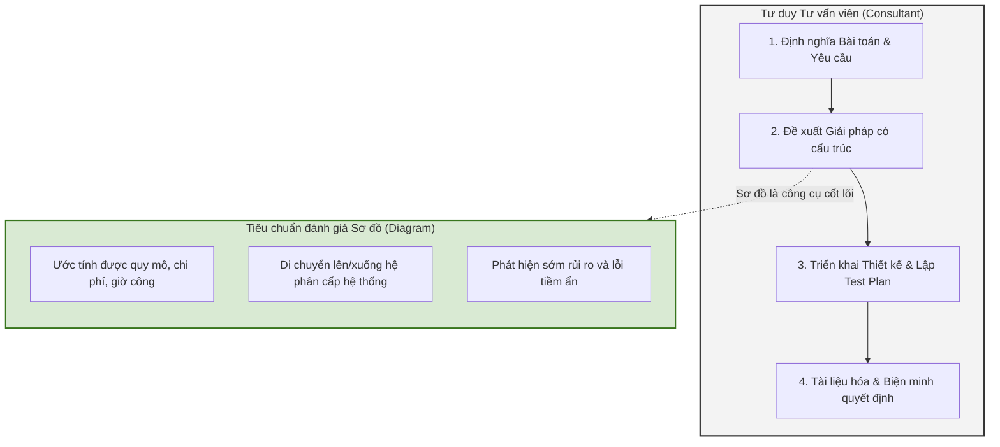

### 1. Lịch trình & Yêu cầu Báo cáo (Slide 2 & 18)

Dự án nhóm (Team project work) là cơ hội đầu tiên để bạn tiếp cận một hệ thống đa node (multi-node) có tính đồng thời cao (highly concurrent). Cần lưu ý các mốc thời gian và yêu cầu báo cáo sau:

- **Thời hạn nộp bài (Slide 2):** Toàn bộ các bài tập Lab từ tuần 2 đến tuần 5 phải được nộp trước cuối tuần 7. Báo cáo thiết kế ban đầu (Initial Design Report) sẽ có hạn nộp vào Tuần 8.
    

**Bảng Yêu cầu Báo cáo Dự án (Slide 18):**

|**Loại Báo cáo**|**Mục tiêu & Nội dung cốt lõi**|
|---|---|
|**Initial Design Report**      _(Báo cáo thiết kế ban đầu)_|- Phác thảo các thiết kế cơ bản nhất (Flesh out basic design).      - Xác định rõ ranh giới dự án: Nêu rõ quy mô dự án, các tính năng nào sẽ hỗ trợ và tính năng nào không hỗ trợ.      - Tạo ra một bản tài liệu tham chiếu (reference) để bám sát, giúp dự án đi đúng hướng.|
|**Final Report**      _(Báo cáo tổng kết)_|- Có nhiệm vụ kết nối và lấp đầy các "khoảng trống logic" (logic gaps) so với bản thiết kế ban đầu.|

### 2. Checklist Đạt Điểm Cao - High Marks (Slide 18)

Để đạt điểm xuất sắc cho dự án, bạn không chỉ làm hệ thống chạy được, mà cần tích hợp các tính năng nâng cao. Hãy cố gắng triển khai một số yêu cầu sau:

|**Hạng mục Nâng cao**|**Chi tiết triển khai để lấy điểm thưởng**|
|---|---|
|**Thực tế hóa (Realism)**|Thiết kế hệ thống dựa trên một nút giao thông thực tế (real intersection).|
|**Độ phức tạp (Complexity)**|Triển khai mô phỏng tàu hỏa chạy từ cả 2 hướng.|
|**Kiểm soát (Controllers)**|Tích hợp nhiều bộ điều khiển (ví dụ: smart controllers, thiết lập các update patterns).|
|**Kiểm thử (Testing)**|Có Kế hoạch Kiểm thử (Test Plan) rõ ràng.|
|**Giao diện (Interface)**|Sử dụng phần cứng tùy chỉnh (custom hardware) hoặc xây dựng giao diện người dùng GUI.|
|**Khả năng chịu lỗi (Fault Tolerance)**|Hệ thống phải xử lý được các trường hợp mất kết nối/lỗi giữa các nodes, bao gồm cả việc xây dựng các cơ chế phục hồi (recovery mechanisms).|

### 3. Tư duy Giải quyết Bài toán - Workshopping the problem (Slide 19)

Có 3 thành phần chính đứng sau việc phát triển giải pháp cho một vấn đề: **Dựa trên sự thật (Fact based)**, **Định hướng giả thuyết (Hypothesis driven)**, và **Có cấu trúc (Structural)**.

Công việc thiết kế của bạn phải nằm trong khuôn khổ của một "cấu trúc". Vấn đề không nằm ở việc bản thân cấu trúc đó cụ thể là gì, mà quan trọng là bài toán phải có một cấu trúc hợp lý, mạch lạc (logic and coherent) và bạn có thể tối ưu hóa nó sau.

Cấu trúc đó phải dẫn dắt toàn bộ quá trình giải quyết vấn đề của bạn, bao gồm việc trả lời các câu hỏi:

1. Bài toán là gì?
    
2. Khoanh vùng (scope) bài toán như thế nào?
    
3. Làm sao để bóc tách nó thành các phần tử cấu thành (constitutes elements)?
    
4. Làm thế nào để lấy được luồng dữ liệu I/O (dữ liệu bên ngoài, các kênh giao tiếp nội bộ...)?
    
5. Cuối cùng, trình bày thiết kế đó cho developers/clients như thế nào để họ có thể hiểu và triển khai (implement) được?
    

### 4. Liên hệ Thực tế & Vai trò của Sơ đồ - Real World (Slide 20)

Dự án này là một bản mô phỏng lại một quy trình đấu thầu dự án công nghiệp nhỏ (small industrial project/tender process) trong thực tế.

**Vai trò cốt lõi của Diagrams (Sơ đồ/Biểu đồ):**

- Sơ đồ của bạn phải cho phép khách hàng, đội thiết kế và đội triển khai rút ra được các kết luận về giải pháp được đề xuất.
    
- Phải giúp họ ước tính được: Quy mô dự án, Phạm vi dự án, Chi phí, và Số giờ công (man hours) dự kiến.
    
- Cung cấp một cơ chế để di chuyển lên/xuống giữa các cấp bậc (hierarchy) của bài toán và của giải pháp thiết kế, qua đó phản ánh tư duy đa tầng của người thiết kế.
    
- Giúp nhận diện sớm các vấn đề/lỗi tiềm ẩn bên trong thiết kế ở nhiều cấp độ khác nhau.
    

**Tư duy của một Consultant (Tư vấn viên):** Trong thế giới thực, một chuyên gia tư vấn sẽ được thuê để thực hiện quy trình sau:

- Định nghĩa bài toán và yêu cầu.
    
- Đề xuất giải pháp (cung cấp cho bài toán một cấu trúc).
    
- Triển khai thiết kế và Cung cấp kế hoạch kiểm thử có cấu trúc.
    
- Tài liệu hóa mọi giai đoạn, hoặc "viết ngược" (backfill) lại báo cáo để biện minh (justify) cho một quyết định đã được đưa ra trước đó.
    

**Sơ đồ tư duy Consultant & Vai trò của Diagram (Tổng hợp từ Slide 19 & 20):**

