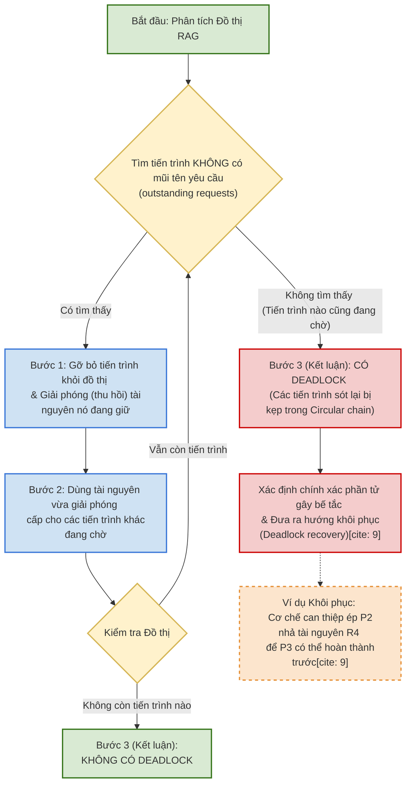

### 1. Đồ thị Phân bổ Tài nguyên (RAG - Resource Allocation Graph)

Hướng tiếp cận thứ 3 để xử lý deadlock là "Deadlock Detection" (Phát hiện bế tắc) sau khi nó đã xảy ra, bằng cách sử dụng công cụ Đồ thị phân bổ tài nguyên - RAG.

**Lý thuyết Đồ thị RAG (Slide 27 & 28):**

- **Bản chất:** RAG là một sơ đồ cấp hệ thống dựa trên ký hiệu "Đồ thị có hướng" (Directed Graph - tất cả các đường đều có mũi tên). (Lưu ý: Các sách giáo khoa khác nhau có thể dùng các ký hiệu khác nhau).
    
- **Thành phần RAG:**
    
    - **Tiến trình (Processes):** Được thể hiện bằng hình vuông.
        
    - **Tài nguyên (Resource types):** Được thể hiện bằng hình tròn. Số lượng chấm nhỏ bên trong hình tròn biểu thị số lượng phiên bản (instances) khả dụng của loại tài nguyên đó.
        
- **Cách đọc mũi tên:**
    
    - **Mũi tên Cấp phát (Allocation):** Hướng từ _Tài nguyên_ trỏ tới _Tiến trình_. Ý nghĩa: Tiến trình đang giữ tài nguyên này.
        
    - **Mũi tên Yêu cầu (Request):** Hướng từ _Tiến trình_ trỏ tới _Tài nguyên_. Ý nghĩa: Tiến trình đang chờ được cấp tài nguyên này.

![[Pasted image 20260810152447.png]]

### 2. Giảm thiểu RAG để phát hiện Bế tắc - RAG Reduction (Slide 29 - 32)

Quá trình "Giảm thiểu RAG" (RAG Reduction) được dùng để xác định xem hệ thống có bị Deadlock hay không bằng cách gỡ bỏ dần các tiến trình thỏa mãn điều kiện hoàn thành.

**Quy trình đánh giá:**

1. **Bước 1 (Tìm tiến trình có thể xong):** Tìm tiến trình không có mũi tên yêu cầu (outstanding requests) nào đang chờ. Khi tiến trình này hoàn thành, gỡ bỏ nó khỏi đồ thị và giải phóng (thu hồi) các tài nguyên mà nó đang giữ.
    
2. **Bước 2 (Cấp phát tiếp):** Dùng tài nguyên vừa được giải phóng để cấp cho các tiến trình khác đang có mũi tên yêu cầu.
    
3. **Bước 3 (Kết luận):**
    
    - Nếu tiếp tục giảm thiểu được cho đến khi không còn tiến trình nào trên đồ thị $\rightarrow$ **Không có Deadlock**.
        
    - Nếu không thể giảm thiểu thêm mà vẫn còn các tiến trình bị sót lại $\rightarrow$ Các tiến trình còn lại đang bị **Deadlock** (Do xảy ra vòng lặp Circular chain). RAG giúp xác định chính xác tiến trình hoặc tài nguyên nào gây ra tình trạng bế tắc, từ đó đưa ra hướng khôi phục (Deadlock recovery).
        

- **Ví dụ Khôi phục (Slide 32):** Nếu P2 và P3 bị kẹp trong một vòng lặp chờ nhau, cơ chế khôi phục có thể can thiệp bắt P2 nhả tài nguyên R4 ra để P3 có thể hoàn thành trước.
    

### 3. Sự liên kết giữa RAG và thuật toán Banker (Slide 33)

Đồ thị RAG và ma trận Banker không hoàn toàn độc lập với nhau. Bạn có thể ánh xạ (map) một phần thông tin từ RAG sang ma trận Banker.

|**Đặc điểm so sánh**|**Thuật toán Banker**|**RAG (Resource Allocation Graph)**|
|---|---|---|
|**Thông tin thể hiện**|Có đủ Alloc, Need, Available và **Maximum**.|Chỉ diễn tả được Alloc (phân bổ hiện tại) và Request (nhu cầu/Need hiện tại). **Không thể hiện** mức tài nguyên Maximum mà tiến trình yêu cầu.|
|**Mục đích sử dụng**|Né tránh deadlock tự động khi có request mới nghiệm ngặt.|Chỉ có thể được sử dụng như một bài kiểm tra an toàn tĩnh (static safety test).|
|**Khả năng chẩn đoán**|**Không thể** chỉ ra chính xác hành động nào/phần tử nào gây ra deadlock.|**Có thể** hiển thị rõ ràng nguyên nhân và vòng lặp gây ra bế tắc.|

### 4. Kiến thức cơ sở về Lập lịch - Scheduling Basics (Slide 38 - 41)

Lập lịch (Scheduling) là quá trình gán các tài nguyên vật lý (như CPU) cho các tiến trình/tasks. Do các mục tiêu lập lịch thường mâu thuẫn nhau (không thể tối ưu hóa đồng thời cả trung bình, tối thiểu, tối đa và phương sai), nên luôn phải có sự đánh đổi (tradeoff).

**A. Ba Cấp độ Lập lịch (Slide 38):**

1. **Admission control (Cấp cao):** Quyết định job (công việc) nào được phép đi vào hệ thống.
    
2. **Intermediate-level (Cấp trung):** Quyết định tiến trình nào được phép cạnh tranh CPU (có thể tạm dừng và tiếp tục các task để kiểm soát tải).
    
3. **Low-level (Cấp thấp):** Quyết định tiến trình nào trong trạng thái 'ready' sẽ được gán CPU khi nó rảnh (dispatch).
    

**B. Phân loại cơ chế Lập lịch (Slide 39):**

- **Preemptive (Có tính tước đoạt):** CPU có thể bị lấy mất khỏi một tiến trình đang chạy (Ví dụ: thông qua time-slicing, ngắt mức độ ưu tiên - IRQs, hoặc reset mềm qua watchdog timer).
    
- **Nonpreemptive (Không tước đoạt):** CPU không thể bị tước đoạt cưỡng bức. Tiến trình tự nguyện nhả CPU khi xong hoặc khi bị block chờ sự kiện (như cách HĐH Windows 3.x cũ hoạt động).
    

**C. Các Chiến lược Lập lịch phổ biến (Slide 40 - 41):**

| **Tên chiến lược**                 | **Loại**      | **Đặc điểm & Ứng dụng**                                                                                                                                                                                                                                |
| ---------------------------------- | ------------- | ------------------------------------------------------------------------------------------------------------------------------------------------------------------------------------------------------------------------------------------------------ |
| **First-Come-First-Served (FCFS)** | Nonpreemptive | - Chạy theo danh sách tuần tự.      - Phương sai thời gian phản hồi nhỏ nếu CPU đang chạy dưới tải (underutilized).                                                                                                                        |
| **Shortest-Job-First (SJF)**       | Nonpreemptive | Giảm thời gian chờ trung bình nhưng làm tăng phương sai (variance). Yêu cầu phải biết trước thời gian thực thi của task.                                                                                                                               |
| **Shortest-Remaining-Time**        | Preemptive    | Ưu tiên task có thời gian hoàn thành ước tính còn lại ngắn nhất. Yêu cầu phải biết trước thời gian thực thi.                                                                                                                                           |
| **Deadline**                       | Preemptive    | Thường dùng cho Real-time systems (Hệ thống thời gian thực).                                                                                                                                                                                           |
| **Time-Slicing (Round-Robin)**     | Preemptive    | - Không cần biết trước quá nhiều thông tin về task.      - **Độ dài time-slice rất quan trọng:** Quá dài thì thời gian phản hồi (response time) tăng; quá ngắn thì việc chuyển đổi process gây overhead làm giảm throughput (thông lượng). |
| **Multilevel Feedback Queues**     | Preemptive    | Phân tách tiến trình theo mức độ cần CPU. Nếu tiến trình dùng quá nhiều CPU, nó sẽ bị đẩy xuống hàng đợi ưu tiên thấp hơn.                                                                                                                             |
| **Priority**                       | Preemptive    | Sử dụng trong nhiều hệ thống Real-Time Systems. Đây cũng là chiến lược mặc định của hệ điều hành **QNX** (kết hợp với Round Robin, FIFO và Sporadic).                                                                                                  |