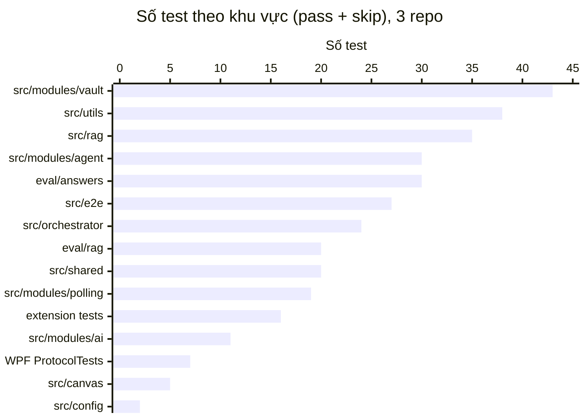
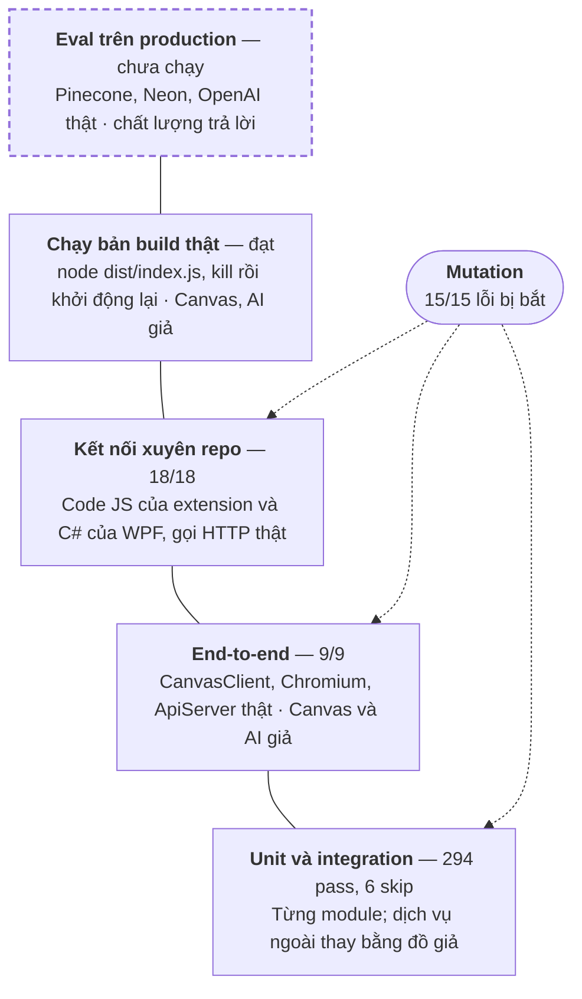

# Báo cáo đánh giá — cter-ai-harness-service

> Ngày: 2026-10-08 · Phạm vi: backend `cter-ai-harness-service`, extension `cter-browser-extension-client`, app WPF `cter-interview-cloak-client`

**Kết luận.** Tính đúng đắn và độ tin cậy đã được kiểm chứng: **321/327 test pass, 0 fail**, và **15/15** lỗi cố tình đưa vào đều bị test bắt. **Chất lượng câu trả lời** (RAG, agent) **chưa đo** vì chưa chạy bộ eval trên dữ liệu production (thiếu credentials trong `eval/.env.eval`).

## Mục lục

1. [Tổng quan](#1-tổng-quan)
2. [Sự cố backend ngừng hoạt động](#2-sự-cố-backend-ngừng-hoạt-động)
3. [Kiểm thử tự động](#3-kiểm-thử-tự-động)
4. [Mutation testing](#4-mutation-testing)
5. [End-to-end và chạy tiến trình thật](#5-end-to-end-và-chạy-tiến-trình-thật)
6. [Các lớp kiểm chứng](#6-các-lớp-kiểm-chứng)
7. [Chất lượng câu trả lời](#7-chất-lượng-câu-trả-lời)
8. [Phát hiện và rủi ro còn mở](#8-phát-hiện-và-rủi-ro-còn-mở)
9. [Việc tiếp theo](#9-việc-tiếp-theo)

---

## 1. Tổng quan

6 hạng mục đã kiểm chứng, 2 hạng mục kiểm chứng một phần, 2 hạng mục chưa đo vì cần credentials production.

| Hạng mục | Trạng thái | Bằng chứng chính |
|---|---|---|
| Chẩn đoán sự cố backend ngừng hoạt động | ✅ Đã kiểm chứng | Tái hiện được lỗi Chromium chết; đo Canvas API thật 10 vòng |
| Polling: không mất file, không trả lời trùng, tự bật | ✅ Đã kiểm chứng | 19 test, 3 mutation, kill tiến trình thật rồi khởi động lại |
| Retry AI có backoff và chuyển model dự phòng | ✅ Đã kiểm chứng | 429 → backoff → fallback trong tiến trình thật |
| Agent mode (cơ chế) | ✅ Đã kiểm chứng | 30 test, E2E, SDK OpenAI thật với server giả |
| Extension và app WPF nói chuyện với backend | ✅ Đã kiểm chứng | 18 test kết nối xuyên repo, 5 mutation |
| Vault và repository Neon | ✅ Đã kiểm chứng | 43 test; mọi query có tham số |
| Deploy trên Render (ngủ, hết RAM) | 🟡 Một phần | Nghi vấn từ cấu hình; chưa có log Render |
| Chạy với Chrome và Canvas thật | 🟡 Một phần | Canvas API thật đã đo (chỉ đọc); extension chưa thử trong Chrome |
| Truy xuất RAG (Hit@k, MRR) | ⚪ Chưa đo | Script `eval:rag` sẵn sàng, cần credentials |
| Chất lượng câu trả lời: single-shot so với agent | ⚪ Chưa đo | Script `eval:answers` sẵn sàng, mới chạy ở chế độ kế hoạch |

---

## 2. Sự cố backend ngừng hoạt động

Nguyên nhân chính là **Chromium (dùng để render PDF) chết thì không tự hồi phục**, nên luồng file dừng hẳn trong khi server vẫn trả lời `/health`. Canvas rate limit đã bị loại trừ bằng số đo.

| Giả thuyết | Cách đo | Kết quả đo | Kết luận |
|---|---|---|---|
| Canvas API rate limit | Chạy lại đúng các GET của một vòng poll, 10 vòng, mỗi 6 s (chỉ đọc) | Quota luôn 700/700; mỗi vòng 15 request, tốn khoảng 2 đơn vị | Loại trừ |
| Chromium chết không tự hồi phục | Render 1 PDF, kill Chromium, render tiếp | Lần đầu OK (22 445 byte); mọi lần sau lỗi `Connection closed` | **Nguyên nhân chính** — đã sửa |
| Rate limit phía AI và retry dồn dập | Đọc `data/processed.json` (119 record); chạy tiến trình thật với AI giả trả 429 | Nhiều request có `retryCount` 13; SDK OpenAI/Anthropic tự retry ngầm nên mỗi lần thử thành 3 request | Góp phần — đã sửa |
| Mất file do con trỏ `lastPollTime` | Đọc `processed.json`; test tái hiện lỗi Canvas 500 giữa hai vòng | 7 file kẹt `pending` từ tháng 7, không bao giờ được xử lý lại | Xác nhận — đã sửa |
| Polling tắt sau restart, Render ngủ | Đọc cấu hình và code | Ping `/health` từ bên trong không tính là traffic ngoài; polling cần gọi `/start` sau mỗi restart | Nghi vấn — cần log Render; đã thêm tự bật |

Phát hiện phụ khi đo:
- Mỗi vòng poll mất **6,0–6,8 s** trong khi chu kỳ là 6 s, vì phải lật 8 trang danh sách 79 conversation để tìm `[CFH:SETTINGS]`. Đã sửa bằng cache 10 phút.
- 5 file Grok bị thử lại 25 lần dù lỗi `400` là lỗi vĩnh viễn; nay lỗi 4xx không còn bị retry.

---

## 3. Kiểm thử tự động

**321/327 test pass, 0 fail**, trải trên 15 khu vực của 3 repo; test backend chạy hết trong 11,2 s.



| Khu vực | Repo | Pass | Skip |
|---|---|---:|---:|
| `src/modules/vault` | backend | 43 | 0 |
| `src/utils` | backend | 38 | 0 |
| `src/rag` | backend | 29 | 6 |
| `src/modules/agent` | backend | 30 | 0 |
| `eval/answers` | backend | 30 | 0 |
| `src/e2e` | backend | 27 | 0 |
| `src/orchestrator` | backend | 24 | 0 |
| `eval/rag` | backend | 20 | 0 |
| `src/shared` | backend | 20 | 0 |
| `src/modules/polling` | backend | 19 | 0 |
| `tests/` (node --test) | extension | 16 | 0 |
| `src/modules/ai` | backend | 11 | 0 |
| `tests/ProtocolTests` | WPF | 7 | 0 |
| `src/canvas` | backend | 5 | 0 |
| `src/config` | backend | 2 | 0 |
| **Tổng** | | **321** | **6** |

6 test bị skip là test cũ của `KnowledgeIndexer` đọc vault từ ổ đĩa, không còn dùng từ khi vault chuyển sang Neon. Typecheck (`tsc --noEmit`) sạch cho cả code và file test, `npm run build` thành công.

Lệnh chạy:

```bash
npx vitest run                                                   # backend (cter-ai-harness-service)
node --test tests/*.test.mjs                                     # extension
dotnet run --project tests/ProtocolTests                         # WPF
```

---

## 4. Mutation testing

Cả **15 lỗi** cố tình đưa lại vào code đều làm test đỏ, và test xanh lại khi khôi phục code. Điều này cho thấy test bắt được lỗi thật, không chỉ xanh cho có.

| Module | Lỗi đưa vào | Test đỏ |
|---|---|---|
| Render PDF | Trả về nguyên văn `getBrowser()` cũ | 1 (đúng lỗi production `Connection closed`) |
| Polling | Con trỏ bỏ qua file chưa xử lý xong | 3 |
| Polling | Lưu con trỏ cả khi job lỗi (hành vi `lastPollTime` cũ) | 2 |
| AI | Retry mọi lỗi, không phân loại | 1 |
| Agent | Bỏ fallback khi agent lỗi | 3 |
| Agent | Bỏ ngân sách số bước và thời gian | 3 |
| Agent | Tính kết quả liệt kê thư mục là nguồn trích dẫn | 1 |
| Eval | Coi mọi khẳng định là có tài liệu hỗ trợ | 2 |
| Eval | Chấm câu ngoài phạm vi như câu trả lời được | 2 |
| Eval | Drift bỏ qua chiều tốt/xấu của metric | 1 |
| Extension | Không gửi header `mode` | 4 + 3 test kết nối |
| Extension | Bỏ qua `mode` trong reply | 2 + 2 test kết nối |
| Extension | Cho bật agent với mọi model OpenAI | 2 + 1 test kết nối |
| WPF | Không gửi header `mode` | 2 + 3 test kết nối |
| WPF | Bỏ qua `mode` trong reply | 2 + 2 test kết nối |

---

## 5. End-to-end và chạy tiến trình thật

Cả 6 nhóm kịch bản đều đạt. Mọi thành phần đều là code thật; riêng **Canvas và nhà cung cấp AI là server giả chạy HTTP thật**.

| Nhóm kịch bản | Chạy trên | Kiểm tra | Kết quả |
|---|---|---|---|
| Polling E2E | `CanvasClient`, scheduler, Chromium, `ApiServer` | File trải 2 trang, chat, restart không trả lời trùng, Canvas 500 không mất file, kill Chromium vẫn render, `/start` `/stop`, file `_agent`, chat `mode: agent`, agent lỗi thì fallback | 9/9 |
| Bản build `node dist/index.js` | Tiến trình thật, thư mục tạm, không đọc `.env` thật | Tự bật polling; 429 → backoff → chuyển `grok-3` sang `grok-4-1-fast-reasoning`; SIGKILL và xóa `processed.json` thì không trả lời trùng; không có FATAL | Đạt |
| Agent trên bản build | Tiến trình thật, SDK `openai` thật | PDF giao sau 2,2 s; tool lỗi được báo cho model; dừng với `final-answer` sau 1 tool call | Đạt |
| Extension ↔ backend | `messageFormat.js` và `canvasApi.js` thật của extension | 5 test hợp đồng + 5 test kết nối: bật, tắt, model không hỗ trợ, agent lỗi, không reply trùng | 10/10 |
| App WPF ↔ backend | `MessageFormat.cs` và `CanvasApiService.cs` biên dịch thật, gọi HTTP | 4 test hợp đồng xuyên ngôn ngữ + 4 test kết nối | 8/8 |
| Giao diện nút Agent | CSS thật của extension, Chromium | 4 trạng thái nút và 2 nhãn mode | Đúng |

Hai lỗi thật chỉ lộ ra ở mức này và đã được sửa:
- SDK OpenAI/Anthropic **tự retry ngầm** (chỉ thấy khi chạy tiến trình thật).
- Parser của eval bỏ sót dạng `**References:**` mà model hay viết.

---

## 6. Các lớp kiểm chứng

Bốn lớp dưới đã chạy và đạt; lớp trên cùng, nơi đo chất lượng trên dịch vụ thật, còn chờ.



Càng lên cao càng nhiều thành phần thật và càng ít test. Mutation xác nhận ba lớp dưới thật sự bắt được lỗi.

---

## 7. Chất lượng câu trả lời

**Chưa có số đo nào.** Bộ đo đã sẵn sàng và được kiểm thử (50 test, 3 mutation), nhưng chưa chạy trên Pinecone, Neon và OpenAI thật. Vì vậy **hiện chưa thể nói agent tốt hơn cách trả lời một lượt bao nhiêu**.

| Metric | Đo cái gì | Script |
|---|---|---|
| Hit@k, Recall@k, Precision@k, MRR | Tài liệu đúng có nằm trong top-k chunk lấy từ Pinecone không | `eval:rag` |
| answerPrecision | Số khẳng định có tài liệu nguồn hỗ trợ / tổng số khẳng định | `eval:answers` |
| completeness | Số `key_points` được nêu / tổng số | `eval:answers` |
| citationPrecision / Recall | Mục References so với `expected_sources` | `eval:answers` |
| refusalAccuracy | Từ chối đúng khi vault không có thông tin | `eval:answers` |
| Latency p50 / p95 / max | Thời gian trả lời theo từng mode | `eval:answers` |
| fallbackRate, token, số tool call | Chi phí và độ ổn định của agent | `eval:answers` |
| Consistency | Độ giống nhau giữa các lần trả lời lặp lại | `eval:answers --repeats` |
| Drift | Thay đổi so với lần chạy trước: metric, dữ liệu vault, từng câu | `eval:answers --baseline latest` |

Khi chạy thử ở chế độ kế hoạch (không gọi API), script ước tính: 5 câu × 2 mode × 2 lần lặp = 20 câu trả lời, tối đa 80 lần gọi model trả lời và 20 lần chấm.

Điều kiện để có số đo thật:
- File `eval/.env.eval` với `PINECONE_API_KEY`, `PINECONE_INDEX`, `EMBEDDING_PROVIDER`, `OPENAI_API_KEY`, `DATABASE_URL` (chỉ dùng để đọc).
- Golden set thật 30–50 câu. Bộ mẫu hiện có 8 câu (6 có nhãn nguồn, 2 ngoài phạm vi), `key_points` mới viết sơ bộ.
- Người đọc lại 5–10 câu đã chấm mỗi lần chạy, vì model chấm cũng là LLM.

```bash
npm run eval:rag
npm run eval:answers -- --yes --label baseline
npm run eval:answers -- --yes --baseline latest --label sau-thay-doi
```

---

## 8. Phát hiện và rủi ro còn mở

3 vấn đề mức **cao** cần xử lý trước: Render có thể vẫn ngủ, chất lượng câu trả lời chưa đo, và app WPF hiện không build được.

| Phát hiện | Mức độ | Ảnh hưởng | Đề xuất |
|---|---|---|---|
| Render free vẫn ngủ nếu chỉ ping nội bộ; mỗi restart mất `processed.json` | 🔴 Cao | Backend có thể vẫn dừng sau một thời gian (đã giảm nhờ tự bật polling và con trỏ lưu Neon) | Ping `/health` từ bên ngoài; xem log Render quanh lúc dừng |
| Chất lượng câu trả lời chưa đo | 🔴 Cao | Chưa biết agent có đáng chi phí gấp 2–7 lần không | Chạy `eval:rag` và `eval:answers` (mục 7) |
| `Styles/CterTheme.xaml` dòng 62: comment XML chứa `--` | 🔴 Cao | App WPF không build được | Sửa comment; lỗi có từ trước trong code đang làm dở |
| Nút Agent trên WPF chưa nối UI; extension chưa thử trong Chrome thật | 🟠 Trung bình | Chưa có xác nhận từ người dùng thật | Reload extension rồi thử; nối UI WPF khi xong phần chat Canvas |
| Danh sách model Gemini ở client lệch backend (còn `gemini-2.0-flash`, thiếu `gemini-3.5-flash`) | 🟠 Trung bình | Chọn model cũ sẽ nhận reply lỗi model | Đồng bộ danh sách và mở rộng test hợp đồng cho mọi model |
| `.env` local vẫn đặt `POLL_INTERVAL_MS=6000` | 🟠 Trung bình | Mỗi vòng poll dài hơn chu kỳ | Đặt 30000 |
| Agent mode, eval câu trả lời và thay đổi ở hai client chưa commit | 🟠 Trung bình | Dễ thất lạc, khó review | Commit theo từng nhóm |
| Chưa chạy GitNexus impact / detect_changes như `CLAUDE.md` yêu cầu | 🟢 Thấp | Thiếu một lớp kiểm tra phạm vi ảnh hưởng | `npx gitnexus analyze` trước khi merge |
| Token của chế độ một lượt chưa được ghi | 🟢 Thấp | Không so được chi phí hai mode | Đọc trường `usage` trong các adapter |
| 6 test legacy của `KnowledgeIndexer` bị skip | 🟢 Thấp | Code cũ không còn được kiểm tra | Xóa hoặc viết lại theo Neon |
| Thư mục `docs/` bị gitignore, kể cả tài liệu agent | 🟢 Thấp | Tài liệu không lên repo | Bỏ dòng ignore hoặc chuyển file |

---

## 9. Việc tiếp theo

Theo thứ tự ưu tiên; ba việc đầu tiên biến các mục "Chưa đo" ở mục 1 thành số đo thật.

- [ ] Điền `eval/.env.eval` rồi chạy `npm run eval:rag` (rẻ, chỉ tốn embedding)
- [ ] Mở rộng golden set lên 30–50 câu hỏi thật, duyệt lại `key_points` và `expected_sources`
- [ ] Chạy `npm run eval:answers -- --yes --label baseline` để so agent với cách trả lời một lượt
- [ ] Thêm ping `/health` từ bên ngoài và xem log Render quanh lúc backend dừng
- [ ] Sửa comment ở `Styles/CterTheme.xaml` dòng 62 để app WPF build được
- [ ] Đặt `POLL_INTERVAL_MS=30000` trong `.env`
- [ ] Commit agent mode, eval câu trả lời, extension, WPF theo từng nhóm; chạy GitNexus trước khi merge
- [ ] Reload extension và thử nút Agent trong Chrome với Canvas thật
- [ ] Đồng bộ danh sách model Gemini ở extension và WPF với backend
