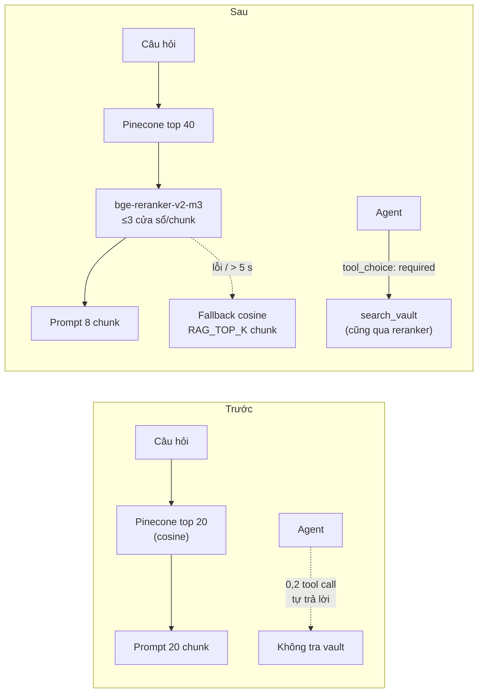

# Metrics trước / sau: Reranker + Agent bắt buộc tra vault

> Đo trên **production** (chỉ đọc): Pinecone `cter-index-production` (388 vector, 31 file), Neon (SELECT).
> Trước: 09/10/2026 · Sau: 09–10/10/2026 · Danh sách thay đổi code: [`CHANGES.md`](../CHANGES.md)

## Tóm tắt

| Khía cạnh | Trước | Sau | Thay đổi |
|---|---|---|---|
| Retrieval Hit@1 | 69,7% | **90,9%** | **+21,2 điểm** |
| Retrieval MRR | 0,802 | **0,947** | +0,145 |
| Chunk vào prompt single-shot | 20 | **8** | −60% ngữ cảnh, Hit@8 vẫn 100% |
| Agent: answerPrecision | 65,4% | **83,7%** | +18,3 điểm |
| Agent: completeness | 78,5% | **90,4%** | +11,9 điểm |
| Agent: citation recall | 6,1% | **97,0%** | agent giờ thực sự trích tài liệu |
| Agent: tool call / câu | 0,2 | 3,1 | trước gần như không tra vault |
| Agent: latency p50 / p95 | 5,4 s / 10,3 s | **11,4 s / 23,3 s** | ▼ chậm hơn ~2× (đánh đổi) |
| Agent: token input / câu | 4 616 | **18 130** | ▼ ~3,9× chi phí input |
| Single-shot: answerPrecision | 93,5% | 91,0% | −2,5 điểm (trong ngưỡng nhiễu, xem §2.3) |
| Single-shot: latency p50 | 6,2 s | 6,5 s | +0,3 s (rerank ~1 s, prompt ngắn hơn bù lại) |
| Timer rò sau 1 000 lời gọi | 1 000 | **0** | fix `withTimeout` |
| Load test: lỗi / mất / trùng | — | **0 / 0 / 0** | 1 200 + 400 + 120 request |

**Kết luận:** bật reranker cho cả hai mode; agent đáng tin hơn hẳn nhưng chỉ nên dùng khi cần (đã là opt-in), vì chậm và tốn gấp ~4 lần.



## 0. Cách đo

| Thành phần | Chi tiết |
|---|---|
| Golden set | `eval/rag/golden.jsonl`: 37 câu (33 trả lời được, 4 ngoài phạm vi), 23 file môn Software Testing, ~60% tiếng Anh / 40% tiếng Việt, 3 câu nhiều nguồn |
| Retrieval | `npm run eval:rag -- --rerank --candidates 40` — 1 lần search/câu, chấm 3 kiểu trên **cùng** ứng viên |
| Câu trả lời | `npm run eval:answers` — model `gpt-5.3-codex` (model OpenAI mặc định của production), judge `gpt-4o`, 37 câu × 2 mode × 1 lần |
| Trước | `RERANK_PROVIDER=none`, agent chưa có `minToolCalls` (= model tự quyết) |
| Sau | `RERANK_PROVIDER=pinecone` (40 → 8), `AGENT_MIN_TOOL_CALLS=1` |
| Load test | `npm run test:load` — fake server có độ trễ + tiêm lỗi, SDK Pinecone/OpenAI thật |
| Run gốc | `eval/rag/runs/*prod-golden-v1*`, `*prod-rerank-v1*`, `*prod-rerank-v2*` · `eval/answers/runs/*prod-baseline-v1*`, `*prod-after-v2*` (gitignored) |

## 1. Retrieval

### 1.1 Các phương án đã thử

| k | Vector (trước) | Rerank v1 (cắt 1 đoạn 1 500 ký tự) | **Rerank v2 (≤ 3 cửa sổ, chọn)** | Fusion RRF (rerank + vector) |
|---|---|---|---|---|
| Hit@1 | 69,7% | 78,8% | **90,9%** | 81,8% |
| Hit@3 | 90,9% | 84,8% | **97,0%** | 97,0% |
| Hit@5 | 90,9% | 90,9% | **100%** | 100% |
| Hit@8 | 100% | 90,9% ▼ | **100%** | 100% |
| Hit@10 | 100% | 100% | **100%** | 100% |
| Precision@1 | 69,7% | 78,8% | **90,9%** | 81,8% |
| Precision@5 | 30,9% | 31,5% | **34,5%** | 32,7% |
| MRR | 0,802 | 0,838 | **0,947** | 0,896 |
| Câu tốt hơn / kém hơn | — | 6 / 6 | **9 / 1** | 8 / 2 |

- **Rerank v1 bị loại** vì làm giảm Hit@8 (100% → 90,9%). Production giữ top 8, nên 3 câu sẽ mất tài liệu đúng khỏi prompt. Nguyên nhân: chunk dài (tới ~3 600 token) bị cắt, phần chứa đáp án không được chấm. Ví dụ câu về load/stress testing: mọi điểm rerank ≈ 0,00.
- **Fusion RRF bị loại** vì kém rerank v2 ở Hit@1 và MRR.
- Precision@k ở k lớn vẫn thấp (~14–22%) vì mỗi câu thường chỉ có 1 file đúng trong k chunk. Đây là giới hạn của metric, không phải nhiễu thật.

### 1.2 Câu đổi thứ hạng (rerank v2)

| Câu | Hạng file đúng: vector → rerank |
|---|---|
| blackbox-ep-01 (equivalence partitioning) | 7 → **1** |
| exp-error-guessing-01 | 6 → **1** |
| levels-acceptance-01 | 6 → **2** |
| sdlc-vmodel-01 | 3 → **1** |
| exp-exploratory-01 | 3 → **1** |
| fund-risk-01 | 3 → **1** |
| whitebox-01, combine-bb-wb-01, ch4-outline-01 | 2 → **1** |
| static-reviews-01 | 1 → 4 ▼ |

Câu duy nhất tụt hạng (`static-reviews-01`) bị các câu hỏi trong đề mẫu ISTQB vượt lên. Các câu đó đúng là bàn về review, nhưng golden set đang coi file đề ISTQB là "không liên quan".

### 1.3 Phát hiện câu ngoài phạm vi

| Điểm top-1 | Vector (cosine) | Rerank v2 |
|---|---|---|
| Câu liên quan (min) | 0,376 | 0,369 |
| Câu ngoài phạm vi (max) | **0,524** (chồng lên câu liên quan) | **0,010** |

Với cosine, **không có ngưỡng nào** tách được câu ngoài phạm vi. Với rerank, câu ngoài phạm vi có điểm ≤ 0,010, còn câu liên quan ≥ 0,369. Một ngưỡng như 0,1 sẽ tách được hai nhóm trên golden set này. Đây là hướng cải tiến tiếp theo (chưa làm); cần thêm câu ngoài phạm vi để kiểm chứng trước khi bật.

### 1.4 Latency rerank (production thật)

| | p50 | p95 | max | Passage / request |
|---|---|---|---|---|
| 40 ứng viên | 1 061 ms | 1 635 ms | 2 660 ms | 68 (≤ 100) |

Timeout mặc định đặt 5 000 ms (≈ 2× max đo được).

## 2. Chất lượng câu trả lời

### 2.1 Bảng chính

| Metric | Single-shot trước | Single-shot sau | Agent trước | Agent sau |
|---|---|---|---|---|
| answerPrecision | 93,5% | 91,0% | 65,4% | **83,7%** |
| completeness | 91,7% | 91,7% | 78,5% | **90,4%** |
| F1 | 93,4% | 91,4% | 73,4% | **91,0%** |
| relevance | 95,1% | 91,9% | 81,1% | **91,4%** |
| citationPrecision¹ | 60,5% | 62,6% | 75,0% (2 câu) | 72,5% |
| citationRecall¹ | 95,5% | **97,0%** | 6,1% | **97,0%** |
| refusalAccuracy | 97,3% | **100%** | 89,2% | **97,3%** |
| errorRate / fallbackRate | 0% / — | 0% / — | 0% / 0% | 0% / 0% |
| tool call trung bình | — | — | 0,2 | 3,1 |
| token in / out (agent) | — | — | 4 616 / 281 | 18 130 / 396 |
| latency mean | 6,4 s | 6,8 s | 6,1 s | 14,4 s |
| latency p50 | 6,2 s | 6,5 s | 5,4 s | 11,4 s |
| latency p95 | 9,2 s | 9,5 s | 10,3 s | 23,3 s |
| latency max | 10,3 s | 11,8 s | 19,7 s | 24,2 s |

¹ Cột "trước" là số **đã chấm lại** bằng parser citation đã sửa, từ chính các câu trả lời đã lưu (không gọi lại API). File report gốc của run trước ghi 11,7% / 15,2% (single-shot) và 0% / 0% (agent) do lỗi parser cắt tên file có dấu cách. Bảng drift tự động trong report "sau" so với số sai này, nên các dòng citation "▲ improved" ở đó phóng đại.

### 2.2 Agent

- Trước: model tự tin trả lời câu hỏi kiến thức chung, nên **35/37 câu không gọi tool** và câu trả lời kết thúc bằng "The provided documents were not retrieved".
- Sau (`tool_choice: required` ở lượt đầu): trung bình 3,1 tool call/câu. Precision tăng 18 điểm, recall trích dẫn từ 6% lên 97%.
- **Đánh đổi:** latency khoảng 2× và token input khoảng 3,9× (transcript gửi lại mỗi lượt, mỗi lượt kèm kết quả tool). Agent vẫn là opt-in (`_agent` / `mode: agent`), nên chi phí chỉ phát sinh khi người dùng chọn.
- Một câu agent tụt rõ: `static-cc-01` (ΔF1 −0,67). Cần đọc lại câu trả lời; có thể do judge hoặc do câu hỏi về độ phức tạp cyclomatic khớp nhiều đề ISTQB.

### 2.3 Single-shot

- Prompt giảm từ 20 xuống **8 chunk**, nhưng completeness giữ nguyên (91,7%) và citation recall tăng lên 97%.
- answerPrecision −2,5 điểm và relevance −3,2 điểm. Bộ phát hiện drift **không gắn cờ** vì mức này nằm dưới ngưỡng nhiễu 5 điểm (`DRIFT_THRESHOLDS.ratioAbs` trong `answerEval.enums.ts`). Với 37 câu và 1 lần chạy, 2,5 điểm tương đương khoảng 1 câu, và judge là LLM. Cần chạy `--repeats 3` để khẳng định có hồi quy thật hay không.
- Có 1 câu single-shot giảm: `qality-mapping-01` (ΔF1 −0,33). Đây là câu 2 nguồn; khi chỉ giữ 8 chunk, có thể một trong hai nguồn bị đẩy ra ngoài.
- Latency +0,3 s ở p50: rerank thêm ~1 s, nhưng prompt ngắn hơn giúp model trả lời nhanh hơn, bù lại phần lớn.

## 3. Load test (`npm run test:load`)

### 3.1 Kết quả sau khi sửa

| Kịch bản | Quy mô | Kết quả |
|---|---|---|
| L1 retrieval + rerank | 1 200 request, 40 đồng thời; tiêm 5% lỗi 500 + 3% chậm 900 ms; timeout 400 ms | 0 lỗi · 1 107 rerank + 93 fallback (= đúng 61 lỗi + 32 chậm) · 274 req/s · p50 105 ms · p95 146 ms · max 463 ms · heap 25,6 → 25,2 MB qua 3 vòng |
| L1 timer | 1 000 lời gọi, timeout 60 s | timer còn sống: 1 → **0** |
| L2 agent, `minToolCalls=0` | 100 câu, 20 đồng thời, model "lười" | 0 lỗi · **0 tool call** · 0% có nguồn (tái hiện lỗi production) |
| L2 agent, `minToolCalls=1` | 300 câu, 30 đồng thời; tiêm 500 vào OpenAI (1/25) và rerank (5% lỗi, 2% chậm) | 0 lỗi · 300/300 trả lời bằng agent (retry xử lý hết lỗi 500) · 1 tool call/câu · 100% request đầu có `tool_choice=required` · 279 có nguồn = 300 − 21 lần rerank lỗi · p95 164 ms · heap +5 MB |
| L3 soak chat | 120 request (60 agent + 60 single-shot) qua `ConversationPoller` thật, 5/vòng | 120/120 trả lời · **0 trùng · 0 mất** · 60 reply có `mode: agent` · mỗi vòng p50 284 ms, p95 352 ms · heap 24,3 → 25,5 MB qua 24 vòng |

Fake server chạy nhanh hơn thật (rerank ~50 ms thay vì ~1 s). Load test kiểm tra **tính đúng và độ ổn định dưới tải** (không mất, không trùng, không rò bộ nhớ hay timer, fallback đúng), **không** đo throughput thật của production.

### 3.2 Lỗi load test tìm ra (trước → sau)

| Vấn đề | Trước | Sau |
|---|---|---|
| `withTimeout` không xoá timer | 1 000 lời gọi để lại **1 000** timer sống tới hết timeout | **0** |
| SDK Pinecone tự retry 5xx (mặc định 3 lần, backoff ≤ 20 s) | Lỗi bị "nuốt" (41 fallback / 98 lỗi tiêm); p95 396 ms | Mỗi lỗi = 1 request; 93 fallback / 93 lỗi; **p95 146 ms** |
| `npm test` vô tình chạy load test song song | 2 file load test fail ngẫu nhiên | Tách cấu hình: `vitest.config.ts` / `vitest.load.config.ts` |

## 4. Giới hạn của các con số

- **37 câu, 1 lần chạy:** một câu ≈ 2,7–3 điểm phần trăm. Chênh lệch dưới ~5 điểm cần `--repeats 3` để chắc chắn.
- **Judge là LLM** (`gpt-4o`): nên đọc lại vài câu mỗi run.
- **Golden set soạn từ bản local** của 23 file. Nếu nội dung production khác, nhãn có thể lệch. Câu ISTQB (8 file) chưa có trong golden set vì không có bản local; file đề ISTQB đang bị tính là "không liên quan", nên precision và thứ hạng có thể bị đánh giá thấp hơn thực tế.
- **Câu hỏi được soạn sau khi đọc tài liệu**, nên retrieval có thể dễ hơn câu hỏi thật của sinh viên.

## 5. Khuyến nghị

| # | Việc | Lý do |
|---|---|---|
| 1 | Bật `RERANK_PROVIDER=pinecone` trên production (sau khi kiểm tra quota Pinecone) | Hit@1 +21 điểm, prompt ngắn hơn 60%, refusal 100% |
| 2 | Giữ `AGENT_MIN_TOOL_CALLS=1` | Không có thì agent không dùng vault |
| 3 | Chạy `eval:answers --repeats 3` cho single-shot | Xác nhận −2,5 điểm precision là nhiễu hay hồi quy thật |
| 4 | Thêm câu ISTQB + 6–10 câu ngoài phạm vi vào golden set | Đánh giá đúng hơn và kiểm chứng ngưỡng điểm rerank |
| 5 | Thử ngưỡng rerank (ví dụ 0,1) để từ chối câu ngoài phạm vi | Câu ngoài phạm vi ≤ 0,010, câu liên quan ≥ 0,369 |
| 6 | Giảm chi phí agent: `previous_response_id` thay vì gửi lại transcript | Token input ×3,9 |

## 6. Chạy lại

```bash
npm run eval:rag -- --rerank --candidates 40 --label rerank-check
# eval/.env.eval: RERANK_PROVIDER=none (trước) hoặc pinecone (sau), AGENT_MIN_TOOL_CALLS=0|1
npm run eval:answers -- --yes --label after --baseline latest
npm run test:load      # ghi load/runs/latest.json
```
