# START_DIAGRAM_SKILLS_FULL_gemini.md

> **Mục đích:** Bộ 10 câu hỏi gộp 1 file để test AI có tự động đọc và cross-check `documents-vault/diagram-skills.md` khi gặp yêu cầu vẽ diagram không. Mỗi câu là 1 trap ký pháp sẽ bị trừ điểm Week-8 nếu sai. Shot prompting đã gắn trong `system-prompt.md` § DIAGRAM SKILLS.

> **Cách chạy:** Đưa nguyên file này cho AI qua pipeline `markdownToPdf` (hoặc tách từng Q). Pipeline phải render Mermaid `ok:true`. Chấm PASS khi AI có dòng `CROSS-CHECK diagram-skills.md §X` và vẽ đúng checklist từng Q.

---

## Q01 — DFD Shape (diagram-skills.md §1.1)

### Câu hỏi
Vẽ DFD Level-1 cho hệ thống Hanoi Intersection theo `diagram-skills.md` §1.1. Hệ thống có 6 Data Process (1.0–6.0), 1 Control Process (7.0 Watchdog), 6 external entities (Pedestrian, Vehicle sensors, Train NB/SB, Railway system, Operator, Display) và 4 Data Store (D1–D4).

### Yêu cầu output
- Sơ đồ `flowchart LR` thể hiện đủ 4 loại thực thể với **đúng hình dạng**:
  - `7.0 Watchdog` = **tròn NÉT ĐỨT** (dashed circle)
  - `1.0 Local Controller` … `6.0 Display` = **tròn NÉT LIỀN** (solid circle)
  - Source/sink = **hình chữ nhật ĐÓNG 4 cạnh** (ví dụ `Pedestrian`)
  - Data store D1–D4 = **hình chữ nhật MỞ chỉ 2 cạnh ngang** (Gane–Sarson) hoặc trụ DB — KHÔNG dùng hình chữ nhật đóng
- Mỗi thực thể có nhãn tiếng Anh, số hiệu (7.0, D1…).
- Kèm legend: "Source/sink = closed rectangle, Data store = open rectangle (Gane–Sarson)".
- Trong mermaid: Data store dùng `[/"D1 Intersection State"/]` hoặc `[(D1)]` để phân biệt với source/sink `["Pedestrian"]`.

### Để kiểm tra (cross-check §1.1)
- [ ] `7.0 Watchdog` là dashed circle (không phải solid)
- [ ] Data Process là solid circle
- [ ] Source/sink là chữ nhật đóng 4 cạnh
- [ ] D1–D4 là chữ nhật mở 2 cạnh HOẶC trụ DB, KHÔNG phải chữ nhật đóng (trap chính)
- [ ] Có legend phân biệt source/sink vs store
- [ ] Nếu AI vẽ D1 như `["D1"]` (đóng) → FAIL

### Đáp án mẫu
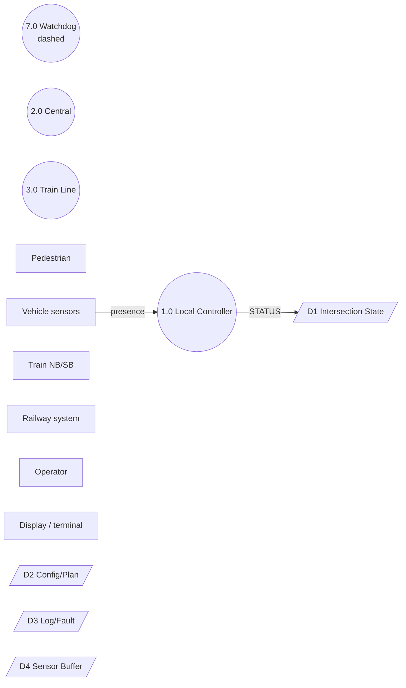
> Legend: Solid circle = Data Process, Dashed circle = Control Process, Closed rectangle = Source/sink, Open rectangle = Data store.

---

## Q02 — DFD Flow Types (diagram-skills.md §1.2)

### Câu hỏi
Phân biệt và vẽ đúng 3 loại flow trong DFD Level-1 Hanoi theo `diagram-skills.md` §1.2. Cho các luồng: `Go/NoGo` (Watchdog → Local Controller), `STATUS_CHANGE` (Local Controller → Central), `presence/occupancy` liên tục từ Vehicle sensors.

### Yêu cầu output
- Sơ đồ `flowchart LR` với 3 loại mũi tên **đúng ký pháp**:
  - **Event flow** = **mũi tên NÉT ĐỨT + nhãn** (`-.->` trong mermaid) — CHỈ vào/ra **Control Process** (Watchdog), KHÔNG mang dữ liệu
  - **Discrete data flow** = **mũi tên NÉT LIỀN 1 đầu** (`-->`) — gói tin rời rạc
  - **Continuous data flow** = **mũi tên NÉT LIỀN 2 đầu/kép** (`==>` hoặc bold) — tín hiệu liên tục
- Mỗi mũi tên có nhãn tiếng Anh.
- Kèm bảng 3 dòng giải thích loại flow + ký hiệu + ví dụ (như Table §1.2).
- Trong mermaid PHẢI dùng: `-. "Go/NoGo" .->` cho event, `-- "STATUS_CHANGE" -->` cho discrete, `== "presence" ==> ` cho continuous.

### Để kiểm tra (cross-check §1.2)
- [ ] `Go/NoGo` vẽ bằng **nét đứt** `-.->` và nối với `7.0 Watchdog`
- [ ] `STATUS_CHANGE`, `CMD_PATTERN` vẽ bằng **nét liền 1 đầu** `-->`
- [ ] `presence/occupancy` vẽ bằng **nét liền 2 đầu** `==>` (trap: nếu AI dùng `--> ` cho continuous → FAIL)
- [ ] Không có event flow nối giữa 2 Data Process (event chỉ vào/ra Control Process)
- [ ] Bảng giải thích đủ 3 loại flow
- [ ] Nếu AI dùng toàn `--> ` cho cả 3 → FAIL

### Đáp án mẫu
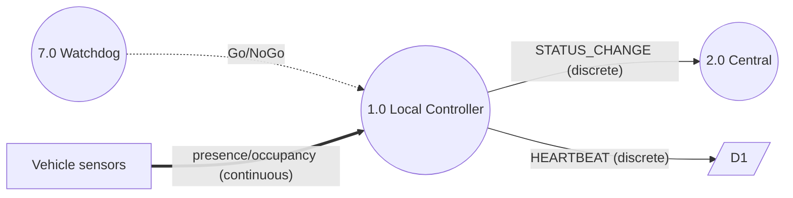

| Loại flow | Ký hiệu mermaid | Ví dụ |
|---|---|---|
| Event flow | `-.->` dashed | `Go/NoGo`, `button push` |
| Discrete data flow | `-->` solid 1 đầu | `STATUS_CHANGE`, `HEARTBEAT` |
| Continuous data flow | `==>` solid 2 đầu | `presence/occupancy` |

---

## Q03 — DFD Balancing SA/SD (diagram-skills.md §1.1)

### Câu hỏi
Kiểm tra nguyên tắc **Cân bằng SA/SD** khi phân rã từ Context (L0) sang DFD Level-1 cho Hanoi theo `diagram-skills.md` §1.1 (điểm cao). Context L0 đã có 6 external entities: Pedestrian, Vehicle sensors, Train NB/SB, Railway system (boom, flashing), Operator (control room), Display/terminal. Và flow `TRAIN_RED` (hệ thống → tàu khi boom fault) xuất hiện ở cả hai mức.

### Yêu cầu output
- Liệt kê tập external entity của Level-0 và Level-1 trong bảng so sánh 2 cột để chứng minh **giữ nguyên HỆT nhau** (không thêm/bớt).
- Sơ đồ DFD Level-1 `flowchart` phải chứa đủ 6 entities trên, không tự bịa thêm `Central System` hay bớt `Operator`.
- Nêu rõ `TRAIN_RED` xuất hiện ở cả Context và Level-1 (đi từ `Local Controller` → `Train`).
- Kèm câu cross-check: "CROSS-CHECK §1.1: Level-1 entities = Level-0 entities = 6".

### Để kiểm tra (trap balancing)
- [ ] Level-1 có đúng 6 external entities như L0 (đếm đủ)
- [ ] Không có entity lạ thêm vào
- [ ] Không thiếu entity (thường AI hay quên `Display/terminal` hoặc `Railway system`)
- [ ] `TRAIN_RED` được nêu ở cả hai mức
- [ ] Có bảng so sánh L0 vs L1
- [ ] Nếu AI nói "Level-1 có thể thêm entity mới" → FAIL

### Đáp án mẫu
| External entity | Level-0 (Context) | Level-1 (DFD) |
|---|---|---|
| Pedestrian | ✓ | ✓ |
| Vehicle sensors | ✓ | ✓ |
| Train NB/SB | ✓ | ✓ |
| Railway system | ✓ | ✓ |
| Operator | ✓ | ✓ |
| Display / terminal | ✓ | ✓ |

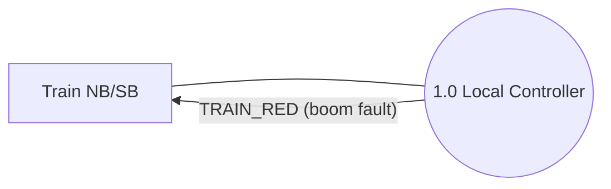
CROSS-CHECK §1.1: Level-1 entities = Level-0 entities = 6 ✓

---

## Q04 — Use Case Boundary (diagram-skills.md §2.1)

### Câu hỏi
Vẽ Use Case diagram cho Hanoi Intersection theo `diagram-skills.md` §2.1. Hệ thống có các UC: `UC1 Detect Vehicle`, `UC2 Control Signal Phase`, `UC3 Pedestrian Crossing`, `UC4 Handle Train Approach`, `UC5 Log Fault`, và nhóm Railway Safety gom UC4–UC6. Actors: Vehicles, Pedestrian, Train, Control Room.

### Yêu cầu output
- Sơ đồ Use Case `flowchart` với:
  - **Đường biên hệ thống** (rectangle = hệ thống) — **actors ĐỨNG NGOÀI biên, use case ĐỨNG TRONG**
  - **Sub-boundary** "Railway Safety" gom UC4–UC6 bên trong system boundary
  - Đầy đủ actors hình que (`{{Actor}}`) và use case hình elip `([UC])`
  - Tên UC dạng verb+object
- Liệt kê đầy đủ 4 actors + ít nhất 5 UC
- Kèm chú thích boundary bằng tiếng Anh

### Để kiểm tra (cross-check §2.1)
- [ ] Có system boundary rectangle bao quanh UC (không bao cả Actor)
- [ ] Actors đứng NGOÀI boundary, UC đứng TRONG (trap: AI hay vẽ actor trong hệ thống)
- [ ] Có sub-boundary Railway Safety
- [ ] UC đặt tên verb+object
- [ ] Đủ 4 actors, đủ UC
- [ ] Nếu AI không vẽ boundary → FAIL

### Đáp án mẫu
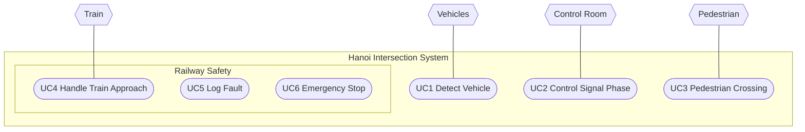
Actors outside, Use Cases inside System boundary ✓

---

## Q05 — Use Case Include/Extend Direction (diagram-skills.md §2.2) — TRAP NẶNG NHẤT

### Câu hỏi
Vẽ quan hệ `<<include>>` và `<<extend>>` trong Use Case diagram Hanoi theo `diagram-skills.md` §2.2. Cho: `UC4 Handle Train Approach` luôn gọi `UC5 Log Fault` (include), `UC6 Emergency Braking` mở rộng `UC1 Detect Vehicle` khi có điều kiện (extend).

### Yêu cầu output — TRAP CHÍNH (chiều mũi tên)
- Sơ đồ với **mũi tên NÉT ĐỨT** cho cả hai:
  - `<<include>>`: mũi tên từ **UC gốc → UC được gọi** : `UC4 ──<<include>>──> UC5` (UC4 luôn chạy UC5)
  - `<<extend>>`: mũi tên từ **UC mở rộng → UC gốc** : `UC6 ──<<extend>>──> UC1` (UC6 thêm vào UC1 khi có điều kiện)
- Association giữa Actor và UC = **mũi tên NÉT LIỀN** (hoặc line không mũi tên nếu không rõ initiator), phân biệt initiator (Actor → UC) vs receiver (UC → Actor)
- Kèm bảng 3 dòng: Association / Include / Extend với chiều + nét + ví dụ
- Trong mermaid: `UC4 -. "«include»" .-> UC5` và `UC6 -. "«extend»" .-> UC1` (nét đứt `.->`)

### Để kiểm tra (cross-check §2.2 — dễ bị trừ điểm nặng)
- [ ] `<<include>>` vẽ từ **UC4 → UC5** (không phải UC5 → UC4)
- [ ] `<<extend>>` vẽ từ **UC6 → UC1** (không phải UC1 → UC6) — ngược trực giác, trap số 1
- [ ] Cả hai đều là **nét đứt** `-.->` (không phải nét liền)
- [ ] Association là **nét liền** `--> ` hoặc `---` (không phải nét đứt)
- [ ] Có nhãn `«include»` / `«extend»` trên mũi tên đứt
- [ ] Nếu AI vẽ `UC5 -.-> UC4` hoặc `UC1 -.-> UC6` → FAIL hoàn toàn

### Đáp án mẫu (đúng)
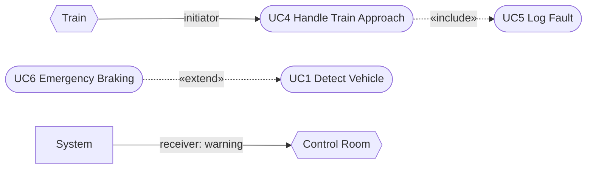

| Quan hệ | Nét | Chiều | Ví dụ đúng |
|---|---|---|---|
| Association | Nét liền | Actor → UC (initiator) / UC → Actor (receiver) | `Train --> UC4` |
| <<include>> | Nét đứt | UC gốc → UC con | `UC4 -.-> UC5` |
| <<extend>> | Nét đứt | UC mở rộng → UC gốc | `UC6 -.-> UC1` |

---

## Q06 — State Chart + Flowchart (diagram-skills.md §3)

### Câu hỏi
Vẽ State chart và Flowchart cho Hanoi Intersection theo `diagram-skills.md` §3 (bảng ký pháp nhanh). State chart: các trạng thái đèn `Red`, `Green`, `Yellow` với start/end `[*]`, composite state `Normal Operation` chứa 3 sub-state. Flowchart: quy trình xử lý `Train Approach` với decision diamond.

### Yêu cầu output
- **State chart** `stateDiagram-v2` với:
  - State = **chữ nhật BO GÓC** (rounded rectangle)
  - Start `[*]` = **vòng tròn đen ĐẶC**, End `[*]` = **vòng tròn đen có viền ngoài**
  - Composite state = khung bo góc **lồng chứa sub-state bên trong** (dùng `state Normal { ... }`)
  - Transition = mũi tên kèm nhãn `event [guard] / action` (ví dụ `trainApproach [boomOk] / setRed`)
- **Flowchart** `graph TD` với:
  - Process/action = **chữ nhật BO GÓC**
  - Decision = **HÌNH THOI** `{{"Train coming?"}}`
  - Mũi tên nhãn `yes`/`no`, start/end = vòng tròn đen
- Kèm bảng ký pháp 2 dòng cho mỗi loại

### Để kiểm tra (cross-check §3)
- [ ] State là rounded rectangle (không phải elip hay chữ nhật thường)
- [ ] Start là chấm đen đặc `[*]`, End là chấm đen có viền
- [ ] Có composite state lồng nhau
- [ ] Transition có nhãn `event [guard] / action` (đủ 3 phần)
- [ ] Flowchart decision là **hình thoi** `{{}}`
- [ ] Nếu AI vẽ state như `["Red"]` (chữ nhật thường) hoặc decision như `["Train?"]` → FAIL

### Đáp án mẫu
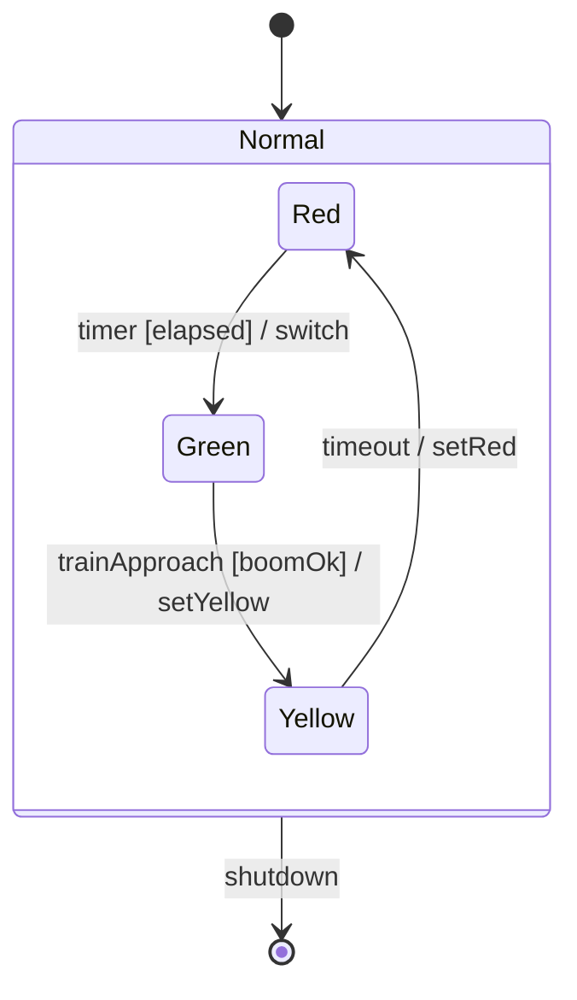

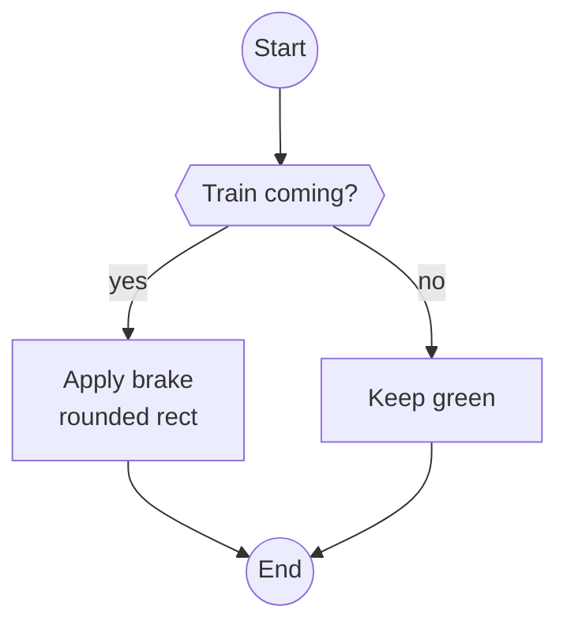

---

## Q07 — COMET Task Architecture (diagram-skills.md §3.1) — TRAP NẶNG

### Câu hỏi
Vẽ Task Architecture diagram (COMET — Gomaa, slide week-8) cho Hanoi theo `diagram-skills.md` §3.1. Hệ thống có: `T_VehSensor` (poll 200ms), `T_Watchdog` (periodic), `T_Light` (FSM đèn), `T_CentralComm`, `T_Ped`, `T_Display`.

### Yêu cầu output — TRAP: Task ≠ DFD Process
- Mỗi task là **chữ nhật 2 dòng** (KHÔNG phải vòng tròn DFD):
  ```
  ┌──────────────────────────┐
  │  «stereotype»            │ ← dòng 1: loại task
  │  : TênTask               │ ← dòng 2: tên bắt đầu bằng ':'
  └──────────────────────────┘
  ```
- Trong mermaid dùng **label 2 dòng**: `TL["«state dependent control»<br>: T_Light"]`
- Đúng stereotype theo §3.1.1:
  - `«periodic»` / `«timer»` → `T_VehSensor`, `T_Watchdog`
  - `«event»` / `«asynchronous»` → `T_CentralComm`, `T_RailMon`
  - `«state dependent control»` → `T_Light`, `T_Central`
  - `«input»` / `«output»` → `T_Ped`, `T_Display`
- Mô tả port/communication bằng nhãn mũi tên: `occupancy → δ_l (Native)` / `button push (pulse)` / `QNET`
- **KHÔNG gộp time-critical task với task thường** (W8-2 criterion 3) — nếu gom phải giải thích
- Phân biệt Task = active object (có thread riêng) vs Data = passive entity

### Để kiểm tra (cross-check §3.1 — trap nặng)
- [ ] Task vẽ dạng **chữ nhật** `["..."]` 2 dòng, KHÔNG phải vòng tròn `((...))` như DFD
- [ ] Mỗi task có đủ 2 dòng: `«stereotype»` + `: TênTask` (thiếu `:` hoặc thiếu `«»` → FAIL)
- [ ] Stereotype đúng loại (ví dụ `T_VehSensor` phải là `«timer»`/`«periodic»`, không phải `«event»`)
- [ ] Nhãn mũi tên ghi loại kênh `Native`/`pulse`/`QNET`
- [ ] Không gộp `T_Watchdog` với task thường không giải thích
- [ ] Nếu AI vẽ `T_Light(("T_Light"))` → FAIL (nhầm DFD notation)

### Đáp án mẫu
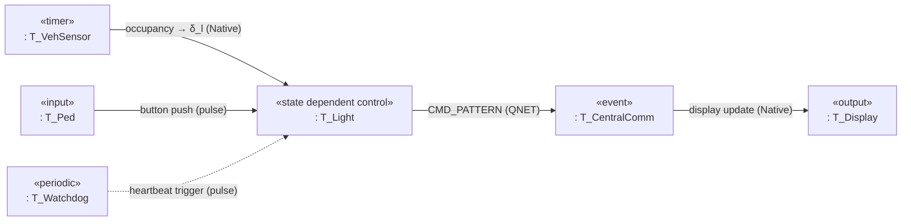
Task = rectangle 2-line, Data = passive store ✓

---

## Q08 — B&W + Glyph + Export (diagram-skills.md §3.2 + §4)

### Câu hỏi
Kiểm tra yêu cầu **TRẮNG ĐEN (B&W) + glyph toán học** khi export diagram cho Hanoi theo `diagram-skills.md` §3.2 + §4 checklist. Diagram có công thức `δ_l`, `ℓ_v`, `≥`, `·`, `×`, `−` (U+2212).

### Yêu cầu output
- Nêu config `mmdc-config.json` cho B&W:
  ```json
  {
    "theme": "base",
    "themeVariables": {
      "primaryColor": "#FFFFFF",
      "secondaryColor": "#FFFFFF",
      "tertiaryColor": "#FFFFFF",
      "background": "#FFFFFF",
      "primaryTextColor": "#000000",
      "primaryBorderColor": "#000000",
      "lineColor": "#000000"
    }
  }
  ```
- Giải thích glyph: chỉ dùng glyph có trong font `trebuchet-ms`/`segouib`, kiểm tra trước khi render; an toàn: `δ_l` → `δ<sub>l</sub>`, `g_feeding` → `g<sub>feeding</sub>`, `≥` giữ nguyên, `−` dùng U+2212
- Mô tả cách verify: `pdftotext` hoặc render PNG kiểm tra không còn màu (chỉ `0 0 0` / `1 1 1`) và không có ô trống/tofu
- Sơ đồ mẫu `flowchart` chứa nhãn `δ<sub>l</sub> ≥ 5 × cycle`
- Checklist §4 rút gọn 4 dòng B&W + Glyph + Tên file ASCII `diagrams/state-normal.pdf` (PDF+PNG)

### Để kiểm tra (cross-check §3.2 + §4)
- [ ] Có nêu `primaryColor:#FFFFFF`, border/text `#000000` (B&W bắt buộc)
- [ ] Có nêu lý do B&W: in PDF + photocopy + chấm đọc dễ
- [ ] Có liệt kê glyph `δ_l`, `ℓ_v`, `≥`, `·`, `×`, `−` và cách thay an toàn `δ<sub>l</sub>`
- [ ] Có mô tả verify bằng `pdftotext` / extract text / render PNG
- [ ] Nhãn toán trong diagram dùng `<sub>` hoặc giữ nguyên glyph an toàn
- [ ] Nếu AI đề xuất export màu `primaryColor:#FF0000` → FAIL

### Đáp án mẫu
Config B&W như trên ✓
Glyph an toàn: `TL -- "δ<sub>l</sub> ≥ threshold" --> NEXT`
Verify: `pdftotext diagrams/state-normal.pdf - | grep -v "0 0 0"` phải rỗng (không còn màu) + kiểm tra PNG không có tofu box.
Tên file: `diagrams/state-normal.pdf` + `diagrams/state-normal.png` (vector + raster).

---

## Q09 — Adversarial Correction (cross-check toàn file) — TEST TRÍ THÔNG MINH

### Câu hỏi
Bạn được đưa 1 diagram MẪU SAI dưới đây (do sinh viên khóa trước vẽ). Hãy **cross-check với `diagram-skills.md` và sửa lại toàn bộ lỗi ký pháp**, giải thích từng lỗi theo đúng §.

**Diagram SAI (đừng copy):**
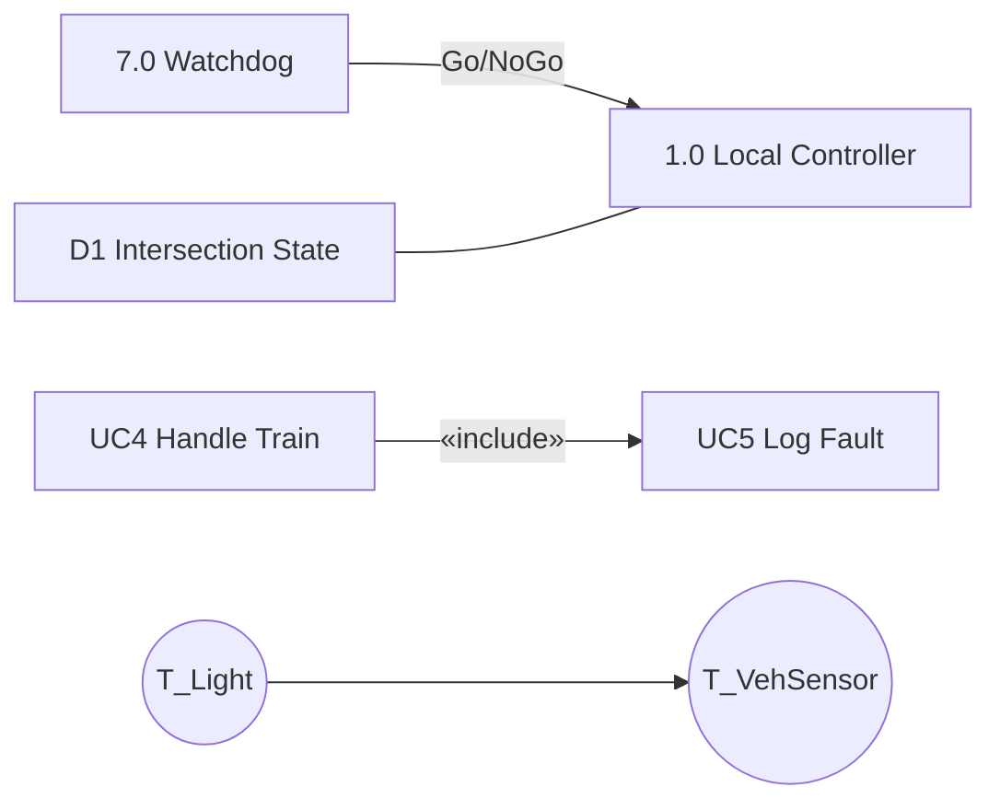
Lỗi cố ý: Watchdog là chữ nhật + nét liền (phải tròn nét đứt), Go/NoGo là nét liền (phải nét đứt), D1 là chữ nhật đóng (phải mở/Gane–Sarson), include vẽ ngược chiều, Task vẽ hình tròn như DFD.

### Yêu cầu output
- Bảng 5 lỗi: mỗi dòng ghi **Lỗi | Quy tắc § | Sửa thế nào**
- Sơ đồ **Đã sửa** đúng chuẩn với:
  - Watchdog = `((...))` dashed + `-.->` cho Go/NoGo
  - D1 = `[/"D1"/]` (mở) hoặc `[(D1)]`
  - Include đúng chiều `UC4 -.-> UC5`, nét đứt
  - Task = `["«state dependent control»<br>: T_Light"]` chữ nhật 2 dòng
- Kết luận: `CROSS-CHECK diagram-skills.md §1.1, §1.2, §2.2, §3.1 — đã sửa 5 lỗi`

### Để kiểm tra (test độ thông minh)
- [ ] AI **nhận ra** Watchdog sai hình (phải tròn đứt) và sửa
- [ ] AI **nhận ra** Go/NoGo phải nét đứt `-.->`
- [ ] AI **nhận ra** D1 sai (phải mở 2 cạnh, không phải đóng)
- [ ] AI **nhận ra** include ngược và sửa `UC4 → UC5`
- [ ] AI **nhận ra** Task tròn là sai (phải chữ nhật 2 dòng + stereotype)
- [ ] Có bảng lỗi với cột § tham chiếu
- [ ] Nếu AI khen diagram mẫu "đã đúng" hoặc copy nguyên không sửa → FAIL nặng

### Đáp án mẫu (đã sửa)
| # | Lỗi | § | Sửa |
|---|---|---|---|
| 1 | Watchdog chữ nhật nét liền | §1.1 | Tròn nét đứt `((7.0 Watchdog))` + `-.->` |
| 2 | Go/NoGo nét liền | §1.2 | Nét đứt `WATCHDOG -. "Go/NoGo" .-> CTRL` |
| 3 | D1 chữ nhật đóng `["D1"]` | §1.1 | Mở `[/"D1"/]` hoặc trụ `[(D1)]` + legend |
| 4 | Include ngược UC5→UC4 | §2.2 | `UC4 -. "«include»" .-> UC5` (gốc→con) |
| 5 | Task hình tròn `((T_Light))` | §3.1 | `["«state dependent control»<br>: T_Light"]` |

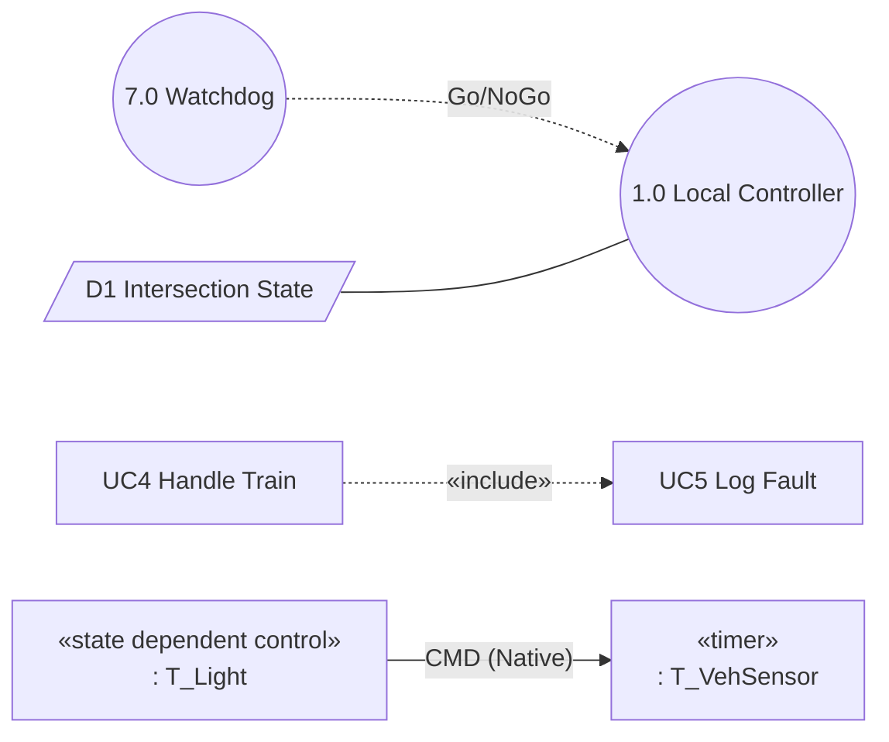

---

## Q10 — Full Hanoi Integration (diagram-skills.md §1–§4) — BENCHMARK

### Câu hỏi
Vẽ **bộ 4 diagram** cho site Hanoi theo `diagram-skills.md` toàn file (§1–§4) + `planning/P2/hanoi/diagram-drawing-guide.md`: (1) DFD Level-1, (2) Use Case, (3) State chart đèn, (4) Task Architecture COMET.

### Yêu cầu output
- **1. DFD Level-1** `flowchart LR`: đủ 6 Data Process tròn liền + 1 Control Watchdog tròn đứt + 6 source/sink chữ nhật đóng + D1–D4 mở/trụ + 3 loại flow (`-.->` event, `--> ` discrete, `==>` continuous) + balancing note.
- **2. Use Case** `flowchart`: system boundary + sub-boundary Railway Safety + actors ngoài + UC trong + association nét liền + `UC4 -.include.-> UC5` + `UC6 -.extend.-> UC1` đúng chiều.
- **3. State chart** `stateDiagram-v2`: `[*]` start đen đặc → `Normal` composite chứa `Red/Green/Yellow` (rounded rect) → `[*]` end có viền, transition `event [guard] / action`.
- **4. Task Architecture** `flowchart LR`: 5 tasks chữ nhật 2 dòng đúng stereotype (`«timer»`, `«state dependent control»`, `«input»`, `«output»`, `«event»`) + nhãn `Native`/`pulse`/`QNET`, không gộp time-critical.
- **5. Checklist export §4** 8 dòng: ASCII filename `diagrams/hanoi-*.pdf` + B&W `#FFFFFF`/`#000000` + glyph `δ<sub>l</sub>` an toàn + legend + nhãn English + đối chiếu spec.

### Để kiểm tra (benchmark toàn bộ)
- [ ] DFD shapes đúng 4 loại (§1.1) + flows 3 loại (§1.2) + balancing 6 entities (§1.1)
- [ ] Use Case boundary + include/extend đúng chiều (§2)
- [ ] State chart rounded rect + start/end + composite + `event [guard]/action` (§3)
- [ ] Task Architecture chữ nhật 2 dòng + stereotype đúng (§3.1) + không vẽ tròn
- [ ] B&W config + glyph check (§3.2) + checklist §4 8 mục
- [ ] Tất cả nhãn mũi tên tiếng Anh, có legend
- [ ] Nếu AI thiếu 1 trong 4 diagram → FAIL, nếu AI vẽ task = tròn → FAIL

### Đáp án mẫu (rút gọn)
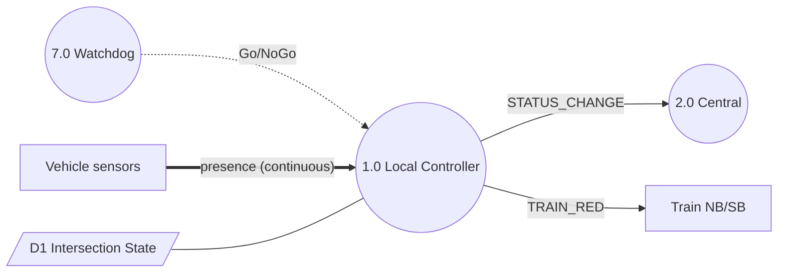

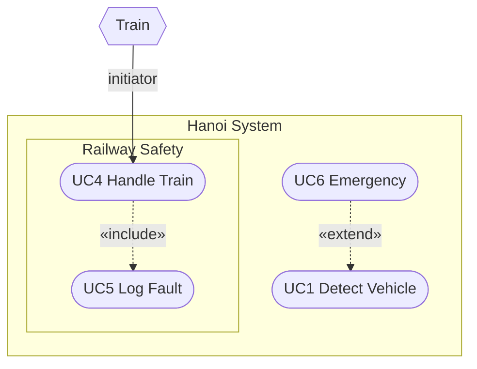

```mermaid
stateDiagram-v2
    [*] --> Normal
    state Normal { Red --> Green: timer [elapsed] / switch }
    Normal --> [*]
```

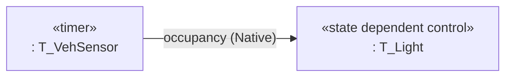

Checklist §4: filename ASCII, B&W `#FFFFFF`/`#000000` verified via pdftotext, glyph `δ<sub>l</sub>` no tofu, legend, arrow direction, shape, English labels, spec-matched ✓
