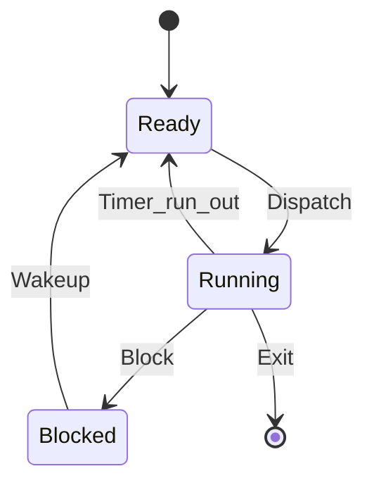

# START_T01_QNX_Thread_States_gemini.md

## Câu hỏi
Mô tả vòng đời cơ bản của Process/Thread trong hệ điều hành QNX bằng sơ đồ trạng thái Mermaid. Dựa trên kiến thức trong Week-02/Lecture 2 - Concurrent Processes.md.

## Yêu cầu output
- Hệ thống phải render sơ đồ dạng `stateDiagram-v2` với 4 trạng thái: Ready, Running, Blocked, Stopped/Dead.
- Có mũi tên chuyển trạng thái: Dispatch, Timer_run_out, Block, Wakeup, Exit.
- Kèm 1 đoạn text giải thích: "Khi một luồng ở trạng thái Blocked, nó hoàn toàn không tiêu thụ thời gian của CPU."
- Kèm 1 công thức toán: QNX chẻ 4 trạng thái cơ bản thành 21 trạng thái chi tiết: $21 = 4 + 17$.

## Để kiểm tra trong output PDF
- [ ] Sơ đồ `stateDiagram-v2` được render thành hình, KHÔNG hiển thị dạng code thô.
- [ ] Các nhãn trạng thái tiếng Anh đúng chính tả.
- [ ] Công thức $21 = 4 + 17$ hiển thị dạng toán học.

## Đáp án mẫu (để test pipeline)

QNX chẻ 4 trạng thái cơ bản thành $21 = 4 + 17$ trạng thái chi tiết.
