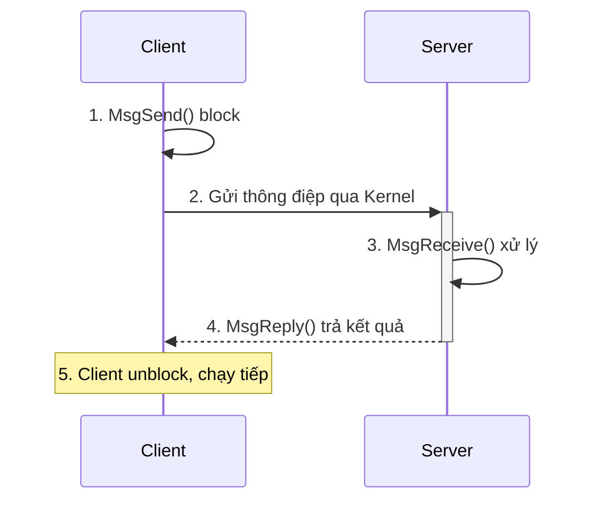

# START_T02_QNX_IPC_gemini.md

## Câu hỏi
Vẽ sơ đồ sequence cho mô hình Native QNX Message Passing (Client/Server) theo Week-02/Lecture 2 - Part 2 - IPC - QNX.md.

## Yêu cầu output
- Sơ đồ `sequenceDiagram` với participant Client và Server.
- Diễn tả đúng 3 bước: `MsgSend()` (Client block), `MsgReceive()` (Server nhận & xử lý), `MsgReply()` (Client unblock).
- Kèm bảng so sánh POSIX Mqueue vs Native QNX IPC.
- Kèm giải thích: Pulse là tín hiệu nhỏ cố định, không cần `MsgReply()`.

## Để kiểm tra trong output PDF
- [ ] `sequenceDiagram` render thành hình, thấy rõ participant + các mũi tên SEND/REPLY.
- [ ] Bảng 2 cột so sánh hiển thị đúng.
- [ ] Không bị vỡ dòng trong phần text mô tả.

## Đáp án mẫu (để test pipeline)

| Tiêu chí | POSIX Mqueue | Native QNX IPC |
|----------|--------------|----------------|
| Cơ chế | Hộp thư store-and-forward | Client/Server đồng bộ |
| Chặn | Người nhận chặn khi rỗng | MsgSend chặn đến khi reply |
| Pulse | Không có | Có, không cần reply |
