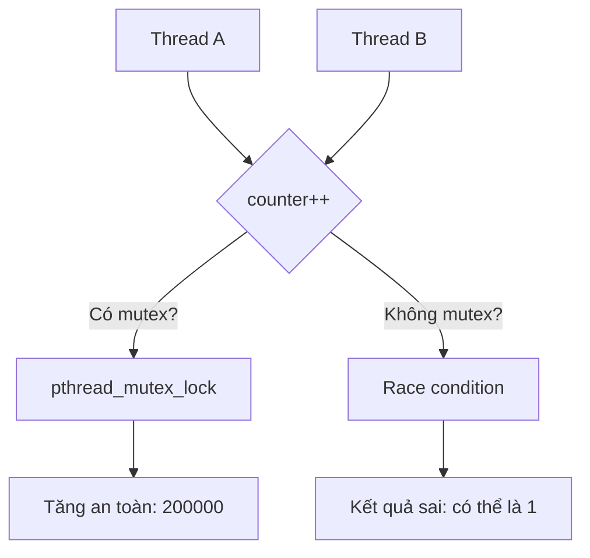

# START_T03_QNX_Mutex_gemini.md

## Câu hỏi
Trình bày bài toán Race Condition và giải pháp Mutex trong QNX bằng sơ đồ flowchart + code C, theo Week-02/Shared-Data-And-Race-Conditions.md.

## Yêu cầu output
- Sơ đồ `graph TD` (flowchart) mô tả 2 luồng cùng tăng biến `shared_counter`.
- Bên trong flowchart có khối quyết định (diamond): "Có mutex?" → Yes: tăng an toàn / No: race condition.
- Kèm đoạn code C sử dụng `pthread_mutex_lock/unlock`.
- Kèm công thức: nếu không có mutex, kết quả cuối cùng có thể là $1$ thay vì $2$.

## Để kiểm tra trong output PDF
- [ ] `graph TD` render thành hình flowchart.
- [ ] Khối diamond và 2 nhánh Yes/No hiển thị đúng.
- [ ] Code block C giữ nguyên định dạng, không mất dòng.
- [ ] Công thức toán hiển thị đúng.

## Đáp án mẫu (để test pipeline)


```c
pthread_mutex_lock(&my_mutex);
shared_counter++;   // critical section
pthread_mutex_unlock(&my_mutex);
```

Không có mutex, kết quả cuối cùng có thể là $1$ thay vì $2$.
