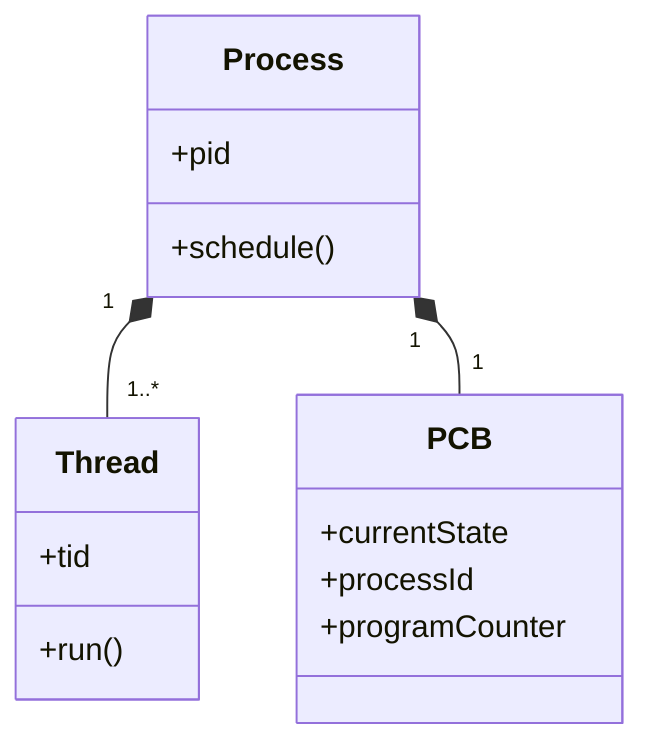

# START_T04_QNX_ClassDiagram_gemini.md

## Câu hỏi
Vẽ class diagram mô tả quan hệ giữa Process, Thread và PCB (Process Control Block) theo Week-02/Lecture 2 - Concurrent Processes.md.

## Yêu cầu output
- Sơ đồ `classDiagram` với 3 class: Process, Thread, PCB.
- Quan hệ: `Process "1" *-- "1..*" Thread`, `Process "1" *-- "1" PCB`.
- Thuộc tính PCB: `currentState`, `processId`, `programCounter`.
- Kèm bảng liệt kê các hàm API định danh: `getpid()`, `gettid()`, `getppid()`.

## Để kiểm tra trong output PDF
- [ ] `classDiagram` render thành hình.
- [ ] Quan hệ composition (vòng kim cương) hiển thị đúng.
- [ ] Bảng API hiển thị đầy đủ 3 hàm.

## Đáp án mẫu (để test pipeline)

| Hàm API | Ý nghĩa |
|---------|---------|
| `getpid()` | Process ID |
| `gettid()` | Thread ID |
| `getppid()` | Parent Process ID |
