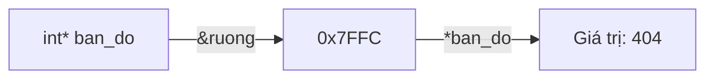

# START_T05_C_Pointer_gemini.md

## Câu hỏi
Giải thích cách hoạt động của con trỏ trong C/C++ bằng sơ đồ, theo C-POINTER/C-POINTER.md.

## Yêu cầu output
- Sơ đồ `graph LR` mô tả: `int* ban_do` (con trỏ) → chứa địa chỉ → trỏ tới ô nhớ chứa giá trị.
- Kèm bảng 3 ký hiệu: `&` (address-of), `*` (pointer/dereference), `->` (truy cập qua con trỏ).
- Kèm code minh họa `void tangGiaTri(int *n) { *n = *n + 1; }`.
- Kèm công thức: $*p \equiv *(p + 0)$.

## Để kiểm tra trong output PDF
- [ ] `graph LR` render thành hình.
- [ ] Code C++ giữ nguyên, không bị mất ký tự `*`, `&`, `->`.
- [ ] Bảng 3 ký hiệu hiển thị đúng.
- [ ] Công thức toán không bị hiểu nhầm thành markdown.

## Đáp án mẫu (để test pipeline)


```cpp
void tangGiaTri(int *n) {   // n là địa chỉ
    *n = *n + 1;            // truy cập giá trị tại địa chỉ
}
```

Ta luôn có $*p \equiv *(p + 0)$.
