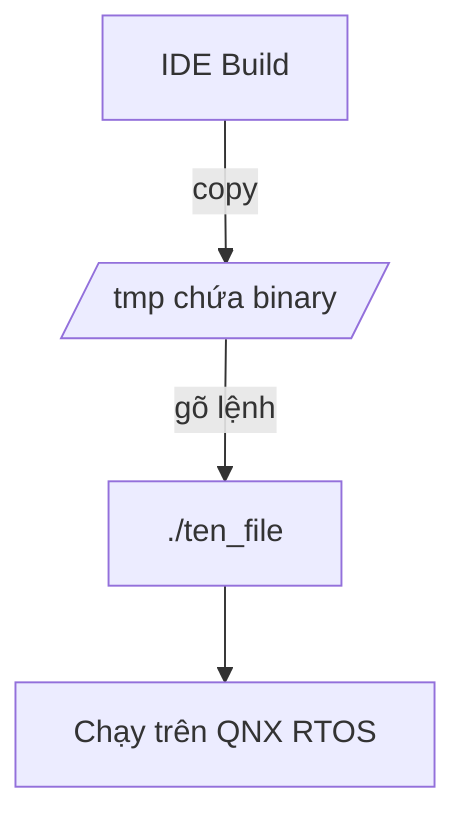

# START_T06_QNX_Terminal_gemini.md

## Câu hỏi
Tổng hợp các lệnh Terminal cơ bản trong QNX theo Week-01/QNX-Terminal-Commands.md.

## Yêu cầu output
- Sơ đồ `graph TD` mô tả quy trình Deploy: IDE Build → Copy .bin → Terminal QNX → `./ten_file` → chạy.
- Kèm bảng lệnh: `uname -a`, `ls -l`, `cat`, `chmod`, `kill`, `ps`.
- Kèm giải thích: QNX phân biệt chữ hoa/chữ thường.

## Để kiểm tra trong output PDF
- [ ] `graph TD` render thành hình quy trình.
- [ ] Bảng lệnh hiển thị đúng các cột Lệnh / Chức năng / Ví dụ.
- [ ] Tên lệnh `./ten_file` hiển thị dạng code.

## Đáp án mẫu (để test pipeline)

| Lệnh | Chức năng |
|------|-----------|
| `uname -a` | Phiên bản kernel |
| `ls -l` | Liệt kê chi tiết |
| `chmod 755` | Đổi quyền |
| `kill pid` | Chấm dứt tiến trình |
