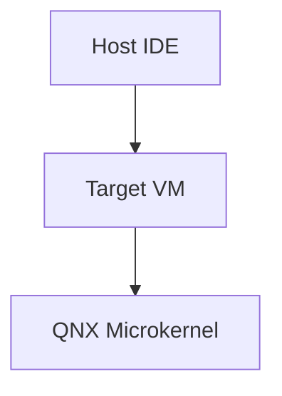
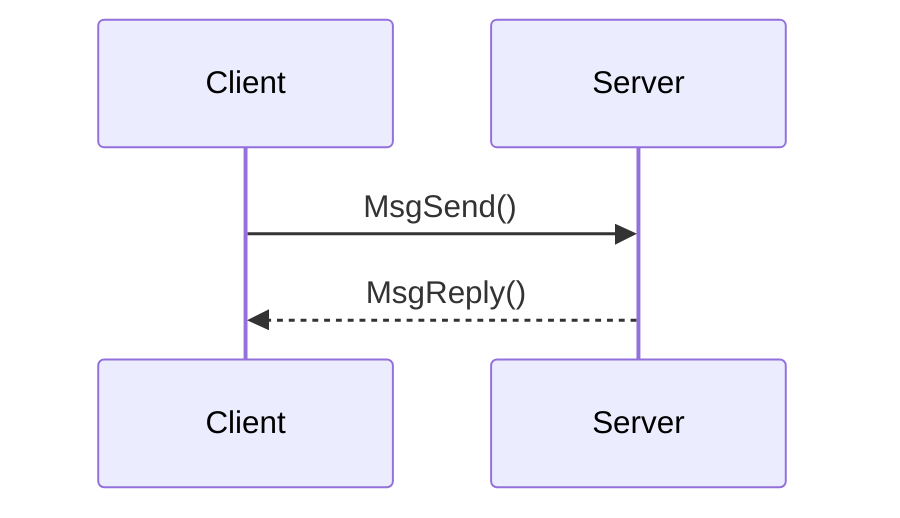
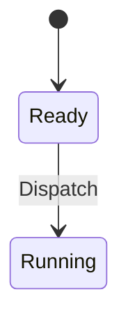
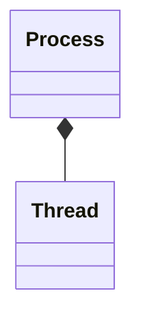

# START_T07_Mixed_Content_gemini.md

## Câu hỏi
Viết 1 câu trả lời tổng hợp dựa trên toàn bộ vault gồm NHIỀU loại sơ đồ Mermaid + nhiều loại block markdown khác nhau.

## Yêu cầu output
Phải chứa ĐỒNG THỜI tất cả các loại block sau:

1. `flowchart` (graph TD) — quy trình Host-Target trong QNX.
2. `sequenceDiagram` — giao tiếp IPC.
3. `stateDiagram-v2` — trạng thái luồng.
4. `classDiagram` — quan hệ Process/Thread/PCB.
5. Một block `table` markdown.
6. Một block `code` (C code).
7. Một công thức toán inline $E = mc^2$.
8. Một công thức toán display:
$$
\sum_{i=1}^{n} i = \frac{n(n+1)}{2}
$$
9. Một `blockquote`.

## Để kiểm tra trong output PDF
- [ ] TẤT CẢ 4 loại sơ đồ Mermaid đều render thành hình.
- [ ] Table, code, blockquote hiển thị đúng.
- [ ] Cả 2 công thức toán đều render.
- [ ] Không có nội dung nào bị lỗi render (renderLog phải toàn `ok:true`).

## Đáp án mẫu (để test pipeline)
1. Flowchart:


2. Sequence:


3. State:


4. Class:


| STT | Nội dung |
|-----|----------|
| 1   | Mermaid |
| 2   | Math |

```c
int main() { return 0; }
```

Inline $E = mc^2$ và display:
$$
\sum_{i=1}^{n} i = \frac{n(n+1)}{2}
$$

> Đây là blockquote để test.
