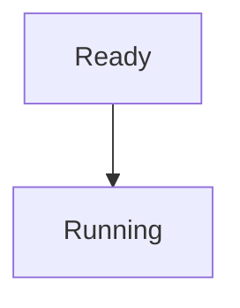

# START_T08_Broken_Mermaid_gemini.md

## Câu hỏi
Giải thích ngắn gọn về tiến trình trong QNX.

## Yêu cầu output
- 1 sơ đồ Mermaid HỢP LỆ.
- 1 sơ đồ Mermaid CỐ TÌNH SAI cú pháp (không tồn tại type diagram, thiếu `end`, nhét ký tự lạ).
- Kèm chú thích rõ ràng block nào "đúng" và block nào "sai".

## Mục đích test
Kiểm tra cơ chế **render-log check + fallback**: block lỗi phải được ghi log `ok:false`, hiển thị dạng raw-code fallback, NHƯNG toàn bộ PDF vẫn xuất ra bình thường (không fail cả pipeline).

## Để kiểm tra trong output PDF
- [ ] PDF vẫn được tạo thành công (đầu file `%PDF-`).
- [ ] Block đúng render thành hình.
- [ ] Block sai hiển thị dạng code thô kèm thông báo lỗi, không phải hình.
- [ ] RenderLog chứa đúng 1 entry `ok:true` và 1 entry `ok:false` có `error`.

## Đáp án mẫu (để test pipeline)
Block HỢP LỆ:


Block CỐ TÌNH SAI (thiếu type diagram):
```mermaid
this is not a valid diagram type %%
  broken ->> syntax [x
```
