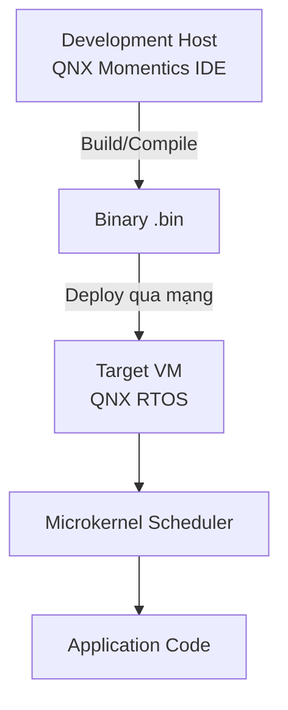
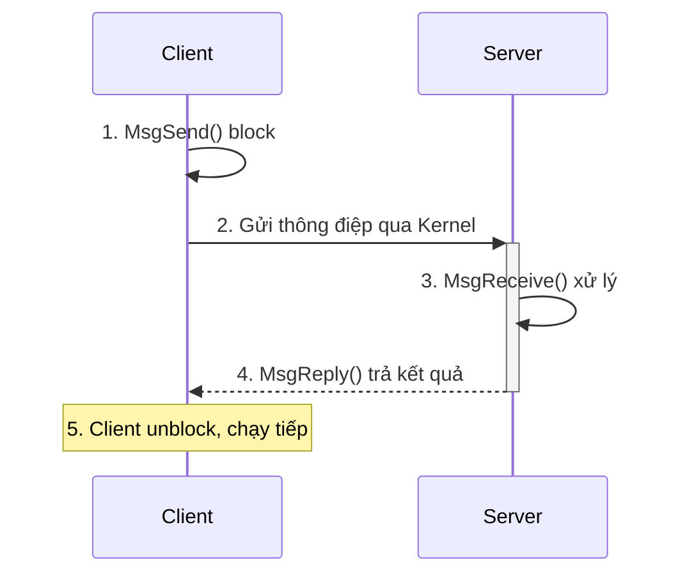
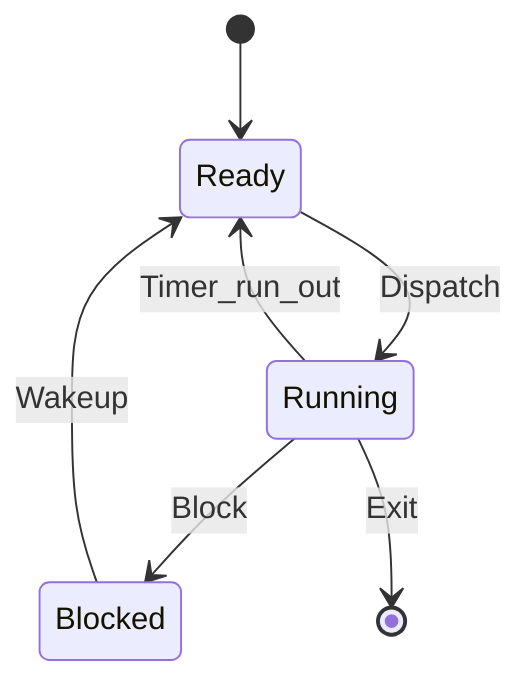
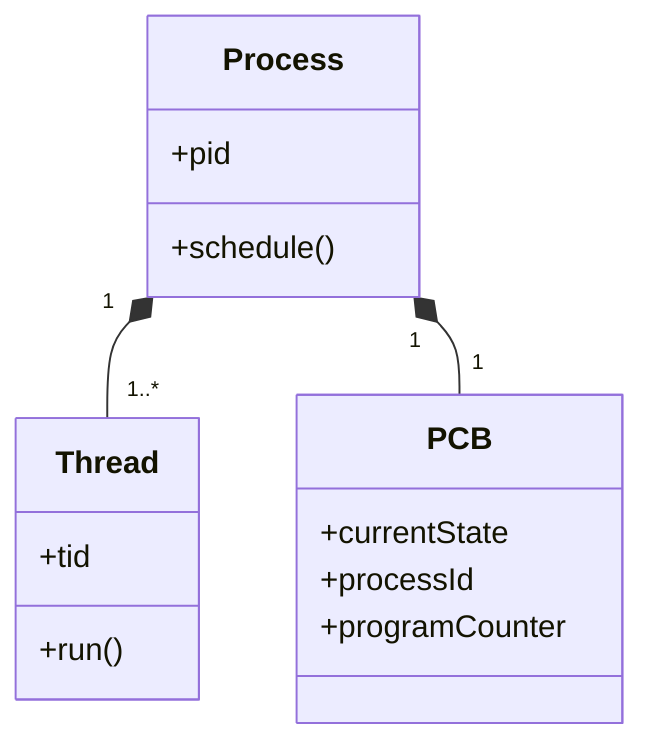

# START_T10_GOLDEN_gemini.md

## Câu hỏi
Đây là câu hỏi benchmark. AI phải trả lời với đúng cấu trúc trong file GOLDEN dưới đây (đáp án mẫu). Dùng để đối chiếu rằng pipeline Mermaid → PDF render được đầy đủ mọi thành phần.

## Đáp án mẫu (GOLDEN)

# Process vs Thread trong QNX

## 1. Flowchart quy trình Host-Target



## 2. Sequence diagram IPC



## 3. State diagram trạng thái luồng



## 4. Class diagram



## 5. Bảng so sánh

| Đặc điểm | Process | Thread |
|----------|---------|--------|
| Bộ nhớ | Không chia sẻ address space | Chia sẻ address space |
| Tài nguyên riêng | Hoạt động độc lập | Stack riêng |
| Độ tin cậy | Cao (memory barrier) | Thấp (sập chùm) |

## 6. Code C

```c
#include <pthread.h>
int shared_counter = 0;
pthread_mutex_t my_mutex;
```

## 7. Công thức

Inline: $counter = counter + 1$

Display:
$$
\sum_{i=1}^{n} i = \frac{n(n+1)}{2}
$$

> **Kết luận:** Mutex bảo vệ Critical section khỏi Race condition.
